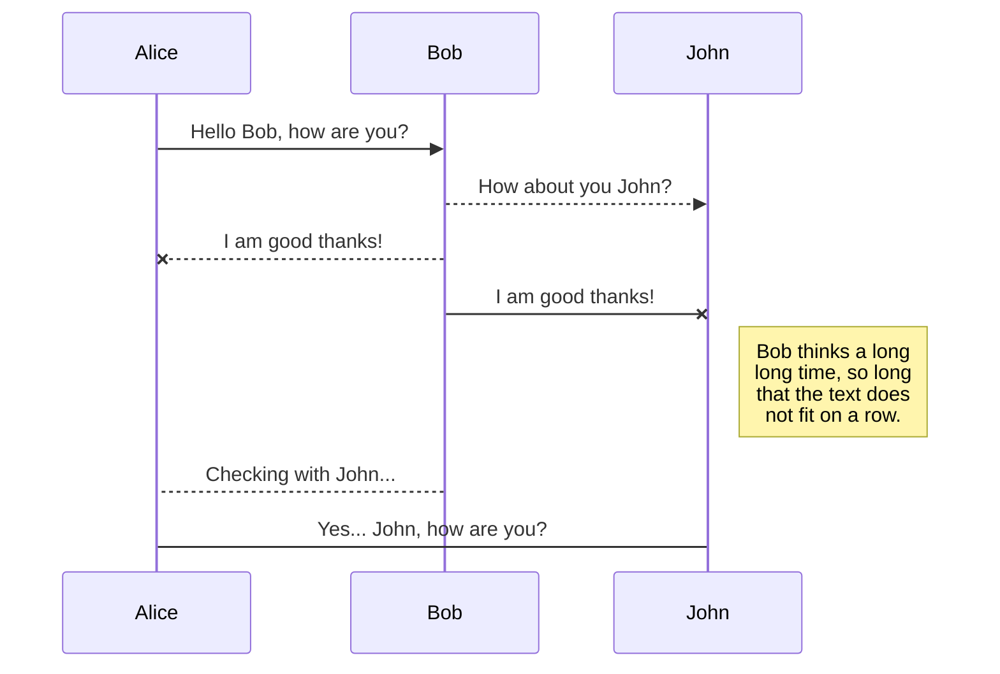
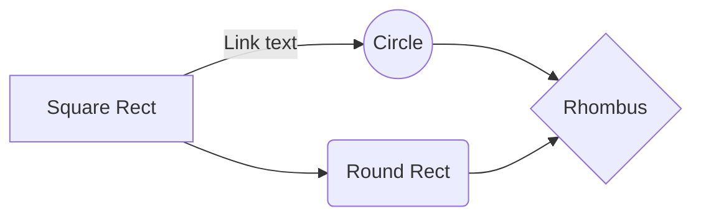

# Welcome to StackEdit!

Hi! I'm your first Markdown file in **StackEdit**. If you want to learn about StackEdit, you can read me. If you want to play with Markdown, you can edit me. Once you have finished with me, you can create new files by opening the **file explorer** on the left corner of the navigation bar.


# Files

StackEdit stores your files in your browser, which means all your files are automatically saved locally and are accessible **offline!**

## Create files and folders

The file explorer is accessible using the button in left corner of the navigation bar. You can create a new file by clicking the **New file** button in the file explorer. You can also create folders by clicking the **New folder** button.

## Switch to another file

All your files and folders are presented as a tree in the file explorer. You can switch from one to another by clicking a file in the tree.

## Rename a file

You can rename the current file by clicking the file name in the navigation bar or by clicking the **Rename** button in the file explorer.

## Delete a file

You can delete the current file by clicking the **Remove** button in the file explorer. The file will be moved into the **Trash** folder and automatically deleted after 7 days of inactivity.

## Export a file

You can export the current file by clicking **Export to disk** in the menu. You can choose to export the file as plain Markdown, as HTML using a Handlebars template or as a PDF.


# Synchronization

Synchronization is one of the biggest features of StackEdit. It enables you to synchronize any file in your workspace with other files stored in your **Google Drive**, your **Dropbox** and your **GitHub** accounts. This allows you to keep writing on other devices, collaborate with people you share the file with, integrate easily into your workflow... The synchronization mechanism takes place every minute in the background, downloading, merging, and uploading file modifications.

There are two types of synchronization and they can complement each other:

- The workspace synchronization will sync all your files, folders and settings automatically. This will allow you to fetch your workspace on any other device.
	> To start syncing your workspace, just sign in with Google in the menu.

- The file synchronization will keep one file of the workspace synced with one or multiple files in **Google Drive**, **Dropbox** or **GitHub**.
	> Before starting to sync files, you must link an account in the **Synchronize** sub-menu.

## Open a file

You can open a file from **Google Drive**, **Dropbox** or **GitHub** by opening the **Synchronize** sub-menu and clicking **Open from**. Once opened in the workspace, any modification in the file will be automatically synced.

## Save a file

You can save any file of the workspace to **Google Drive**, **Dropbox** or **GitHub** by opening the **Synchronize** sub-menu and clicking **Save on**. Even if a file in the workspace is already synced, you can save it to another location. StackEdit can sync one file with multiple locations and accounts.

## Synchronize a file

Once your file is linked to a synchronized location, StackEdit will periodically synchronize it by downloading/uploading any modification. A merge will be performed if necessary and conflicts will be resolved.

If you just have modified your file and you want to force syncing, click the **Synchronize now** button in the navigation bar.

> **Note:** The **Synchronize now** button is disabled if you have no file to synchronize.

## Manage file synchronization

Since one file can be synced with multiple locations, you can list and manage synchronized locations by clicking **File synchronization** in the **Synchronize** sub-menu. This allows you to list and remove synchronized locations that are linked to your file.


# Publication

Publishing in StackEdit makes it simple for you to publish online your files. Once you're happy with a file, you can publish it to different hosting platforms like **Blogger**, **Dropbox**, **Gist**, **GitHub**, **Google Drive**, **WordPress** and **Zendesk**. With [Handlebars templates](http://handlebarsjs.com/), you have full control over what you export.

> Before starting to publish, you must link an account in the **Publish** sub-menu.

## Publish a File

You can publish your file by opening the **Publish** sub-menu and by clicking **Publish to**. For some locations, you can choose between the following formats:

- Markdown: publish the Markdown text on a website that can interpret it (**GitHub** for instance),
- HTML: publish the file converted to HTML via a Handlebars template (on a blog for example).

## Update a publication

After publishing, StackEdit keeps your file linked to that publication which makes it easy for you to re-publish it. Once you have modified your file and you want to update your publication, click on the **Publish now** button in the navigation bar.

> **Note:** The **Publish now** button is disabled if your file has not been published yet.

## Manage file publication

Since one file can be published to multiple locations, you can list and manage publish locations by clicking **File publication** in the **Publish** sub-menu. This allows you to list and remove publication locations that are linked to your file.


# Markdown extensions

StackEdit extends the standard Markdown syntax by adding extra **Markdown extensions**, providing you with some nice features.

> **ProTip:** You can disable any **Markdown extension** in the **File properties** dialog.


## SmartyPants

SmartyPants converts ASCII punctuation characters into "smart" typographic punctuation HTML entities. For example:

|                |ASCII                          |HTML                         |
|----------------|-------------------------------|-----------------------------|
|Single backticks|`'Isn't this fun?'`            |'Isn't this fun?'            |
|Quotes          |`"Isn't this fun?"`            |"Isn't this fun?"            |
|Dashes          |`-- is en-dash, --- is em-dash`|-- is en-dash, --- is em-dash|


## KaTeX

You can render LaTeX mathematical expressions using [KaTeX](https://khan.github.io/KaTeX/):

The *Gamma function* satisfying $\Gamma(n) = (n-1)!\quad\forall n\in\mathbb N$ is via the Euler integral

$$
\Gamma(z) = \int_0^\infty t^{z-1}e^{-t}dt\,.
$$

> You can find more information about **LaTeX** mathematical expressions [here](http://meta.math.stackexchange.com/questions/5020/mathjax-basic-tutorial-and-quick-reference).


## UML diagrams

You can render UML diagrams using [Mermaid](https://mermaidjs.github.io/). For example, this will produce a sequence diagram:



And this will produce a flow chart:




1.  It's not his fault. I know you're going to want to, but you can't blame him. He really has no idea how it happened. I kept trying to come up with excuses I could say to mom that would keep her calm when she found out what happened, but the more I tried, the more I could see none of them would work. He was going to get her wrath and there was nothing I could say to prevent it.
    

----------

3.  He looked at the sand. Picking up a handful, he wondered how many grains were in his hand. Hundreds of thousands? "Not enough," the said under his breath. I need more.
    

----------

5.  He walked down the steps from the train station in a bit of a hurry knowing the secrets in the briefcase must be secured as quickly as possible. Bounding down the steps, he heard something behind him and quickly turned in a panic. There was nobody there but a pair of old worn-out shoes were placed neatly on the steps he had just come down. Had he past them without seeing them? It didn't seem possible. He was about to turn and be on his way when a deep chill filled his body.
    

----------

7.  I recently discovered I could make fudge with just chocolate chips, sweetened condensed milk, vanilla extract, and a thick pot on slow heat. I tried it with dark chocolate chunks and I tried it with semi-sweet chocolate chips. It's better with both kinds. It comes out pretty bad with just the dark chocolate. The best add-ins are crushed almonds and marshmallows -- what you get from that is Rocky Road. It takes about twenty minutes from start to fridge, and then it takes about six months to work off the twenty pounds you gain from eating it. All things in moderation, friends. All things in moderation.
    

----------

9.  Eating raw fish didn't sound like a good idea. "It's a delicacy in Japan," didn't seem to make it any more appetizing. Raw fish is raw fish, delicacy or not.
    

----------

11.  Dave watched as the forest burned up on the hill, only a few miles from her house. The car had been hastily packed and Marta was inside trying to round up the last of the pets. Dave went through his mental list of the most important papers and documents that they couldn't leave behind. He scolded himself for not having prepared these better in advance and hoped that he had remembered everything that was needed. He continued to wait for Marta to appear with the pets, but she still was nowhere to be seen.
    

----------

13.  Since they are still preserved in the rocks for us to see, they must have been formed quite recently, that is, geologically speaking. What can explain these striations and their common orientation? Did you ever hear about the Great Ice Age or the Pleistocene Epoch? Less than one million years ago, in fact, some 12,000 years ago, an ice sheet many thousands of feet thick rode over Burke Mountain in a southeastward direction. The many boulders frozen to the underside of the ice sheet tended to scratch the rocks over which they rode. The scratches or striations seen in the park rocks were caused by these attached boulders. The ice sheet also plucked and rounded Burke Mountain into the shape it possesses today.
    

----------

15.  It was a question of which of the two she preferred. On the one hand, the choice seemed simple. The more expensive one with a brand name would be the choice of most. It was the easy choice. The safe choice. But she wasn't sure she actually preferred it.
    

----------

17.  She looked at her little girl who was about to become a teen. She tried to think back to when the girl had been younger but failed to pinpoint the exact moment when she had become a little too big to pick up and carry. It hit her all at once. She was no longer a little girl and she stood there speechless with fear, sadness, and pride all running through her at the same time.
    

----------

19.  Do you think you're living an ordinary life? You are so mistaken it's difficult to even explain. The mere fact that you exist makes you extraordinary. The odds of you existing are less than winning the lottery, but here you are. Are you going to let this extraordinary opportunity pass?
# Welcome to StackEdit!

Hi! I'm your first Markdown file in **StackEdit**. If you want to learn about StackEdit, you can read me. If you want to play with Markdown, you can edit me. Once you have finished with me, you can create new files by opening the **file explorer** on the left corner of the navigation bar.


# Files

StackEdit stores your files in your browser, which means all your files are automatically saved locally and are accessible **offline!**

## Create files and folders

The file explorer is accessible using the button in left corner of the navigation bar. You can create a new file by clicking the **New file** button in the file explorer. You can also create folders by clicking the **New folder** button.

## Switch to another file

All your files and folders are presented as a tree in the file explorer. You can switch from one to another by clicking a file in the tree.

## Rename a file

You can rename the current file by clicking the file name in the navigation bar or by clicking the **Rename** button in the file explorer.

## Delete a file

You can delete the current file by clicking the **Remove** button in the file explorer. The file will be moved into the **Trash** folder and automatically deleted after 7 days of inactivity.

## Export a file

You can export the current file by clicking **Export to disk** in the menu. You can choose to export the file as plain Markdown, as HTML using a Handlebars template or as a PDF.


# Synchronization

Synchronization is one of the biggest features of StackEdit. It enables you to synchronize any file in your workspace with other files stored in your **Google Drive**, your **Dropbox** and your **GitHub** accounts. This allows you to keep writing on other devices, collaborate with people you share the file with, integrate easily into your workflow... The synchronization mechanism takes place every minute in the background, downloading, merging, and uploading file modifications.

There are two types of synchronization and they can complement each other:

- The workspace synchronization will sync all your files, folders and settings automatically. This will allow you to fetch your workspace on any other device.
	> To start syncing your workspace, just sign in with Google in the menu.

- The file synchronization will keep one file of the workspace synced with one or multiple files in **Google Drive**, **Dropbox** or **GitHub**.
	> Before starting to sync files, you must link an account in the **Synchronize** sub-menu.

## Open a file

You can open a file from **Google Drive**, **Dropbox** or **GitHub** by opening the **Synchronize** sub-menu and clicking **Open from**. Once opened in the workspace, any modification in the file will be automatically synced.

## Save a file

You can save any file of the workspace to **Google Drive**, **Dropbox** or **GitHub** by opening the **Synchronize** sub-menu and clicking **Save on**. Even if a file in the workspace is already synced, you can save it to another location. StackEdit can sync one file with multiple locations and accounts.

## Synchronize a file

Once your file is linked to a synchronized location, StackEdit will periodically synchronize it by downloading/uploading any modification. A merge will be performed if necessary and conflicts will be resolved.

If you just have modified your file and you want to force syncing, click the **Synchronize now** button in the navigation bar.

> **Note:** The **Synchronize now** button is disabled if you have no file to synchronize.

## Manage file synchronization

Since one file can be synced with multiple locations, you can list and manage synchronized locations by clicking **File synchronization** in the **Synchronize** sub-menu. This allows you to list and remove synchronized locations that are linked to your file.


# Publication

Publishing in StackEdit makes it simple for you to publish online your files. Once you're happy with a file, you can publish it to different hosting platforms like **Blogger**, **Dropbox**, **Gist**, **GitHub**, **Google Drive**, **WordPress** and **Zendesk**. With [Handlebars templates](http://handlebarsjs.com/), you have full control over what you export.

> Before starting to publish, you must link an account in the **Publish** sub-menu.

## Publish a File

You can publish your file by opening the **Publish** sub-menu and by clicking **Publish to**. For some locations, you can choose between the following formats:

- Markdown: publish the Markdown text on a website that can interpret it (**GitHub** for instance),
- HTML: publish the file converted to HTML via a Handlebars template (on a blog for example).

## Update a publication

After publishing, StackEdit keeps your file linked to that publication which makes it easy for you to re-publish it. Once you have modified your file and you want to update your publication, click on the **Publish now** button in the navigation bar.

> **Note:** The **Publish now** button is disabled if your file has not been published yet.

## Manage file publication

Since one file can be published to multiple locations, you can list and manage publish locations by clicking **File publication** in the **Publish** sub-menu. This allows you to list and remove publication locations that are linked to your file.


# Markdown extensions

StackEdit extends the standard Markdown syntax by adding extra **Markdown extensions**, providing you with some nice features.

> **ProTip:** You can disable any **Markdown extension** in the **File properties** dialog.


## SmartyPants

SmartyPants converts ASCII punctuation characters into "smart" typographic punctuation HTML entities. For example:

|                |ASCII                          |HTML                         |
|----------------|-------------------------------|-----------------------------|
|Single backticks|`'Isn't this fun?'`            |'Isn't this fun?'            |
|Quotes          |`"Isn't this fun?"`            |"Isn't this fun?"            |
|Dashes          |`-- is en-dash, --- is em-dash`|-- is en-dash, --- is em-dash|


## KaTeX

You can render LaTeX mathematical expressions using [KaTeX](https://khan.github.io/KaTeX/):

The *Gamma function* satisfying $\Gamma(n) = (n-1)!\quad\forall n\in\mathbb N$ is via the Euler integral

$$
\Gamma(z) = \int_0^\infty t^{z-1}e^{-t}dt\,.
$$

> You can find more information about **LaTeX** mathematical expressions [here](http://meta.math.stackexchange.com/questions/5020/mathjax-basic-tutorial-and-quick-reference).


## UML diagrams

You can render UML diagrams using [Mermaid](https://mermaidjs.github.io/). For example, this will produce a sequence diagram:


And this will produce a flow chart:


1.  It's not his fault. I know you're going to want to, but you can't blame him. He really has no idea how it happened. I kept trying to come up with excuses I could say to mom that would keep her calm when she found out what happened, but the more I tried, the more I could see none of them would work. He was going to get her wrath and there was nothing I could say to prevent it.
    

----------

3.  He looked at the sand. Picking up a handful, he wondered how many grains were in his hand. Hundreds of thousands? "Not enough," the said under his breath. I need more.
    

----------

5.  He walked down the steps from the train station in a bit of a hurry knowing the secrets in the briefcase must be secured as quickly as possible. Bounding down the steps, he heard something behind him and quickly turned in a panic. There was nobody there but a pair of old worn-out shoes were placed neatly on the steps he had just come down. Had he past them without seeing them? It didn't seem possible. He was about to turn and be on his way when a deep chill filled his body.
    

----------

7.  I recently discovered I could make fudge with just chocolate chips, sweetened condensed milk, vanilla extract, and a thick pot on slow heat. I tried it with dark chocolate chunks and I tried it with semi-sweet chocolate chips. It's better with both kinds. It comes out pretty bad with just the dark chocolate. The best add-ins are crushed almonds and marshmallows -- what you get from that is Rocky Road. It takes about twenty minutes from start to fridge, and then it takes about six months to work off the twenty pounds you gain from eating it. All things in moderation, friends. All things in moderation.
    

----------

9.  Eating raw fish didn't sound like a good idea. "It's a delicacy in Japan," didn't seem to make it any more appetizing. Raw fish is raw fish, delicacy or not.
    

----------

11.  Dave watched as the forest burned up on the hill, only a few miles from her house. The car had been hastily packed and Marta was inside trying to round up the last of the pets. Dave went through his mental list of the most important papers and documents that they couldn't leave behind. He scolded himself for not having prepared these better in advance and hoped that he had remembered everything that was needed. He continued to wait for Marta to appear with the pets, but she still was nowhere to be seen.
    

----------

13.  Since they are still preserved in the rocks for us to see, they must have been formed quite recently, that is, geologically speaking. What can explain these striations and their common orientation? Did you ever hear about the Great Ice Age or the Pleistocene Epoch? Less than one million years ago, in fact, some 12,000 years ago, an ice sheet many thousands of feet thick rode over Burke Mountain in a southeastward direction. The many boulders frozen to the underside of the ice sheet tended to scratch the rocks over which they rode. The scratches or striations seen in the park rocks were caused by these attached boulders. The ice sheet also plucked and rounded Burke Mountain into the shape it possesses today.
    

----------

15.  It was a question of which of the two she preferred. On the one hand, the choice seemed simple. The more expensive one with a brand name would be the choice of most. It was the easy choice. The safe choice. But she wasn't sure she actually preferred it.
    

----------

17.  She looked at her little girl who was about to become a teen. She tried to think back to when the girl had been younger but failed to pinpoint the exact moment when she had become a little too big to pick up and carry. It hit her all at once. She was no longer a little girl and she stood there speechless with fear, sadness, and pride all running through her at the same time.
    

----------

19.  Do you think you're living an ordinary life? You are so mistaken it's difficult to even explain. The mere fact that you exist makes you extraordinary. The odds of you existing are less than winning the lottery, but here you are. Are you going to let this extraordinary opportunity pass?
# Welcome to StackEdit!

Hi! I'm your first Markdown file in **StackEdit**. If you want to learn about StackEdit, you can read me. If you want to play with Markdown, you can edit me. Once you have finished with me, you can create new files by opening the **file explorer** on the left corner of the navigation bar.


# Files

StackEdit stores your files in your browser, which means all your files are automatically saved locally and are accessible **offline!**

## Create files and folders

The file explorer is accessible using the button in left corner of the navigation bar. You can create a new file by clicking the **New file** button in the file explorer. You can also create folders by clicking the **New folder** button.

## Switch to another file

All your files and folders are presented as a tree in the file explorer. You can switch from one to another by clicking a file in the tree.

## Rename a file

You can rename the current file by clicking the file name in the navigation bar or by clicking the **Rename** button in the file explorer.

## Delete a file

You can delete the current file by clicking the **Remove** button in the file explorer. The file will be moved into the **Trash** folder and automatically deleted after 7 days of inactivity.

## Export a file

You can export the current file by clicking **Export to disk** in the menu. You can choose to export the file as plain Markdown, as HTML using a Handlebars template or as a PDF.


# Synchronization

Synchronization is one of the biggest features of StackEdit. It enables you to synchronize any file in your workspace with other files stored in your **Google Drive**, your **Dropbox** and your **GitHub** accounts. This allows you to keep writing on other devices, collaborate with people you share the file with, integrate easily into your workflow... The synchronization mechanism takes place every minute in the background, downloading, merging, and uploading file modifications.

There are two types of synchronization and they can complement each other:

- The workspace synchronization will sync all your files, folders and settings automatically. This will allow you to fetch your workspace on any other device.
	> To start syncing your workspace, just sign in with Google in the menu.

- The file synchronization will keep one file of the workspace synced with one or multiple files in **Google Drive**, **Dropbox** or **GitHub**.
	> Before starting to sync files, you must link an account in the **Synchronize** sub-menu.

## Open a file

You can open a file from **Google Drive**, **Dropbox** or **GitHub** by opening the **Synchronize** sub-menu and clicking **Open from**. Once opened in the workspace, any modification in the file will be automatically synced.

## Save a file

You can save any file of the workspace to **Google Drive**, **Dropbox** or **GitHub** by opening the **Synchronize** sub-menu and clicking **Save on**. Even if a file in the workspace is already synced, you can save it to another location. StackEdit can sync one file with multiple locations and accounts.

## Synchronize a file

Once your file is linked to a synchronized location, StackEdit will periodically synchronize it by downloading/uploading any modification. A merge will be performed if necessary and conflicts will be resolved.

If you just have modified your file and you want to force syncing, click the **Synchronize now** button in the navigation bar.

> **Note:** The **Synchronize now** button is disabled if you have no file to synchronize.

## Manage file synchronization

Since one file can be synced with multiple locations, you can list and manage synchronized locations by clicking **File synchronization** in the **Synchronize** sub-menu. This allows you to list and remove synchronized locations that are linked to your file.


# Publication

Publishing in StackEdit makes it simple for you to publish online your files. Once you're happy with a file, you can publish it to different hosting platforms like **Blogger**, **Dropbox**, **Gist**, **GitHub**, **Google Drive**, **WordPress** and **Zendesk**. With [Handlebars templates](http://handlebarsjs.com/), you have full control over what you export.

> Before starting to publish, you must link an account in the **Publish** sub-menu.

## Publish a File

You can publish your file by opening the **Publish** sub-menu and by clicking **Publish to**. For some locations, you can choose between the following formats:

- Markdown: publish the Markdown text on a website that can interpret it (**GitHub** for instance),
- HTML: publish the file converted to HTML via a Handlebars template (on a blog for example).

## Update a publication

After publishing, StackEdit keeps your file linked to that publication which makes it easy for you to re-publish it. Once you have modified your file and you want to update your publication, click on the **Publish now** button in the navigation bar.

> **Note:** The **Publish now** button is disabled if your file has not been published yet.

## Manage file publication

Since one file can be published to multiple locations, you can list and manage publish locations by clicking **File publication** in the **Publish** sub-menu. This allows you to list and remove publication locations that are linked to your file.


# Markdown extensions

StackEdit extends the standard Markdown syntax by adding extra **Markdown extensions**, providing you with some nice features.

> **ProTip:** You can disable any **Markdown extension** in the **File properties** dialog.


## SmartyPants

SmartyPants converts ASCII punctuation characters into "smart" typographic punctuation HTML entities. For example:

|                |ASCII                          |HTML                         |
|----------------|-------------------------------|-----------------------------|
|Single backticks|`'Isn't this fun?'`            |'Isn't this fun?'            |
|Quotes          |`"Isn't this fun?"`            |"Isn't this fun?"            |
|Dashes          |`-- is en-dash, --- is em-dash`|-- is en-dash, --- is em-dash|


## KaTeX

You can render LaTeX mathematical expressions using [KaTeX](https://khan.github.io/KaTeX/):

The *Gamma function* satisfying $\Gamma(n) = (n-1)!\quad\forall n\in\mathbb N$ is via the Euler integral

$$
\Gamma(z) = \int_0^\infty t^{z-1}e^{-t}dt\,.
$$

> You can find more information about **LaTeX** mathematical expressions [here](http://meta.math.stackexchange.com/questions/5020/mathjax-basic-tutorial-and-quick-reference).


## UML diagrams

You can render UML diagrams using [Mermaid](https://mermaidjs.github.io/). For example, this will produce a sequence diagram:


And this will produce a flow chart:


1.  It's not his fault. I know you're going to want to, but you can't blame him. He really has no idea how it happened. I kept trying to come up with excuses I could say to mom that would keep her calm when she found out what happened, but the more I tried, the more I could see none of them would work. He was going to get her wrath and there was nothing I could say to prevent it.
    

----------

3.  He looked at the sand. Picking up a handful, he wondered how many grains were in his hand. Hundreds of thousands? "Not enough," the said under his breath. I need more.
    

----------

5.  He walked down the steps from the train station in a bit of a hurry knowing the secrets in the briefcase must be secured as quickly as possible. Bounding down the steps, he heard something behind him and quickly turned in a panic. There was nobody there but a pair of old worn-out shoes were placed neatly on the steps he had just come down. Had he past them without seeing them? It didn't seem possible. He was about to turn and be on his way when a deep chill filled his body.
    

----------

7.  I recently discovered I could make fudge with just chocolate chips, sweetened condensed milk, vanilla extract, and a thick pot on slow heat. I tried it with dark chocolate chunks and I tried it with semi-sweet chocolate chips. It's better with both kinds. It comes out pretty bad with just the dark chocolate. The best add-ins are crushed almonds and marshmallows -- what you get from that is Rocky Road. It takes about twenty minutes from start to fridge, and then it takes about six months to work off the twenty pounds you gain from eating it. All things in moderation, friends. All things in moderation.
    

----------

9.  Eating raw fish didn't sound like a good idea. "It's a delicacy in Japan," didn't seem to make it any more appetizing. Raw fish is raw fish, delicacy or not.
    

----------

11.  Dave watched as the forest burned up on the hill, only a few miles from her house. The car had been hastily packed and Marta was inside trying to round up the last of the pets. Dave went through his mental list of the most important papers and documents that they couldn't leave behind. He scolded himself for not having prepared these better in advance and hoped that he had remembered everything that was needed. He continued to wait for Marta to appear with the pets, but she still was nowhere to be seen.
    

----------

13.  Since they are still preserved in the rocks for us to see, they must have been formed quite recently, that is, geologically speaking. What can explain these striations and their common orientation? Did you ever hear about the Great Ice Age or the Pleistocene Epoch? Less than one million years ago, in fact, some 12,000 years ago, an ice sheet many thousands of feet thick rode over Burke Mountain in a southeastward direction. The many boulders frozen to the underside of the ice sheet tended to scratch the rocks over which they rode. The scratches or striations seen in the park rocks were caused by these attached boulders. The ice sheet also plucked and rounded Burke Mountain into the shape it possesses today.
    

----------

15.  It was a question of which of the two she preferred. On the one hand, the choice seemed simple. The more expensive one with a brand name would be the choice of most. It was the easy choice. The safe choice. But she wasn't sure she actually preferred it.
    

----------

17.  She looked at her little girl who was about to become a teen. She tried to think back to when the girl had been younger but failed to pinpoint the exact moment when she had become a little too big to pick up and carry. It hit her all at once. She was no longer a little girl and she stood there speechless with fear, sadness, and pride all running through her at the same time.
    

----------

19.  Do you think you're living an ordinary life? You are so mistaken it's difficult to even explain. The mere fact that you exist makes you extraordinary. The odds of you existing are less than winning the lottery, but here you are. Are you going to let this extraordinary opportunity pass?
# Welcome to StackEdit!

Hi! I'm your first Markdown file in **StackEdit**. If you want to learn about StackEdit, you can read me. If you want to play with Markdown, you can edit me. Once you have finished with me, you can create new files by opening the **file explorer** on the left corner of the navigation bar.


# Files

StackEdit stores your files in your browser, which means all your files are automatically saved locally and are accessible **offline!**

## Create files and folders

The file explorer is accessible using the button in left corner of the navigation bar. You can create a new file by clicking the **New file** button in the file explorer. You can also create folders by clicking the **New folder** button.

## Switch to another file

All your files and folders are presented as a tree in the file explorer. You can switch from one to another by clicking a file in the tree.

## Rename a file

You can rename the current file by clicking the file name in the navigation bar or by clicking the **Rename** button in the file explorer.

## Delete a file

You can delete the current file by clicking the **Remove** button in the file explorer. The file will be moved into the **Trash** folder and automatically deleted after 7 days of inactivity.

## Export a file

You can export the current file by clicking **Export to disk** in the menu. You can choose to export the file as plain Markdown, as HTML using a Handlebars template or as a PDF.


# Synchronization

Synchronization is one of the biggest features of StackEdit. It enables you to synchronize any file in your workspace with other files stored in your **Google Drive**, your **Dropbox** and your **GitHub** accounts. This allows you to keep writing on other devices, collaborate with people you share the file with, integrate easily into your workflow... The synchronization mechanism takes place every minute in the background, downloading, merging, and uploading file modifications.

There are two types of synchronization and they can complement each other:

- The workspace synchronization will sync all your files, folders and settings automatically. This will allow you to fetch your workspace on any other device.
	> To start syncing your workspace, just sign in with Google in the menu.

- The file synchronization will keep one file of the workspace synced with one or multiple files in **Google Drive**, **Dropbox** or **GitHub**.
	> Before starting to sync files, you must link an account in the **Synchronize** sub-menu.

## Open a file

You can open a file from **Google Drive**, **Dropbox** or **GitHub** by opening the **Synchronize** sub-menu and clicking **Open from**. Once opened in the workspace, any modification in the file will be automatically synced.

## Save a file

You can save any file of the workspace to **Google Drive**, **Dropbox** or **GitHub** by opening the **Synchronize** sub-menu and clicking **Save on**. Even if a file in the workspace is already synced, you can save it to another location. StackEdit can sync one file with multiple locations and accounts.

## Synchronize a file

Once your file is linked to a synchronized location, StackEdit will periodically synchronize it by downloading/uploading any modification. A merge will be performed if necessary and conflicts will be resolved.

If you just have modified your file and you want to force syncing, click the **Synchronize now** button in the navigation bar.

> **Note:** The **Synchronize now** button is disabled if you have no file to synchronize.

## Manage file synchronization

Since one file can be synced with multiple locations, you can list and manage synchronized locations by clicking **File synchronization** in the **Synchronize** sub-menu. This allows you to list and remove synchronized locations that are linked to your file.


# Publication

Publishing in StackEdit makes it simple for you to publish online your files. Once you're happy with a file, you can publish it to different hosting platforms like **Blogger**, **Dropbox**, **Gist**, **GitHub**, **Google Drive**, **WordPress** and **Zendesk**. With [Handlebars templates](http://handlebarsjs.com/), you have full control over what you export.

> Before starting to publish, you must link an account in the **Publish** sub-menu.

## Publish a File

You can publish your file by opening the **Publish** sub-menu and by clicking **Publish to**. For some locations, you can choose between the following formats:

- Markdown: publish the Markdown text on a website that can interpret it (**GitHub** for instance),
- HTML: publish the file converted to HTML via a Handlebars template (on a blog for example).

## Update a publication

After publishing, StackEdit keeps your file linked to that publication which makes it easy for you to re-publish it. Once you have modified your file and you want to update your publication, click on the **Publish now** button in the navigation bar.

> **Note:** The **Publish now** button is disabled if your file has not been published yet.

## Manage file publication

Since one file can be published to multiple locations, you can list and manage publish locations by clicking **File publication** in the **Publish** sub-menu. This allows you to list and remove publication locations that are linked to your file.


# Markdown extensions

StackEdit extends the standard Markdown syntax by adding extra **Markdown extensions**, providing you with some nice features.

> **ProTip:** You can disable any **Markdown extension** in the **File properties** dialog.


## SmartyPants

SmartyPants converts ASCII punctuation characters into "smart" typographic punctuation HTML entities. For example:

|                |ASCII                          |HTML                         |
|----------------|-------------------------------|-----------------------------|
|Single backticks|`'Isn't this fun?'`            |'Isn't this fun?'            |
|Quotes          |`"Isn't this fun?"`            |"Isn't this fun?"            |
|Dashes          |`-- is en-dash, --- is em-dash`|-- is en-dash, --- is em-dash|


## KaTeX

You can render LaTeX mathematical expressions using [KaTeX](https://khan.github.io/KaTeX/):

The *Gamma function* satisfying $\Gamma(n) = (n-1)!\quad\forall n\in\mathbb N$ is via the Euler integral

$$
\Gamma(z) = \int_0^\infty t^{z-1}e^{-t}dt\,.
$$

> You can find more information about **LaTeX** mathematical expressions [here](http://meta.math.stackexchange.com/questions/5020/mathjax-basic-tutorial-and-quick-reference).


## UML diagrams

You can render UML diagrams using [Mermaid](https://mermaidjs.github.io/). For example, this will produce a sequence diagram:


And this will produce a flow chart:


1.  It's not his fault. I know you're going to want to, but you can't blame him. He really has no idea how it happened. I kept trying to come up with excuses I could say to mom that would keep her calm when she found out what happened, but the more I tried, the more I could see none of them would work. He was going to get her wrath and there was nothing I could say to prevent it.
    

----------

3.  He looked at the sand. Picking up a handful, he wondered how many grains were in his hand. Hundreds of thousands? "Not enough," the said under his breath. I need more.
    

----------

5.  He walked down the steps from the train station in a bit of a hurry knowing the secrets in the briefcase must be secured as quickly as possible. Bounding down the steps, he heard something behind him and quickly turned in a panic. There was nobody there but a pair of old worn-out shoes were placed neatly on the steps he had just come down. Had he past them without seeing them? It didn't seem possible. He was about to turn and be on his way when a deep chill filled his body.
    

----------

7.  I recently discovered I could make fudge with just chocolate chips, sweetened condensed milk, vanilla extract, and a thick pot on slow heat. I tried it with dark chocolate chunks and I tried it with semi-sweet chocolate chips. It's better with both kinds. It comes out pretty bad with just the dark chocolate. The best add-ins are crushed almonds and marshmallows -- what you get from that is Rocky Road. It takes about twenty minutes from start to fridge, and then it takes about six months to work off the twenty pounds you gain from eating it. All things in moderation, friends. All things in moderation.
    

----------

9.  Eating raw fish didn't sound like a good idea. "It's a delicacy in Japan," didn't seem to make it any more appetizing. Raw fish is raw fish, delicacy or not.
    

----------

11.  Dave watched as the forest burned up on the hill, only a few miles from her house. The car had been hastily packed and Marta was inside trying to round up the last of the pets. Dave went through his mental list of the most important papers and documents that they couldn't leave behind. He scolded himself for not having prepared these better in advance and hoped that he had remembered everything that was needed. He continued to wait for Marta to appear with the pets, but she still was nowhere to be seen.
    

----------

13.  Since they are still preserved in the rocks for us to see, they must have been formed quite recently, that is, geologically speaking. What can explain these striations and their common orientation? Did you ever hear about the Great Ice Age or the Pleistocene Epoch? Less than one million years ago, in fact, some 12,000 years ago, an ice sheet many thousands of feet thick rode over Burke Mountain in a southeastward direction. The many boulders frozen to the underside of the ice sheet tended to scratch the rocks over which they rode. The scratches or striations seen in the park rocks were caused by these attached boulders. The ice sheet also plucked and rounded Burke Mountain into the shape it possesses today.
    

----------

15.  It was a question of which of the two she preferred. On the one hand, the choice seemed simple. The more expensive one with a brand name would be the choice of most. It was the easy choice. The safe choice. But she wasn't sure she actually preferred it.
    

----------

17.  She looked at her little girl who was about to become a teen. She tried to think back to when the girl had been younger but failed to pinpoint the exact moment when she had become a little too big to pick up and carry. It hit her all at once. She was no longer a little girl and she stood there speechless with fear, sadness, and pride all running through her at the same time.
    

----------

19.  Do you think you're living an ordinary life? You are so mistaken it's difficult to even explain. The mere fact that you exist makes you extraordinary. The odds of you existing are less than winning the lottery, but here you are. Are you going to let this extraordinary opportunity pass?
# Welcome to StackEdit!

Hi! I'm your first Markdown file in **StackEdit**. If you want to learn about StackEdit, you can read me. If you want to play with Markdown, you can edit me. Once you have finished with me, you can create new files by opening the **file explorer** on the left corner of the navigation bar.


# Files

StackEdit stores your files in your browser, which means all your files are automatically saved locally and are accessible **offline!**

## Create files and folders

The file explorer is accessible using the button in left corner of the navigation bar. You can create a new file by clicking the **New file** button in the file explorer. You can also create folders by clicking the **New folder** button.

## Switch to another file

All your files and folders are presented as a tree in the file explorer. You can switch from one to another by clicking a file in the tree.

## Rename a file

You can rename the current file by clicking the file name in the navigation bar or by clicking the **Rename** button in the file explorer.

## Delete a file

You can delete the current file by clicking the **Remove** button in the file explorer. The file will be moved into the **Trash** folder and automatically deleted after 7 days of inactivity.

## Export a file

You can export the current file by clicking **Export to disk** in the menu. You can choose to export the file as plain Markdown, as HTML using a Handlebars template or as a PDF.


# Synchronization

Synchronization is one of the biggest features of StackEdit. It enables you to synchronize any file in your workspace with other files stored in your **Google Drive**, your **Dropbox** and your **GitHub** accounts. This allows you to keep writing on other devices, collaborate with people you share the file with, integrate easily into your workflow... The synchronization mechanism takes place every minute in the background, downloading, merging, and uploading file modifications.

There are two types of synchronization and they can complement each other:

- The workspace synchronization will sync all your files, folders and settings automatically. This will allow you to fetch your workspace on any other device.
	> To start syncing your workspace, just sign in with Google in the menu.

- The file synchronization will keep one file of the workspace synced with one or multiple files in **Google Drive**, **Dropbox** or **GitHub**.
	> Before starting to sync files, you must link an account in the **Synchronize** sub-menu.

## Open a file

You can open a file from **Google Drive**, **Dropbox** or **GitHub** by opening the **Synchronize** sub-menu and clicking **Open from**. Once opened in the workspace, any modification in the file will be automatically synced.

## Save a file

You can save any file of the workspace to **Google Drive**, **Dropbox** or **GitHub** by opening the **Synchronize** sub-menu and clicking **Save on**. Even if a file in the workspace is already synced, you can save it to another location. StackEdit can sync one file with multiple locations and accounts.

## Synchronize a file

Once your file is linked to a synchronized location, StackEdit will periodically synchronize it by downloading/uploading any modification. A merge will be performed if necessary and conflicts will be resolved.

If you just have modified your file and you want to force syncing, click the **Synchronize now** button in the navigation bar.

> **Note:** The **Synchronize now** button is disabled if you have no file to synchronize.

## Manage file synchronization

Since one file can be synced with multiple locations, you can list and manage synchronized locations by clicking **File synchronization** in the **Synchronize** sub-menu. This allows you to list and remove synchronized locations that are linked to your file.


# Publication

Publishing in StackEdit makes it simple for you to publish online your files. Once you're happy with a file, you can publish it to different hosting platforms like **Blogger**, **Dropbox**, **Gist**, **GitHub**, **Google Drive**, **WordPress** and **Zendesk**. With [Handlebars templates](http://handlebarsjs.com/), you have full control over what you export.

> Before starting to publish, you must link an account in the **Publish** sub-menu.

## Publish a File

You can publish your file by opening the **Publish** sub-menu and by clicking **Publish to**. For some locations, you can choose between the following formats:

- Markdown: publish the Markdown text on a website that can interpret it (**GitHub** for instance),
- HTML: publish the file converted to HTML via a Handlebars template (on a blog for example).

## Update a publication

After publishing, StackEdit keeps your file linked to that publication which makes it easy for you to re-publish it. Once you have modified your file and you want to update your publication, click on the **Publish now** button in the navigation bar.

> **Note:** The **Publish now** button is disabled if your file has not been published yet.

## Manage file publication

Since one file can be published to multiple locations, you can list and manage publish locations by clicking **File publication** in the **Publish** sub-menu. This allows you to list and remove publication locations that are linked to your file.


# Markdown extensions

StackEdit extends the standard Markdown syntax by adding extra **Markdown extensions**, providing you with some nice features.

> **ProTip:** You can disable any **Markdown extension** in the **File properties** dialog.


## SmartyPants

SmartyPants converts ASCII punctuation characters into "smart" typographic punctuation HTML entities. For example:

|                |ASCII                          |HTML                         |
|----------------|-------------------------------|-----------------------------|
|Single backticks|`'Isn't this fun?'`            |'Isn't this fun?'            |
|Quotes          |`"Isn't this fun?"`            |"Isn't this fun?"            |
|Dashes          |`-- is en-dash, --- is em-dash`|-- is en-dash, --- is em-dash|


## KaTeX

You can render LaTeX mathematical expressions using [KaTeX](https://khan.github.io/KaTeX/):

The *Gamma function* satisfying $\Gamma(n) = (n-1)!\quad\forall n\in\mathbb N$ is via the Euler integral

$$
\Gamma(z) = \int_0^\infty t^{z-1}e^{-t}dt\,.
$$

> You can find more information about **LaTeX** mathematical expressions [here](http://meta.math.stackexchange.com/questions/5020/mathjax-basic-tutorial-and-quick-reference).


## UML diagrams

You can render UML diagrams using [Mermaid](https://mermaidjs.github.io/). For example, this will produce a sequence diagram:


And this will produce a flow chart:


1.  It's not his fault. I know you're going to want to, but you can't blame him. He really has no idea how it happened. I kept trying to come up with excuses I could say to mom that would keep her calm when she found out what happened, but the more I tried, the more I could see none of them would work. He was going to get her wrath and there was nothing I could say to prevent it.
    

----------

3.  He looked at the sand. Picking up a handful, he wondered how many grains were in his hand. Hundreds of thousands? "Not enough," the said under his breath. I need more.
    

----------

5.  He walked down the steps from the train station in a bit of a hurry knowing the secrets in the briefcase must be secured as quickly as possible. Bounding down the steps, he heard something behind him and quickly turned in a panic. There was nobody there but a pair of old worn-out shoes were placed neatly on the steps he had just come down. Had he past them without seeing them? It didn't seem possible. He was about to turn and be on his way when a deep chill filled his body.
    

----------

7.  I recently discovered I could make fudge with just chocolate chips, sweetened condensed milk, vanilla extract, and a thick pot on slow heat. I tried it with dark chocolate chunks and I tried it with semi-sweet chocolate chips. It's better with both kinds. It comes out pretty bad with just the dark chocolate. The best add-ins are crushed almonds and marshmallows -- what you get from that is Rocky Road. It takes about twenty minutes from start to fridge, and then it takes about six months to work off the twenty pounds you gain from eating it. All things in moderation, friends. All things in moderation.
    

----------

9.  Eating raw fish didn't sound like a good idea. "It's a delicacy in Japan," didn't seem to make it any more appetizing. Raw fish is raw fish, delicacy or not.
    

----------

11.  Dave watched as the forest burned up on the hill, only a few miles from her house. The car had been hastily packed and Marta was inside trying to round up the last of the pets. Dave went through his mental list of the most important papers and documents that they couldn't leave behind. He scolded himself for not having prepared these better in advance and hoped that he had remembered everything that was needed. He continued to wait for Marta to appear with the pets, but she still was nowhere to be seen.
    

----------

13.  Since they are still preserved in the rocks for us to see, they must have been formed quite recently, that is, geologically speaking. What can explain these striations and their common orientation? Did you ever hear about the Great Ice Age or the Pleistocene Epoch? Less than one million years ago, in fact, some 12,000 years ago, an ice sheet many thousands of feet thick rode over Burke Mountain in a southeastward direction. The many boulders frozen to the underside of the ice sheet tended to scratch the rocks over which they rode. The scratches or striations seen in the park rocks were caused by these attached boulders. The ice sheet also plucked and rounded Burke Mountain into the shape it possesses today.
    

----------

15.  It was a question of which of the two she preferred. On the one hand, the choice seemed simple. The more expensive one with a brand name would be the choice of most. It was the easy choice. The safe choice. But she wasn't sure she actually preferred it.
    

----------

17.  She looked at her little girl who was about to become a teen. She tried to think back to when the girl had been younger but failed to pinpoint the exact moment when she had become a little too big to pick up and carry. It hit her all at once. She was no longer a little girl and she stood there speechless with fear, sadness, and pride all running through her at the same time.
    

----------

19.  Do you think you're living an ordinary life? You are so mistaken it's difficult to even explain. The mere fact that you exist makes you extraordinary. The odds of you existing are less than winning the lottery, but here you are. Are you going to let this extraordinary opportunity pass?
# Welcome to StackEdit!

Hi! I'm your first Markdown file in **StackEdit**. If you want to learn about StackEdit, you can read me. If you want to play with Markdown, you can edit me. Once you have finished with me, you can create new files by opening the **file explorer** on the left corner of the navigation bar.


# Files

StackEdit stores your files in your browser, which means all your files are automatically saved locally and are accessible **offline!**

## Create files and folders

The file explorer is accessible using the button in left corner of the navigation bar. You can create a new file by clicking the **New file** button in the file explorer. You can also create folders by clicking the **New folder** button.

## Switch to another file

All your files and folders are presented as a tree in the file explorer. You can switch from one to another by clicking a file in the tree.

## Rename a file

You can rename the current file by clicking the file name in the navigation bar or by clicking the **Rename** button in the file explorer.

## Delete a file

You can delete the current file by clicking the **Remove** button in the file explorer. The file will be moved into the **Trash** folder and automatically deleted after 7 days of inactivity.

## Export a file

You can export the current file by clicking **Export to disk** in the menu. You can choose to export the file as plain Markdown, as HTML using a Handlebars template or as a PDF.


# Synchronization

Synchronization is one of the biggest features of StackEdit. It enables you to synchronize any file in your workspace with other files stored in your **Google Drive**, your **Dropbox** and your **GitHub** accounts. This allows you to keep writing on other devices, collaborate with people you share the file with, integrate easily into your workflow... The synchronization mechanism takes place every minute in the background, downloading, merging, and uploading file modifications.

There are two types of synchronization and they can complement each other:

- The workspace synchronization will sync all your files, folders and settings automatically. This will allow you to fetch your workspace on any other device.
	> To start syncing your workspace, just sign in with Google in the menu.

- The file synchronization will keep one file of the workspace synced with one or multiple files in **Google Drive**, **Dropbox** or **GitHub**.
	> Before starting to sync files, you must link an account in the **Synchronize** sub-menu.

## Open a file

You can open a file from **Google Drive**, **Dropbox** or **GitHub** by opening the **Synchronize** sub-menu and clicking **Open from**. Once opened in the workspace, any modification in the file will be automatically synced.

## Save a file

You can save any file of the workspace to **Google Drive**, **Dropbox** or **GitHub** by opening the **Synchronize** sub-menu and clicking **Save on**. Even if a file in the workspace is already synced, you can save it to another location. StackEdit can sync one file with multiple locations and accounts.

## Synchronize a file

Once your file is linked to a synchronized location, StackEdit will periodically synchronize it by downloading/uploading any modification. A merge will be performed if necessary and conflicts will be resolved.

If you just have modified your file and you want to force syncing, click the **Synchronize now** button in the navigation bar.

> **Note:** The **Synchronize now** button is disabled if you have no file to synchronize.

## Manage file synchronization

Since one file can be synced with multiple locations, you can list and manage synchronized locations by clicking **File synchronization** in the **Synchronize** sub-menu. This allows you to list and remove synchronized locations that are linked to your file.


# Publication

Publishing in StackEdit makes it simple for you to publish online your files. Once you're happy with a file, you can publish it to different hosting platforms like **Blogger**, **Dropbox**, **Gist**, **GitHub**, **Google Drive**, **WordPress** and **Zendesk**. With [Handlebars templates](http://handlebarsjs.com/), you have full control over what you export.

> Before starting to publish, you must link an account in the **Publish** sub-menu.

## Publish a File

You can publish your file by opening the **Publish** sub-menu and by clicking **Publish to**. For some locations, you can choose between the following formats:

- Markdown: publish the Markdown text on a website that can interpret it (**GitHub** for instance),
- HTML: publish the file converted to HTML via a Handlebars template (on a blog for example).

## Update a publication

After publishing, StackEdit keeps your file linked to that publication which makes it easy for you to re-publish it. Once you have modified your file and you want to update your publication, click on the **Publish now** button in the navigation bar.

> **Note:** The **Publish now** button is disabled if your file has not been published yet.

## Manage file publication

Since one file can be published to multiple locations, you can list and manage publish locations by clicking **File publication** in the **Publish** sub-menu. This allows you to list and remove publication locations that are linked to your file.


# Markdown extensions

StackEdit extends the standard Markdown syntax by adding extra **Markdown extensions**, providing you with some nice features.

> **ProTip:** You can disable any **Markdown extension** in the **File properties** dialog.


## SmartyPants

SmartyPants converts ASCII punctuation characters into "smart" typographic punctuation HTML entities. For example:

|                |ASCII                          |HTML                         |
|----------------|-------------------------------|-----------------------------|
|Single backticks|`'Isn't this fun?'`            |'Isn't this fun?'            |
|Quotes          |`"Isn't this fun?"`            |"Isn't this fun?"            |
|Dashes          |`-- is en-dash, --- is em-dash`|-- is en-dash, --- is em-dash|


## KaTeX

You can render LaTeX mathematical expressions using [KaTeX](https://khan.github.io/KaTeX/):

The *Gamma function* satisfying $\Gamma(n) = (n-1)!\quad\forall n\in\mathbb N$ is via the Euler integral

$$
\Gamma(z) = \int_0^\infty t^{z-1}e^{-t}dt\,.
$$

> You can find more information about **LaTeX** mathematical expressions [here](http://meta.math.stackexchange.com/questions/5020/mathjax-basic-tutorial-and-quick-reference).


## UML diagrams

You can render UML diagrams using [Mermaid](https://mermaidjs.github.io/). For example, this will produce a sequence diagram:


And this will produce a flow chart:


1.  It's not his fault. I know you're going to want to, but you can't blame him. He really has no idea how it happened. I kept trying to come up with excuses I could say to mom that would keep her calm when she found out what happened, but the more I tried, the more I could see none of them would work. He was going to get her wrath and there was nothing I could say to prevent it.
    

----------

3.  He looked at the sand. Picking up a handful, he wondered how many grains were in his hand. Hundreds of thousands? "Not enough," the said under his breath. I need more.
    

----------

5.  He walked down the steps from the train station in a bit of a hurry knowing the secrets in the briefcase must be secured as quickly as possible. Bounding down the steps, he heard something behind him and quickly turned in a panic. There was nobody there but a pair of old worn-out shoes were placed neatly on the steps he had just come down. Had he past them without seeing them? It didn't seem possible. He was about to turn and be on his way when a deep chill filled his body.
    

----------

7.  I recently discovered I could make fudge with just chocolate chips, sweetened condensed milk, vanilla extract, and a thick pot on slow heat. I tried it with dark chocolate chunks and I tried it with semi-sweet chocolate chips. It's better with both kinds. It comes out pretty bad with just the dark chocolate. The best add-ins are crushed almonds and marshmallows -- what you get from that is Rocky Road. It takes about twenty minutes from start to fridge, and then it takes about six months to work off the twenty pounds you gain from eating it. All things in moderation, friends. All things in moderation.
    

----------

9.  Eating raw fish didn't sound like a good idea. "It's a delicacy in Japan," didn't seem to make it any more appetizing. Raw fish is raw fish, delicacy or not.
    

----------

11.  Dave watched as the forest burned up on the hill, only a few miles from her house. The car had been hastily packed and Marta was inside trying to round up the last of the pets. Dave went through his mental list of the most important papers and documents that they couldn't leave behind. He scolded himself for not having prepared these better in advance and hoped that he had remembered everything that was needed. He continued to wait for Marta to appear with the pets, but she still was nowhere to be seen.
    

----------

13.  Since they are still preserved in the rocks for us to see, they must have been formed quite recently, that is, geologically speaking. What can explain these striations and their common orientation? Did you ever hear about the Great Ice Age or the Pleistocene Epoch? Less than one million years ago, in fact, some 12,000 years ago, an ice sheet many thousands of feet thick rode over Burke Mountain in a southeastward direction. The many boulders frozen to the underside of the ice sheet tended to scratch the rocks over which they rode. The scratches or striations seen in the park rocks were caused by these attached boulders. The ice sheet also plucked and rounded Burke Mountain into the shape it possesses today.
    

----------

15.  It was a question of which of the two she preferred. On the one hand, the choice seemed simple. The more expensive one with a brand name would be the choice of most. It was the easy choice. The safe choice. But she wasn't sure she actually preferred it.
    

----------

17.  She looked at her little girl who was about to become a teen. She tried to think back to when the girl had been younger but failed to pinpoint the exact moment when she had become a little too big to pick up and carry. It hit her all at once. She was no longer a little girl and she stood there speechless with fear, sadness, and pride all running through her at the same time.
    

----------

19.  Do you think you're living an ordinary life? You are so mistaken it's difficult to even explain. The mere fact that you exist makes you extraordinary. The odds of you existing are less than winning the lottery, but here you are. Are you going to let this extraordinary opportunity pass?
# Welcome to StackEdit!

Hi! I'm your first Markdown file in **StackEdit**. If you want to learn about StackEdit, you can read me. If you want to play with Markdown, you can edit me. Once you have finished with me, you can create new files by opening the **file explorer** on the left corner of the navigation bar.


# Files

StackEdit stores your files in your browser, which means all your files are automatically saved locally and are accessible **offline!**

## Create files and folders

The file explorer is accessible using the button in left corner of the navigation bar. You can create a new file by clicking the **New file** button in the file explorer. You can also create folders by clicking the **New folder** button.

## Switch to another file

All your files and folders are presented as a tree in the file explorer. You can switch from one to another by clicking a file in the tree.

## Rename a file

You can rename the current file by clicking the file name in the navigation bar or by clicking the **Rename** button in the file explorer.

## Delete a file

You can delete the current file by clicking the **Remove** button in the file explorer. The file will be moved into the **Trash** folder and automatically deleted after 7 days of inactivity.

## Export a file

You can export the current file by clicking **Export to disk** in the menu. You can choose to export the file as plain Markdown, as HTML using a Handlebars template or as a PDF.


# Synchronization

Synchronization is one of the biggest features of StackEdit. It enables you to synchronize any file in your workspace with other files stored in your **Google Drive**, your **Dropbox** and your **GitHub** accounts. This allows you to keep writing on other devices, collaborate with people you share the file with, integrate easily into your workflow... The synchronization mechanism takes place every minute in the background, downloading, merging, and uploading file modifications.

There are two types of synchronization and they can complement each other:

- The workspace synchronization will sync all your files, folders and settings automatically. This will allow you to fetch your workspace on any other device.
	> To start syncing your workspace, just sign in with Google in the menu.

- The file synchronization will keep one file of the workspace synced with one or multiple files in **Google Drive**, **Dropbox** or **GitHub**.
	> Before starting to sync files, you must link an account in the **Synchronize** sub-menu.

## Open a file

You can open a file from **Google Drive**, **Dropbox** or **GitHub** by opening the **Synchronize** sub-menu and clicking **Open from**. Once opened in the workspace, any modification in the file will be automatically synced.

## Save a file

You can save any file of the workspace to **Google Drive**, **Dropbox** or **GitHub** by opening the **Synchronize** sub-menu and clicking **Save on**. Even if a file in the workspace is already synced, you can save it to another location. StackEdit can sync one file with multiple locations and accounts.

## Synchronize a file

Once your file is linked to a synchronized location, StackEdit will periodically synchronize it by downloading/uploading any modification. A merge will be performed if necessary and conflicts will be resolved.

If you just have modified your file and you want to force syncing, click the **Synchronize now** button in the navigation bar.

> **Note:** The **Synchronize now** button is disabled if you have no file to synchronize.

## Manage file synchronization

Since one file can be synced with multiple locations, you can list and manage synchronized locations by clicking **File synchronization** in the **Synchronize** sub-menu. This allows you to list and remove synchronized locations that are linked to your file.


# Publication

Publishing in StackEdit makes it simple for you to publish online your files. Once you're happy with a file, you can publish it to different hosting platforms like **Blogger**, **Dropbox**, **Gist**, **GitHub**, **Google Drive**, **WordPress** and **Zendesk**. With [Handlebars templates](http://handlebarsjs.com/), you have full control over what you export.

> Before starting to publish, you must link an account in the **Publish** sub-menu.

## Publish a File

You can publish your file by opening the **Publish** sub-menu and by clicking **Publish to**. For some locations, you can choose between the following formats:

- Markdown: publish the Markdown text on a website that can interpret it (**GitHub** for instance),
- HTML: publish the file converted to HTML via a Handlebars template (on a blog for example).

## Update a publication

After publishing, StackEdit keeps your file linked to that publication which makes it easy for you to re-publish it. Once you have modified your file and you want to update your publication, click on the **Publish now** button in the navigation bar.

> **Note:** The **Publish now** button is disabled if your file has not been published yet.

## Manage file publication

Since one file can be published to multiple locations, you can list and manage publish locations by clicking **File publication** in the **Publish** sub-menu. This allows you to list and remove publication locations that are linked to your file.


# Markdown extensions

StackEdit extends the standard Markdown syntax by adding extra **Markdown extensions**, providing you with some nice features.

> **ProTip:** You can disable any **Markdown extension** in the **File properties** dialog.


## SmartyPants

SmartyPants converts ASCII punctuation characters into "smart" typographic punctuation HTML entities. For example:

|                |ASCII                          |HTML                         |
|----------------|-------------------------------|-----------------------------|
|Single backticks|`'Isn't this fun?'`            |'Isn't this fun?'            |
|Quotes          |`"Isn't this fun?"`            |"Isn't this fun?"            |
|Dashes          |`-- is en-dash, --- is em-dash`|-- is en-dash, --- is em-dash|


## KaTeX

You can render LaTeX mathematical expressions using [KaTeX](https://khan.github.io/KaTeX/):

The *Gamma function* satisfying $\Gamma(n) = (n-1)!\quad\forall n\in\mathbb N$ is via the Euler integral

$$
\Gamma(z) = \int_0^\infty t^{z-1}e^{-t}dt\,.
$$

> You can find more information about **LaTeX** mathematical expressions [here](http://meta.math.stackexchange.com/questions/5020/mathjax-basic-tutorial-and-quick-reference).


## UML diagrams

You can render UML diagrams using [Mermaid](https://mermaidjs.github.io/). For example, this will produce a sequence diagram:


And this will produce a flow chart:


1.  It's not his fault. I know you're going to want to, but you can't blame him. He really has no idea how it happened. I kept trying to come up with excuses I could say to mom that would keep her calm when she found out what happened, but the more I tried, the more I could see none of them would work. He was going to get her wrath and there was nothing I could say to prevent it.
    

----------

3.  He looked at the sand. Picking up a handful, he wondered how many grains were in his hand. Hundreds of thousands? "Not enough," the said under his breath. I need more.
    

----------

5.  He walked down the steps from the train station in a bit of a hurry knowing the secrets in the briefcase must be secured as quickly as possible. Bounding down the steps, he heard something behind him and quickly turned in a panic. There was nobody there but a pair of old worn-out shoes were placed neatly on the steps he had just come down. Had he past them without seeing them? It didn't seem possible. He was about to turn and be on his way when a deep chill filled his body.
    

----------

7.  I recently discovered I could make fudge with just chocolate chips, sweetened condensed milk, vanilla extract, and a thick pot on slow heat. I tried it with dark chocolate chunks and I tried it with semi-sweet chocolate chips. It's better with both kinds. It comes out pretty bad with just the dark chocolate. The best add-ins are crushed almonds and marshmallows -- what you get from that is Rocky Road. It takes about twenty minutes from start to fridge, and then it takes about six months to work off the twenty pounds you gain from eating it. All things in moderation, friends. All things in moderation.
    

----------

9.  Eating raw fish didn't sound like a good idea. "It's a delicacy in Japan," didn't seem to make it any more appetizing. Raw fish is raw fish, delicacy or not.
    

----------

11.  Dave watched as the forest burned up on the hill, only a few miles from her house. The car had been hastily packed and Marta was inside trying to round up the last of the pets. Dave went through his mental list of the most important papers and documents that they couldn't leave behind. He scolded himself for not having prepared these better in advance and hoped that he had remembered everything that was needed. He continued to wait for Marta to appear with the pets, but she still was nowhere to be seen.
    

----------

13.  Since they are still preserved in the rocks for us to see, they must have been formed quite recently, that is, geologically speaking. What can explain these striations and their common orientation? Did you ever hear about the Great Ice Age or the Pleistocene Epoch? Less than one million years ago, in fact, some 12,000 years ago, an ice sheet many thousands of feet thick rode over Burke Mountain in a southeastward direction. The many boulders frozen to the underside of the ice sheet tended to scratch the rocks over which they rode. The scratches or striations seen in the park rocks were caused by these attached boulders. The ice sheet also plucked and rounded Burke Mountain into the shape it possesses today.
    

----------

15.  It was a question of which of the two she preferred. On the one hand, the choice seemed simple. The more expensive one with a brand name would be the choice of most. It was the easy choice. The safe choice. But she wasn't sure she actually preferred it.
    

----------

17.  She looked at her little girl who was about to become a teen. She tried to think back to when the girl had been younger but failed to pinpoint the exact moment when she had become a little too big to pick up and carry. It hit her all at once. She was no longer a little girl and she stood there speechless with fear, sadness, and pride all running through her at the same time.
    

----------

19.  Do you think you're living an ordinary life? You are so mistaken it's difficult to even explain. The mere fact that you exist makes you extraordinary. The odds of you existing are less than winning the lottery, but here you are. Are you going to let this extraordinary opportunity pass?
# Welcome to StackEdit!

Hi! I'm your first Markdown file in **StackEdit**. If you want to learn about StackEdit, you can read me. If you want to play with Markdown, you can edit me. Once you have finished with me, you can create new files by opening the **file explorer** on the left corner of the navigation bar.


# Files

StackEdit stores your files in your browser, which means all your files are automatically saved locally and are accessible **offline!**

## Create files and folders

The file explorer is accessible using the button in left corner of the navigation bar. You can create a new file by clicking the **New file** button in the file explorer. You can also create folders by clicking the **New folder** button.

## Switch to another file

All your files and folders are presented as a tree in the file explorer. You can switch from one to another by clicking a file in the tree.

## Rename a file

You can rename the current file by clicking the file name in the navigation bar or by clicking the **Rename** button in the file explorer.

## Delete a file

You can delete the current file by clicking the **Remove** button in the file explorer. The file will be moved into the **Trash** folder and automatically deleted after 7 days of inactivity.

## Export a file

You can export the current file by clicking **Export to disk** in the menu. You can choose to export the file as plain Markdown, as HTML using a Handlebars template or as a PDF.


# Synchronization

Synchronization is one of the biggest features of StackEdit. It enables you to synchronize any file in your workspace with other files stored in your **Google Drive**, your **Dropbox** and your **GitHub** accounts. This allows you to keep writing on other devices, collaborate with people you share the file with, integrate easily into your workflow... The synchronization mechanism takes place every minute in the background, downloading, merging, and uploading file modifications.

There are two types of synchronization and they can complement each other:

- The workspace synchronization will sync all your files, folders and settings automatically. This will allow you to fetch your workspace on any other device.
	> To start syncing your workspace, just sign in with Google in the menu.

- The file synchronization will keep one file of the workspace synced with one or multiple files in **Google Drive**, **Dropbox** or **GitHub**.
	> Before starting to sync files, you must link an account in the **Synchronize** sub-menu.

## Open a file

You can open a file from **Google Drive**, **Dropbox** or **GitHub** by opening the **Synchronize** sub-menu and clicking **Open from**. Once opened in the workspace, any modification in the file will be automatically synced.

## Save a file

You can save any file of the workspace to **Google Drive**, **Dropbox** or **GitHub** by opening the **Synchronize** sub-menu and clicking **Save on**. Even if a file in the workspace is already synced, you can save it to another location. StackEdit can sync one file with multiple locations and accounts.

## Synchronize a file

Once your file is linked to a synchronized location, StackEdit will periodically synchronize it by downloading/uploading any modification. A merge will be performed if necessary and conflicts will be resolved.

If you just have modified your file and you want to force syncing, click the **Synchronize now** button in the navigation bar.

> **Note:** The **Synchronize now** button is disabled if you have no file to synchronize.

## Manage file synchronization

Since one file can be synced with multiple locations, you can list and manage synchronized locations by clicking **File synchronization** in the **Synchronize** sub-menu. This allows you to list and remove synchronized locations that are linked to your file.


# Publication

Publishing in StackEdit makes it simple for you to publish online your files. Once you're happy with a file, you can publish it to different hosting platforms like **Blogger**, **Dropbox**, **Gist**, **GitHub**, **Google Drive**, **WordPress** and **Zendesk**. With [Handlebars templates](http://handlebarsjs.com/), you have full control over what you export.

> Before starting to publish, you must link an account in the **Publish** sub-menu.

## Publish a File

You can publish your file by opening the **Publish** sub-menu and by clicking **Publish to**. For some locations, you can choose between the following formats:

- Markdown: publish the Markdown text on a website that can interpret it (**GitHub** for instance),
- HTML: publish the file converted to HTML via a Handlebars template (on a blog for example).

## Update a publication

After publishing, StackEdit keeps your file linked to that publication which makes it easy for you to re-publish it. Once you have modified your file and you want to update your publication, click on the **Publish now** button in the navigation bar.

> **Note:** The **Publish now** button is disabled if your file has not been published yet.

## Manage file publication

Since one file can be published to multiple locations, you can list and manage publish locations by clicking **File publication** in the **Publish** sub-menu. This allows you to list and remove publication locations that are linked to your file.


# Markdown extensions

StackEdit extends the standard Markdown syntax by adding extra **Markdown extensions**, providing you with some nice features.

> **ProTip:** You can disable any **Markdown extension** in the **File properties** dialog.


## SmartyPants

SmartyPants converts ASCII punctuation characters into "smart" typographic punctuation HTML entities. For example:

|                |ASCII                          |HTML                         |
|----------------|-------------------------------|-----------------------------|
|Single backticks|`'Isn't this fun?'`            |'Isn't this fun?'            |
|Quotes          |`"Isn't this fun?"`            |"Isn't this fun?"            |
|Dashes          |`-- is en-dash, --- is em-dash`|-- is en-dash, --- is em-dash|


## KaTeX

You can render LaTeX mathematical expressions using [KaTeX](https://khan.github.io/KaTeX/):

The *Gamma function* satisfying $\Gamma(n) = (n-1)!\quad\forall n\in\mathbb N$ is via the Euler integral

$$
\Gamma(z) = \int_0^\infty t^{z-1}e^{-t}dt\,.
$$

> You can find more information about **LaTeX** mathematical expressions [here](http://meta.math.stackexchange.com/questions/5020/mathjax-basic-tutorial-and-quick-reference).


## UML diagrams

You can render UML diagrams using [Mermaid](https://mermaidjs.github.io/). For example, this will produce a sequence diagram:


And this will produce a flow chart:


1.  It's not his fault. I know you're going to want to, but you can't blame him. He really has no idea how it happened. I kept trying to come up with excuses I could say to mom that would keep her calm when she found out what happened, but the more I tried, the more I could see none of them would work. He was going to get her wrath and there was nothing I could say to prevent it.
    

----------

3.  He looked at the sand. Picking up a handful, he wondered how many grains were in his hand. Hundreds of thousands? "Not enough," the said under his breath. I need more.
    

----------

5.  He walked down the steps from the train station in a bit of a hurry knowing the secrets in the briefcase must be secured as quickly as possible. Bounding down the steps, he heard something behind him and quickly turned in a panic. There was nobody there but a pair of old worn-out shoes were placed neatly on the steps he had just come down. Had he past them without seeing them? It didn't seem possible. He was about to turn and be on his way when a deep chill filled his body.
    

----------

7.  I recently discovered I could make fudge with just chocolate chips, sweetened condensed milk, vanilla extract, and a thick pot on slow heat. I tried it with dark chocolate chunks and I tried it with semi-sweet chocolate chips. It's better with both kinds. It comes out pretty bad with just the dark chocolate. The best add-ins are crushed almonds and marshmallows -- what you get from that is Rocky Road. It takes about twenty minutes from start to fridge, and then it takes about six months to work off the twenty pounds you gain from eating it. All things in moderation, friends. All things in moderation.
    

----------

9.  Eating raw fish didn't sound like a good idea. "It's a delicacy in Japan," didn't seem to make it any more appetizing. Raw fish is raw fish, delicacy or not.
    

----------

11.  Dave watched as the forest burned up on the hill, only a few miles from her house. The car had been hastily packed and Marta was inside trying to round up the last of the pets. Dave went through his mental list of the most important papers and documents that they couldn't leave behind. He scolded himself for not having prepared these better in advance and hoped that he had remembered everything that was needed. He continued to wait for Marta to appear with the pets, but she still was nowhere to be seen.
    

----------

13.  Since they are still preserved in the rocks for us to see, they must have been formed quite recently, that is, geologically speaking. What can explain these striations and their common orientation? Did you ever hear about the Great Ice Age or the Pleistocene Epoch? Less than one million years ago, in fact, some 12,000 years ago, an ice sheet many thousands of feet thick rode over Burke Mountain in a southeastward direction. The many boulders frozen to the underside of the ice sheet tended to scratch the rocks over which they rode. The scratches or striations seen in the park rocks were caused by these attached boulders. The ice sheet also plucked and rounded Burke Mountain into the shape it possesses today.
    

----------

15.  It was a question of which of the two she preferred. On the one hand, the choice seemed simple. The more expensive one with a brand name would be the choice of most. It was the easy choice. The safe choice. But she wasn't sure she actually preferred it.
    

----------

17.  She looked at her little girl who was about to become a teen. She tried to think back to when the girl had been younger but failed to pinpoint the exact moment when she had become a little too big to pick up and carry. It hit her all at once. She was no longer a little girl and she stood there speechless with fear, sadness, and pride all running through her at the same time.
    

----------

19.  Do you think you're living an ordinary life? You are so mistaken it's difficult to even explain. The mere fact that you exist makes you extraordinary. The odds of you existing are less than winning the lottery, but here you are. Are you going to let this extraordinary opportunity pass?
# Welcome to StackEdit!

Hi! I'm your first Markdown file in **StackEdit**. If you want to learn about StackEdit, you can read me. If you want to play with Markdown, you can edit me. Once you have finished with me, you can create new files by opening the **file explorer** on the left corner of the navigation bar.


# Files

StackEdit stores your files in your browser, which means all your files are automatically saved locally and are accessible **offline!**

## Create files and folders

The file explorer is accessible using the button in left corner of the navigation bar. You can create a new file by clicking the **New file** button in the file explorer. You can also create folders by clicking the **New folder** button.

## Switch to another file

All your files and folders are presented as a tree in the file explorer. You can switch from one to another by clicking a file in the tree.

## Rename a file

You can rename the current file by clicking the file name in the navigation bar or by clicking the **Rename** button in the file explorer.

## Delete a file

You can delete the current file by clicking the **Remove** button in the file explorer. The file will be moved into the **Trash** folder and automatically deleted after 7 days of inactivity.

## Export a file

You can export the current file by clicking **Export to disk** in the menu. You can choose to export the file as plain Markdown, as HTML using a Handlebars template or as a PDF.


# Synchronization

Synchronization is one of the biggest features of StackEdit. It enables you to synchronize any file in your workspace with other files stored in your **Google Drive**, your **Dropbox** and your **GitHub** accounts. This allows you to keep writing on other devices, collaborate with people you share the file with, integrate easily into your workflow... The synchronization mechanism takes place every minute in the background, downloading, merging, and uploading file modifications.

There are two types of synchronization and they can complement each other:

- The workspace synchronization will sync all your files, folders and settings automatically. This will allow you to fetch your workspace on any other device.
	> To start syncing your workspace, just sign in with Google in the menu.

- The file synchronization will keep one file of the workspace synced with one or multiple files in **Google Drive**, **Dropbox** or **GitHub**.
	> Before starting to sync files, you must link an account in the **Synchronize** sub-menu.

## Open a file

You can open a file from **Google Drive**, **Dropbox** or **GitHub** by opening the **Synchronize** sub-menu and clicking **Open from**. Once opened in the workspace, any modification in the file will be automatically synced.

## Save a file

You can save any file of the workspace to **Google Drive**, **Dropbox** or **GitHub** by opening the **Synchronize** sub-menu and clicking **Save on**. Even if a file in the workspace is already synced, you can save it to another location. StackEdit can sync one file with multiple locations and accounts.

## Synchronize a file

Once your file is linked to a synchronized location, StackEdit will periodically synchronize it by downloading/uploading any modification. A merge will be performed if necessary and conflicts will be resolved.

If you just have modified your file and you want to force syncing, click the **Synchronize now** button in the navigation bar.

> **Note:** The **Synchronize now** button is disabled if you have no file to synchronize.

## Manage file synchronization

Since one file can be synced with multiple locations, you can list and manage synchronized locations by clicking **File synchronization** in the **Synchronize** sub-menu. This allows you to list and remove synchronized locations that are linked to your file.


# Publication

Publishing in StackEdit makes it simple for you to publish online your files. Once you're happy with a file, you can publish it to different hosting platforms like **Blogger**, **Dropbox**, **Gist**, **GitHub**, **Google Drive**, **WordPress** and **Zendesk**. With [Handlebars templates](http://handlebarsjs.com/), you have full control over what you export.

> Before starting to publish, you must link an account in the **Publish** sub-menu.

## Publish a File

You can publish your file by opening the **Publish** sub-menu and by clicking **Publish to**. For some locations, you can choose between the following formats:

- Markdown: publish the Markdown text on a website that can interpret it (**GitHub** for instance),
- HTML: publish the file converted to HTML via a Handlebars template (on a blog for example).

## Update a publication

After publishing, StackEdit keeps your file linked to that publication which makes it easy for you to re-publish it. Once you have modified your file and you want to update your publication, click on the **Publish now** button in the navigation bar.

> **Note:** The **Publish now** button is disabled if your file has not been published yet.

## Manage file publication

Since one file can be published to multiple locations, you can list and manage publish locations by clicking **File publication** in the **Publish** sub-menu. This allows you to list and remove publication locations that are linked to your file.


# Markdown extensions

StackEdit extends the standard Markdown syntax by adding extra **Markdown extensions**, providing you with some nice features.

> **ProTip:** You can disable any **Markdown extension** in the **File properties** dialog.


## SmartyPants

SmartyPants converts ASCII punctuation characters into "smart" typographic punctuation HTML entities. For example:

|                |ASCII                          |HTML                         |
|----------------|-------------------------------|-----------------------------|
|Single backticks|`'Isn't this fun?'`            |'Isn't this fun?'            |
|Quotes          |`"Isn't this fun?"`            |"Isn't this fun?"            |
|Dashes          |`-- is en-dash, --- is em-dash`|-- is en-dash, --- is em-dash|


## KaTeX

You can render LaTeX mathematical expressions using [KaTeX](https://khan.github.io/KaTeX/):

The *Gamma function* satisfying $\Gamma(n) = (n-1)!\quad\forall n\in\mathbb N$ is via the Euler integral

$$
\Gamma(z) = \int_0^\infty t^{z-1}e^{-t}dt\,.
$$

> You can find more information about **LaTeX** mathematical expressions [here](http://meta.math.stackexchange.com/questions/5020/mathjax-basic-tutorial-and-quick-reference).


## UML diagrams

You can render UML diagrams using [Mermaid](https://mermaidjs.github.io/). For example, this will produce a sequence diagram:


And this will produce a flow chart:


1.  It's not his fault. I know you're going to want to, but you can't blame him. He really has no idea how it happened. I kept trying to come up with excuses I could say to mom that would keep her calm when she found out what happened, but the more I tried, the more I could see none of them would work. He was going to get her wrath and there was nothing I could say to prevent it.
    

----------

3.  He looked at the sand. Picking up a handful, he wondered how many grains were in his hand. Hundreds of thousands? "Not enough," the said under his breath. I need more.
    

----------

5.  He walked down the steps from the train station in a bit of a hurry knowing the secrets in the briefcase must be secured as quickly as possible. Bounding down the steps, he heard something behind him and quickly turned in a panic. There was nobody there but a pair of old worn-out shoes were placed neatly on the steps he had just come down. Had he past them without seeing them? It didn't seem possible. He was about to turn and be on his way when a deep chill filled his body.
    

----------

7.  I recently discovered I could make fudge with just chocolate chips, sweetened condensed milk, vanilla extract, and a thick pot on slow heat. I tried it with dark chocolate chunks and I tried it with semi-sweet chocolate chips. It's better with both kinds. It comes out pretty bad with just the dark chocolate. The best add-ins are crushed almonds and marshmallows -- what you get from that is Rocky Road. It takes about twenty minutes from start to fridge, and then it takes about six months to work off the twenty pounds you gain from eating it. All things in moderation, friends. All things in moderation.
    

----------

9.  Eating raw fish didn't sound like a good idea. "It's a delicacy in Japan," didn't seem to make it any more appetizing. Raw fish is raw fish, delicacy or not.
    

----------

11.  Dave watched as the forest burned up on the hill, only a few miles from her house. The car had been hastily packed and Marta was inside trying to round up the last of the pets. Dave went through his mental list of the most important papers and documents that they couldn't leave behind. He scolded himself for not having prepared these better in advance and hoped that he had remembered everything that was needed. He continued to wait for Marta to appear with the pets, but she still was nowhere to be seen.
    

----------

13.  Since they are still preserved in the rocks for us to see, they must have been formed quite recently, that is, geologically speaking. What can explain these striations and their common orientation? Did you ever hear about the Great Ice Age or the Pleistocene Epoch? Less than one million years ago, in fact, some 12,000 years ago, an ice sheet many thousands of feet thick rode over Burke Mountain in a southeastward direction. The many boulders frozen to the underside of the ice sheet tended to scratch the rocks over which they rode. The scratches or striations seen in the park rocks were caused by these attached boulders. The ice sheet also plucked and rounded Burke Mountain into the shape it possesses today.
    

----------

15.  It was a question of which of the two she preferred. On the one hand, the choice seemed simple. The more expensive one with a brand name would be the choice of most. It was the easy choice. The safe choice. But she wasn't sure she actually preferred it.
    

----------

17.  She looked at her little girl who was about to become a teen. She tried to think back to when the girl had been younger but failed to pinpoint the exact moment when she had become a little too big to pick up and carry. It hit her all at once. She was no longer a little girl and she stood there speechless with fear, sadness, and pride all running through her at the same time.
    

----------

19.  Do you think you're living an ordinary life? You are so mistaken it's difficult to even explain. The mere fact that you exist makes you extraordinary. The odds of you existing are less than winning the lottery, but here you are. Are you going to let this extraordinary opportunity pass?
# Welcome to StackEdit!

Hi! I'm your first Markdown file in **StackEdit**. If you want to learn about StackEdit, you can read me. If you want to play with Markdown, you can edit me. Once you have finished with me, you can create new files by opening the **file explorer** on the left corner of the navigation bar.


# Files

StackEdit stores your files in your browser, which means all your files are automatically saved locally and are accessible **offline!**

## Create files and folders

The file explorer is accessible using the button in left corner of the navigation bar. You can create a new file by clicking the **New file** button in the file explorer. You can also create folders by clicking the **New folder** button.

## Switch to another file

All your files and folders are presented as a tree in the file explorer. You can switch from one to another by clicking a file in the tree.

## Rename a file

You can rename the current file by clicking the file name in the navigation bar or by clicking the **Rename** button in the file explorer.

## Delete a file

You can delete the current file by clicking the **Remove** button in the file explorer. The file will be moved into the **Trash** folder and automatically deleted after 7 days of inactivity.

## Export a file

You can export the current file by clicking **Export to disk** in the menu. You can choose to export the file as plain Markdown, as HTML using a Handlebars template or as a PDF.


# Synchronization

Synchronization is one of the biggest features of StackEdit. It enables you to synchronize any file in your workspace with other files stored in your **Google Drive**, your **Dropbox** and your **GitHub** accounts. This allows you to keep writing on other devices, collaborate with people you share the file with, integrate easily into your workflow... The synchronization mechanism takes place every minute in the background, downloading, merging, and uploading file modifications.

There are two types of synchronization and they can complement each other:

- The workspace synchronization will sync all your files, folders and settings automatically. This will allow you to fetch your workspace on any other device.
	> To start syncing your workspace, just sign in with Google in the menu.

- The file synchronization will keep one file of the workspace synced with one or multiple files in **Google Drive**, **Dropbox** or **GitHub**.
	> Before starting to sync files, you must link an account in the **Synchronize** sub-menu.

## Open a file

You can open a file from **Google Drive**, **Dropbox** or **GitHub** by opening the **Synchronize** sub-menu and clicking **Open from**. Once opened in the workspace, any modification in the file will be automatically synced.

## Save a file

You can save any file of the workspace to **Google Drive**, **Dropbox** or **GitHub** by opening the **Synchronize** sub-menu and clicking **Save on**. Even if a file in the workspace is already synced, you can save it to another location. StackEdit can sync one file with multiple locations and accounts.

## Synchronize a file

Once your file is linked to a synchronized location, StackEdit will periodically synchronize it by downloading/uploading any modification. A merge will be performed if necessary and conflicts will be resolved.

If you just have modified your file and you want to force syncing, click the **Synchronize now** button in the navigation bar.

> **Note:** The **Synchronize now** button is disabled if you have no file to synchronize.

## Manage file synchronization

Since one file can be synced with multiple locations, you can list and manage synchronized locations by clicking **File synchronization** in the **Synchronize** sub-menu. This allows you to list and remove synchronized locations that are linked to your file.


# Publication

Publishing in StackEdit makes it simple for you to publish online your files. Once you're happy with a file, you can publish it to different hosting platforms like **Blogger**, **Dropbox**, **Gist**, **GitHub**, **Google Drive**, **WordPress** and **Zendesk**. With [Handlebars templates](http://handlebarsjs.com/), you have full control over what you export.

> Before starting to publish, you must link an account in the **Publish** sub-menu.

## Publish a File

You can publish your file by opening the **Publish** sub-menu and by clicking **Publish to**. For some locations, you can choose between the following formats:

- Markdown: publish the Markdown text on a website that can interpret it (**GitHub** for instance),
- HTML: publish the file converted to HTML via a Handlebars template (on a blog for example).

## Update a publication

After publishing, StackEdit keeps your file linked to that publication which makes it easy for you to re-publish it. Once you have modified your file and you want to update your publication, click on the **Publish now** button in the navigation bar.

> **Note:** The **Publish now** button is disabled if your file has not been published yet.

## Manage file publication

Since one file can be published to multiple locations, you can list and manage publish locations by clicking **File publication** in the **Publish** sub-menu. This allows you to list and remove publication locations that are linked to your file.


# Markdown extensions

StackEdit extends the standard Markdown syntax by adding extra **Markdown extensions**, providing you with some nice features.

> **ProTip:** You can disable any **Markdown extension** in the **File properties** dialog.


## SmartyPants

SmartyPants converts ASCII punctuation characters into "smart" typographic punctuation HTML entities. For example:

|                |ASCII                          |HTML                         |
|----------------|-------------------------------|-----------------------------|
|Single backticks|`'Isn't this fun?'`            |'Isn't this fun?'            |
|Quotes          |`"Isn't this fun?"`            |"Isn't this fun?"            |
|Dashes          |`-- is en-dash, --- is em-dash`|-- is en-dash, --- is em-dash|


## KaTeX

You can render LaTeX mathematical expressions using [KaTeX](https://khan.github.io/KaTeX/):

The *Gamma function* satisfying $\Gamma(n) = (n-1)!\quad\forall n\in\mathbb N$ is via the Euler integral

$$
\Gamma(z) = \int_0^\infty t^{z-1}e^{-t}dt\,.
$$

> You can find more information about **LaTeX** mathematical expressions [here](http://meta.math.stackexchange.com/questions/5020/mathjax-basic-tutorial-and-quick-reference).


## UML diagrams

You can render UML diagrams using [Mermaid](https://mermaidjs.github.io/). For example, this will produce a sequence diagram:


And this will produce a flow chart:


1.  It's not his fault. I know you're going to want to, but you can't blame him. He really has no idea how it happened. I kept trying to come up with excuses I could say to mom that would keep her calm when she found out what happened, but the more I tried, the more I could see none of them would work. He was going to get her wrath and there was nothing I could say to prevent it.
    

----------

3.  He looked at the sand. Picking up a handful, he wondered how many grains were in his hand. Hundreds of thousands? "Not enough," the said under his breath. I need more.
    

----------

5.  He walked down the steps from the train station in a bit of a hurry knowing the secrets in the briefcase must be secured as quickly as possible. Bounding down the steps, he heard something behind him and quickly turned in a panic. There was nobody there but a pair of old worn-out shoes were placed neatly on the steps he had just come down. Had he past them without seeing them? It didn't seem possible. He was about to turn and be on his way when a deep chill filled his body.
    

----------

7.  I recently discovered I could make fudge with just chocolate chips, sweetened condensed milk, vanilla extract, and a thick pot on slow heat. I tried it with dark chocolate chunks and I tried it with semi-sweet chocolate chips. It's better with both kinds. It comes out pretty bad with just the dark chocolate. The best add-ins are crushed almonds and marshmallows -- what you get from that is Rocky Road. It takes about twenty minutes from start to fridge, and then it takes about six months to work off the twenty pounds you gain from eating it. All things in moderation, friends. All things in moderation.
    

----------

9.  Eating raw fish didn't sound like a good idea. "It's a delicacy in Japan," didn't seem to make it any more appetizing. Raw fish is raw fish, delicacy or not.
    

----------

11.  Dave watched as the forest burned up on the hill, only a few miles from her house. The car had been hastily packed and Marta was inside trying to round up the last of the pets. Dave went through his mental list of the most important papers and documents that they couldn't leave behind. He scolded himself for not having prepared these better in advance and hoped that he had remembered everything that was needed. He continued to wait for Marta to appear with the pets, but she still was nowhere to be seen.
    

----------

13.  Since they are still preserved in the rocks for us to see, they must have been formed quite recently, that is, geologically speaking. What can explain these striations and their common orientation? Did you ever hear about the Great Ice Age or the Pleistocene Epoch? Less than one million years ago, in fact, some 12,000 years ago, an ice sheet many thousands of feet thick rode over Burke Mountain in a southeastward direction. The many boulders frozen to the underside of the ice sheet tended to scratch the rocks over which they rode. The scratches or striations seen in the park rocks were caused by these attached boulders. The ice sheet also plucked and rounded Burke Mountain into the shape it possesses today.
    

----------

15.  It was a question of which of the two she preferred. On the one hand, the choice seemed simple. The more expensive one with a brand name would be the choice of most. It was the easy choice. The safe choice. But she wasn't sure she actually preferred it.
    

----------

17.  She looked at her little girl who was about to become a teen. She tried to think back to when the girl had been younger but failed to pinpoint the exact moment when she had become a little too big to pick up and carry. It hit her all at once. She was no longer a little girl and she stood there speechless with fear, sadness, and pride all running through her at the same time.
    

----------

19.  Do you think you're living an ordinary life? You are so mistaken it's difficult to even explain. The mere fact that you exist makes you extraordinary. The odds of you existing are less than winning the lottery, but here you are. Are you going to let this extraordinary opportunity pass?
# Welcome to StackEdit!

Hi! I'm your first Markdown file in **StackEdit**. If you want to learn about StackEdit, you can read me. If you want to play with Markdown, you can edit me. Once you have finished with me, you can create new files by opening the **file explorer** on the left corner of the navigation bar.


# Files

StackEdit stores your files in your browser, which means all your files are automatically saved locally and are accessible **offline!**

## Create files and folders

The file explorer is accessible using the button in left corner of the navigation bar. You can create a new file by clicking the **New file** button in the file explorer. You can also create folders by clicking the **New folder** button.

## Switch to another file

All your files and folders are presented as a tree in the file explorer. You can switch from one to another by clicking a file in the tree.

## Rename a file

You can rename the current file by clicking the file name in the navigation bar or by clicking the **Rename** button in the file explorer.

## Delete a file

You can delete the current file by clicking the **Remove** button in the file explorer. The file will be moved into the **Trash** folder and automatically deleted after 7 days of inactivity.

## Export a file

You can export the current file by clicking **Export to disk** in the menu. You can choose to export the file as plain Markdown, as HTML using a Handlebars template or as a PDF.


# Synchronization

Synchronization is one of the biggest features of StackEdit. It enables you to synchronize any file in your workspace with other files stored in your **Google Drive**, your **Dropbox** and your **GitHub** accounts. This allows you to keep writing on other devices, collaborate with people you share the file with, integrate easily into your workflow... The synchronization mechanism takes place every minute in the background, downloading, merging, and uploading file modifications.

There are two types of synchronization and they can complement each other:

- The workspace synchronization will sync all your files, folders and settings automatically. This will allow you to fetch your workspace on any other device.
	> To start syncing your workspace, just sign in with Google in the menu.

- The file synchronization will keep one file of the workspace synced with one or multiple files in **Google Drive**, **Dropbox** or **GitHub**.
	> Before starting to sync files, you must link an account in the **Synchronize** sub-menu.

## Open a file

You can open a file from **Google Drive**, **Dropbox** or **GitHub** by opening the **Synchronize** sub-menu and clicking **Open from**. Once opened in the workspace, any modification in the file will be automatically synced.

## Save a file

You can save any file of the workspace to **Google Drive**, **Dropbox** or **GitHub** by opening the **Synchronize** sub-menu and clicking **Save on**. Even if a file in the workspace is already synced, you can save it to another location. StackEdit can sync one file with multiple locations and accounts.

## Synchronize a file

Once your file is linked to a synchronized location, StackEdit will periodically synchronize it by downloading/uploading any modification. A merge will be performed if necessary and conflicts will be resolved.

If you just have modified your file and you want to force syncing, click the **Synchronize now** button in the navigation bar.

> **Note:** The **Synchronize now** button is disabled if you have no file to synchronize.

## Manage file synchronization

Since one file can be synced with multiple locations, you can list and manage synchronized locations by clicking **File synchronization** in the **Synchronize** sub-menu. This allows you to list and remove synchronized locations that are linked to your file.


# Publication

Publishing in StackEdit makes it simple for you to publish online your files. Once you're happy with a file, you can publish it to different hosting platforms like **Blogger**, **Dropbox**, **Gist**, **GitHub**, **Google Drive**, **WordPress** and **Zendesk**. With [Handlebars templates](http://handlebarsjs.com/), you have full control over what you export.

> Before starting to publish, you must link an account in the **Publish** sub-menu.

## Publish a File

You can publish your file by opening the **Publish** sub-menu and by clicking **Publish to**. For some locations, you can choose between the following formats:

- Markdown: publish the Markdown text on a website that can interpret it (**GitHub** for instance),
- HTML: publish the file converted to HTML via a Handlebars template (on a blog for example).

## Update a publication

After publishing, StackEdit keeps your file linked to that publication which makes it easy for you to re-publish it. Once you have modified your file and you want to update your publication, click on the **Publish now** button in the navigation bar.

> **Note:** The **Publish now** button is disabled if your file has not been published yet.

## Manage file publication

Since one file can be published to multiple locations, you can list and manage publish locations by clicking **File publication** in the **Publish** sub-menu. This allows you to list and remove publication locations that are linked to your file.


# Markdown extensions

StackEdit extends the standard Markdown syntax by adding extra **Markdown extensions**, providing you with some nice features.

> **ProTip:** You can disable any **Markdown extension** in the **File properties** dialog.


## SmartyPants

SmartyPants converts ASCII punctuation characters into "smart" typographic punctuation HTML entities. For example:

|                |ASCII                          |HTML                         |
|----------------|-------------------------------|-----------------------------|
|Single backticks|`'Isn't this fun?'`            |'Isn't this fun?'            |
|Quotes          |`"Isn't this fun?"`            |"Isn't this fun?"            |
|Dashes          |`-- is en-dash, --- is em-dash`|-- is en-dash, --- is em-dash|


## KaTeX

You can render LaTeX mathematical expressions using [KaTeX](https://khan.github.io/KaTeX/):

The *Gamma function* satisfying $\Gamma(n) = (n-1)!\quad\forall n\in\mathbb N$ is via the Euler integral

$$
\Gamma(z) = \int_0^\infty t^{z-1}e^{-t}dt\,.
$$

> You can find more information about **LaTeX** mathematical expressions [here](http://meta.math.stackexchange.com/questions/5020/mathjax-basic-tutorial-and-quick-reference).


## UML diagrams

You can render UML diagrams using [Mermaid](https://mermaidjs.github.io/). For example, this will produce a sequence diagram:

```mermaid
sequenceDiagram
Alice ->> Bob: Hello Bob, how are you?
Bob-->>John: How about you John?
Bob--x Alice: I am good thanks!
Bob-x John: I am good thanks!
Note right of John: Bob thinks a long<br/>long time, so long<br/>that the text does<br/>not fit on a row.

Bob-->Alice: Checking with John...
Alice->John: Yes... John, how are you?
```

And this will produce a flow chart:

```mermaid
graph LR
A[Square Rect] -- Link text --> B((Circle))
A --> C(Round Rect)
B --> D{Rhombus}
C --> D
```


1.  It's not his fault. I know you're going to want to, but you can't blame him. He really has no idea how it happened. I kept trying to come up with excuses I could say to mom that would keep her calm when she found out what happened, but the more I tried, the more I could see none of them would work. He was going to get her wrath and there was nothing I could say to prevent it.
    

----------

3.  He looked at the sand. Picking up a handful, he wondered how many grains were in his hand. Hundreds of thousands? "Not enough," the said under his breath. I need more.
    

----------

5.  He walked down the steps from the train station in a bit of a hurry knowing the secrets in the briefcase must be secured as quickly as possible. Bounding down the steps, he heard something behind him and quickly turned in a panic. There was nobody there but a pair of old worn-out shoes were placed neatly on the steps he had just come down. Had he past them without seeing them? It didn't seem possible. He was about to turn and be on his way when a deep chill filled his body.
    

----------

7.  I recently discovered I could make fudge with just chocolate chips, sweetened condensed milk, vanilla extract, and a thick pot on slow heat. I tried it with dark chocolate chunks and I tried it with semi-sweet chocolate chips. It's better with both kinds. It comes out pretty bad with just the dark chocolate. The best add-ins are crushed almonds and marshmallows -- what you get from that is Rocky Road. It takes about twenty minutes from start to fridge, and then it takes about six months to work off the twenty pounds you gain from eating it. All things in moderation, friends. All things in moderation.
    

----------

9.  Eating raw fish didn't sound like a good idea. "It's a delicacy in Japan," didn't seem to make it any more appetizing. Raw fish is raw fish, delicacy or not.
    

----------

11.  Dave watched as the forest burned up on the hill, only a few miles from her house. The car had been hastily packed and Marta was inside trying to round up the last of the pets. Dave went through his mental list of the most important papers and documents that they couldn't leave behind. He scolded himself for not having prepared these better in advance and hoped that he had remembered everything that was needed. He continued to wait for Marta to appear with the pets, but she still was nowhere to be seen.
    

----------

13.  Since they are still preserved in the rocks for us to see, they must have been formed quite recently, that is, geologically speaking. What can explain these striations and their common orientation? Did you ever hear about the Great Ice Age or the Pleistocene Epoch? Less than one million years ago, in fact, some 12,000 years ago, an ice sheet many thousands of feet thick rode over Burke Mountain in a southeastward direction. The many boulders frozen to the underside of the ice sheet tended to scratch the rocks over which they rode. The scratches or striations seen in the park rocks were caused by these attached boulders. The ice sheet also plucked and rounded Burke Mountain into the shape it possesses today.
    

----------

15.  It was a question of which of the two she preferred. On the one hand, the choice seemed simple. The more expensive one with a brand name would be the choice of most. It was the easy choice. The safe choice. But she wasn't sure she actually preferred it.
    

----------

17.  She looked at her little girl who was about to become a teen. She tried to think back to when the girl had been younger but failed to pinpoint the exact moment when she had become a little too big to pick up and carry. It hit her all at once. She was no longer a little girl and she stood there speechless with fear, sadness, and pride all running through her at the same time.
    

----------

19.  Do you think you're living an ordinary life? You are so mistaken it's difficult to even explain. The mere fact that you exist makes you extraordinary. The odds of you existing are less than winning the lottery, but here you are. Are you going to let this extraordinary opportunity pass?
# Welcome to StackEdit!

Hi! I'm your first Markdown file in **StackEdit**. If you want to learn about StackEdit, you can read me. If you want to play with Markdown, you can edit me. Once you have finished with me, you can create new files by opening the **file explorer** on the left corner of the navigation bar.


# Files

StackEdit stores your files in your browser, which means all your files are automatically saved locally and are accessible **offline!**

## Create files and folders

The file explorer is accessible using the button in left corner of the navigation bar. You can create a new file by clicking the **New file** button in the file explorer. You can also create folders by clicking the **New folder** button.

## Switch to another file

All your files and folders are presented as a tree in the file explorer. You can switch from one to another by clicking a file in the tree.

## Rename a file

You can rename the current file by clicking the file name in the navigation bar or by clicking the **Rename** button in the file explorer.

## Delete a file

You can delete the current file by clicking the **Remove** button in the file explorer. The file will be moved into the **Trash** folder and automatically deleted after 7 days of inactivity.

## Export a file

You can export the current file by clicking **Export to disk** in the menu. You can choose to export the file as plain Markdown, as HTML using a Handlebars template or as a PDF.


# Synchronization

Synchronization is one of the biggest features of StackEdit. It enables you to synchronize any file in your workspace with other files stored in your **Google Drive**, your **Dropbox** and your **GitHub** accounts. This allows you to keep writing on other devices, collaborate with people you share the file with, integrate easily into your workflow... The synchronization mechanism takes place every minute in the background, downloading, merging, and uploading file modifications.

There are two types of synchronization and they can complement each other:

- The workspace synchronization will sync all your files, folders and settings automatically. This will allow you to fetch your workspace on any other device.
	> To start syncing your workspace, just sign in with Google in the menu.

- The file synchronization will keep one file of the workspace synced with one or multiple files in **Google Drive**, **Dropbox** or **GitHub**.
	> Before starting to sync files, you must link an account in the **Synchronize** sub-menu.

## Open a file

You can open a file from **Google Drive**, **Dropbox** or **GitHub** by opening the **Synchronize** sub-menu and clicking **Open from**. Once opened in the workspace, any modification in the file will be automatically synced.

## Save a file

You can save any file of the workspace to **Google Drive**, **Dropbox** or **GitHub** by opening the **Synchronize** sub-menu and clicking **Save on**. Even if a file in the workspace is already synced, you can save it to another location. StackEdit can sync one file with multiple locations and accounts.

## Synchronize a file

Once your file is linked to a synchronized location, StackEdit will periodically synchronize it by downloading/uploading any modification. A merge will be performed if necessary and conflicts will be resolved.

If you just have modified your file and you want to force syncing, click the **Synchronize now** button in the navigation bar.

> **Note:** The **Synchronize now** button is disabled if you have no file to synchronize.

## Manage file synchronization

Since one file can be synced with multiple locations, you can list and manage synchronized locations by clicking **File synchronization** in the **Synchronize** sub-menu. This allows you to list and remove synchronized locations that are linked to your file.


# Publication

Publishing in StackEdit makes it simple for you to publish online your files. Once you're happy with a file, you can publish it to different hosting platforms like **Blogger**, **Dropbox**, **Gist**, **GitHub**, **Google Drive**, **WordPress** and **Zendesk**. With [Handlebars templates](http://handlebarsjs.com/), you have full control over what you export.

> Before starting to publish, you must link an account in the **Publish** sub-menu.

## Publish a File

You can publish your file by opening the **Publish** sub-menu and by clicking **Publish to**. For some locations, you can choose between the following formats:

- Markdown: publish the Markdown text on a website that can interpret it (**GitHub** for instance),
- HTML: publish the file converted to HTML via a Handlebars template (on a blog for example).

## Update a publication

After publishing, StackEdit keeps your file linked to that publication which makes it easy for you to re-publish it. Once you have modified your file and you want to update your publication, click on the **Publish now** button in the navigation bar.

> **Note:** The **Publish now** button is disabled if your file has not been published yet.

## Manage file publication

Since one file can be published to multiple locations, you can list and manage publish locations by clicking **File publication** in the **Publish** sub-menu. This allows you to list and remove publication locations that are linked to your file.


# Markdown extensions

StackEdit extends the standard Markdown syntax by adding extra **Markdown extensions**, providing you with some nice features.

> **ProTip:** You can disable any **Markdown extension** in the **File properties** dialog.


## SmartyPants

SmartyPants converts ASCII punctuation characters into "smart" typographic punctuation HTML entities. For example:

|                |ASCII                          |HTML                         |
|----------------|-------------------------------|-----------------------------|
|Single backticks|`'Isn't this fun?'`            |'Isn't this fun?'            |
|Quotes          |`"Isn't this fun?"`            |"Isn't this fun?"            |
|Dashes          |`-- is en-dash, --- is em-dash`|-- is en-dash, --- is em-dash|


## KaTeX

You can render LaTeX mathematical expressions using [KaTeX](https://khan.github.io/KaTeX/):

The *Gamma function* satisfying $\Gamma(n) = (n-1)!\quad\forall n\in\mathbb N$ is via the Euler integral

$$
\Gamma(z) = \int_0^\infty t^{z-1}e^{-t}dt\,.
$$

> You can find more information about **LaTeX** mathematical expressions [here](http://meta.math.stackexchange.com/questions/5020/mathjax-basic-tutorial-and-quick-reference).


## UML diagrams

You can render UML diagrams using [Mermaid](https://mermaidjs.github.io/). For example, this will produce a sequence diagram:

```mermaid
sequenceDiagram
Alice ->> Bob: Hello Bob, how are you?
Bob-->>John: How about you John?
Bob--x Alice: I am good thanks!
Bob-x John: I am good thanks!
Note right of John: Bob thinks a long<br/>long time, so long<br/>that the text does<br/>not fit on a row.

Bob-->Alice: Checking with John...
Alice->John: Yes... John, how are you?
```

And this will produce a flow chart:

```mermaid
graph LR
A[Square Rect] -- Link text --> B((Circle))
A --> C(Round Rect)
B --> D{Rhombus}
C --> D
```


1.  It's not his fault. I know you're going to want to, but you can't blame him. He really has no idea how it happened. I kept trying to come up with excuses I could say to mom that would keep her calm when she found out what happened, but the more I tried, the more I could see none of them would work. He was going to get her wrath and there was nothing I could say to prevent it.
    

----------

3.  He looked at the sand. Picking up a handful, he wondered how many grains were in his hand. Hundreds of thousands? "Not enough," the said under his breath. I need more.
    

----------

5.  He walked down the steps from the train station in a bit of a hurry knowing the secrets in the briefcase must be secured as quickly as possible. Bounding down the steps, he heard something behind him and quickly turned in a panic. There was nobody there but a pair of old worn-out shoes were placed neatly on the steps he had just come down. Had he past them without seeing them? It didn't seem possible. He was about to turn and be on his way when a deep chill filled his body.
    

----------

7.  I recently discovered I could make fudge with just chocolate chips, sweetened condensed milk, vanilla extract, and a thick pot on slow heat. I tried it with dark chocolate chunks and I tried it with semi-sweet chocolate chips. It's better with both kinds. It comes out pretty bad with just the dark chocolate. The best add-ins are crushed almonds and marshmallows -- what you get from that is Rocky Road. It takes about twenty minutes from start to fridge, and then it takes about six months to work off the twenty pounds you gain from eating it. All things in moderation, friends. All things in moderation.
    

----------

9.  Eating raw fish didn't sound like a good idea. "It's a delicacy in Japan," didn't seem to make it any more appetizing. Raw fish is raw fish, delicacy or not.
    

----------

11.  Dave watched as the forest burned up on the hill, only a few miles from her house. The car had been hastily packed and Marta was inside trying to round up the last of the pets. Dave went through his mental list of the most important papers and documents that they couldn't leave behind. He scolded himself for not having prepared these better in advance and hoped that he had remembered everything that was needed. He continued to wait for Marta to appear with the pets, but she still was nowhere to be seen.
    

----------

13.  Since they are still preserved in the rocks for us to see, they must have been formed quite recently, that is, geologically speaking. What can explain these striations and their common orientation? Did you ever hear about the Great Ice Age or the Pleistocene Epoch? Less than one million years ago, in fact, some 12,000 years ago, an ice sheet many thousands of feet thick rode over Burke Mountain in a southeastward direction. The many boulders frozen to the underside of the ice sheet tended to scratch the rocks over which they rode. The scratches or striations seen in the park rocks were caused by these attached boulders. The ice sheet also plucked and rounded Burke Mountain into the shape it possesses today.
    

----------

15.  It was a question of which of the two she preferred. On the one hand, the choice seemed simple. The more expensive one with a brand name would be the choice of most. It was the easy choice. The safe choice. But she wasn't sure she actually preferred it.
    

----------

17.  She looked at her little girl who was about to become a teen. She tried to think back to when the girl had been younger but failed to pinpoint the exact moment when she had become a little too big to pick up and carry. It hit her all at once. She was no longer a little girl and she stood there speechless with fear, sadness, and pride all running through her at the same time.
    

----------

19.  Do you think you're living an ordinary life? You are so mistaken it's difficult to even explain. The mere fact that you exist makes you extraordinary. The odds of you existing are less than winning the lottery, but here you are. Are you going to let this extraordinary opportunity pass?
# Welcome to StackEdit!

Hi! I'm your first Markdown file in **StackEdit**. If you want to learn about StackEdit, you can read me. If you want to play with Markdown, you can edit me. Once you have finished with me, you can create new files by opening the **file explorer** on the left corner of the navigation bar.


# Files

StackEdit stores your files in your browser, which means all your files are automatically saved locally and are accessible **offline!**

## Create files and folders

The file explorer is accessible using the button in left corner of the navigation bar. You can create a new file by clicking the **New file** button in the file explorer. You can also create folders by clicking the **New folder** button.

## Switch to another file

All your files and folders are presented as a tree in the file explorer. You can switch from one to another by clicking a file in the tree.

## Rename a file

You can rename the current file by clicking the file name in the navigation bar or by clicking the **Rename** button in the file explorer.

## Delete a file

You can delete the current file by clicking the **Remove** button in the file explorer. The file will be moved into the **Trash** folder and automatically deleted after 7 days of inactivity.

## Export a file

You can export the current file by clicking **Export to disk** in the menu. You can choose to export the file as plain Markdown, as HTML using a Handlebars template or as a PDF.


# Synchronization

Synchronization is one of the biggest features of StackEdit. It enables you to synchronize any file in your workspace with other files stored in your **Google Drive**, your **Dropbox** and your **GitHub** accounts. This allows you to keep writing on other devices, collaborate with people you share the file with, integrate easily into your workflow... The synchronization mechanism takes place every minute in the background, downloading, merging, and uploading file modifications.

There are two types of synchronization and they can complement each other:

- The workspace synchronization will sync all your files, folders and settings automatically. This will allow you to fetch your workspace on any other device.
	> To start syncing your workspace, just sign in with Google in the menu.

- The file synchronization will keep one file of the workspace synced with one or multiple files in **Google Drive**, **Dropbox** or **GitHub**.
	> Before starting to sync files, you must link an account in the **Synchronize** sub-menu.

## Open a file

You can open a file from **Google Drive**, **Dropbox** or **GitHub** by opening the **Synchronize** sub-menu and clicking **Open from**. Once opened in the workspace, any modification in the file will be automatically synced.

## Save a file

You can save any file of the workspace to **Google Drive**, **Dropbox** or **GitHub** by opening the **Synchronize** sub-menu and clicking **Save on**. Even if a file in the workspace is already synced, you can save it to another location. StackEdit can sync one file with multiple locations and accounts.

## Synchronize a file

Once your file is linked to a synchronized location, StackEdit will periodically synchronize it by downloading/uploading any modification. A merge will be performed if necessary and conflicts will be resolved.

If you just have modified your file and you want to force syncing, click the **Synchronize now** button in the navigation bar.

> **Note:** The **Synchronize now** button is disabled if you have no file to synchronize.

## Manage file synchronization

Since one file can be synced with multiple locations, you can list and manage synchronized locations by clicking **File synchronization** in the **Synchronize** sub-menu. This allows you to list and remove synchronized locations that are linked to your file.


# Publication

Publishing in StackEdit makes it simple for you to publish online your files. Once you're happy with a file, you can publish it to different hosting platforms like **Blogger**, **Dropbox**, **Gist**, **GitHub**, **Google Drive**, **WordPress** and **Zendesk**. With [Handlebars templates](http://handlebarsjs.com/), you have full control over what you export.

> Before starting to publish, you must link an account in the **Publish** sub-menu.

## Publish a File

You can publish your file by opening the **Publish** sub-menu and by clicking **Publish to**. For some locations, you can choose between the following formats:

- Markdown: publish the Markdown text on a website that can interpret it (**GitHub** for instance),
- HTML: publish the file converted to HTML via a Handlebars template (on a blog for example).

## Update a publication

After publishing, StackEdit keeps your file linked to that publication which makes it easy for you to re-publish it. Once you have modified your file and you want to update your publication, click on the **Publish now** button in the navigation bar.

> **Note:** The **Publish now** button is disabled if your file has not been published yet.

## Manage file publication

Since one file can be published to multiple locations, you can list and manage publish locations by clicking **File publication** in the **Publish** sub-menu. This allows you to list and remove publication locations that are linked to your file.


# Markdown extensions

StackEdit extends the standard Markdown syntax by adding extra **Markdown extensions**, providing you with some nice features.

> **ProTip:** You can disable any **Markdown extension** in the **File properties** dialog.


## SmartyPants

SmartyPants converts ASCII punctuation characters into "smart" typographic punctuation HTML entities. For example:

|                |ASCII                          |HTML                         |
|----------------|-------------------------------|-----------------------------|
|Single backticks|`'Isn't this fun?'`            |'Isn't this fun?'            |
|Quotes          |`"Isn't this fun?"`            |"Isn't this fun?"            |
|Dashes          |`-- is en-dash, --- is em-dash`|-- is en-dash, --- is em-dash|


## KaTeX

You can render LaTeX mathematical expressions using [KaTeX](https://khan.github.io/KaTeX/):

The *Gamma function* satisfying $\Gamma(n) = (n-1)!\quad\forall n\in\mathbb N$ is via the Euler integral

$$
\Gamma(z) = \int_0^\infty t^{z-1}e^{-t}dt\,.
$$

> You can find more information about **LaTeX** mathematical expressions [here](http://meta.math.stackexchange.com/questions/5020/mathjax-basic-tutorial-and-quick-reference).


## UML diagrams

You can render UML diagrams using [Mermaid](https://mermaidjs.github.io/). For example, this will produce a sequence diagram:

```mermaid
sequenceDiagram
Alice ->> Bob: Hello Bob, how are you?
Bob-->>John: How about you John?
Bob--x Alice: I am good thanks!
Bob-x John: I am good thanks!
Note right of John: Bob thinks a long<br/>long time, so long<br/>that the text does<br/>not fit on a row.

Bob-->Alice: Checking with John...
Alice->John: Yes... John, how are you?
```

And this will produce a flow chart:

```mermaid
graph LR
A[Square Rect] -- Link text --> B((Circle))
A --> C(Round Rect)
B --> D{Rhombus}
C --> D
```


1.  It's not his fault. I know you're going to want to, but you can't blame him. He really has no idea how it happened. I kept trying to come up with excuses I could say to mom that would keep her calm when she found out what happened, but the more I tried, the more I could see none of them would work. He was going to get her wrath and there was nothing I could say to prevent it.
    

----------

3.  He looked at the sand. Picking up a handful, he wondered how many grains were in his hand. Hundreds of thousands? "Not enough," the said under his breath. I need more.
    

----------

5.  He walked down the steps from the train station in a bit of a hurry knowing the secrets in the briefcase must be secured as quickly as possible. Bounding down the steps, he heard something behind him and quickly turned in a panic. There was nobody there but a pair of old worn-out shoes were placed neatly on the steps he had just come down. Had he past them without seeing them? It didn't seem possible. He was about to turn and be on his way when a deep chill filled his body.
    

----------

7.  I recently discovered I could make fudge with just chocolate chips, sweetened condensed milk, vanilla extract, and a thick pot on slow heat. I tried it with dark chocolate chunks and I tried it with semi-sweet chocolate chips. It's better with both kinds. It comes out pretty bad with just the dark chocolate. The best add-ins are crushed almonds and marshmallows -- what you get from that is Rocky Road. It takes about twenty minutes from start to fridge, and then it takes about six months to work off the twenty pounds you gain from eating it. All things in moderation, friends. All things in moderation.
    

----------

9.  Eating raw fish didn't sound like a good idea. "It's a delicacy in Japan," didn't seem to make it any more appetizing. Raw fish is raw fish, delicacy or not.
    

----------

11.  Dave watched as the forest burned up on the hill, only a few miles from her house. The car had been hastily packed and Marta was inside trying to round up the last of the pets. Dave went through his mental list of the most important papers and documents that they couldn't leave behind. He scolded himself for not having prepared these better in advance and hoped that he had remembered everything that was needed. He continued to wait for Marta to appear with the pets, but she still was nowhere to be seen.
    

----------

13.  Since they are still preserved in the rocks for us to see, they must have been formed quite recently, that is, geologically speaking. What can explain these striations and their common orientation? Did you ever hear about the Great Ice Age or the Pleistocene Epoch? Less than one million years ago, in fact, some 12,000 years ago, an ice sheet many thousands of feet thick rode over Burke Mountain in a southeastward direction. The many boulders frozen to the underside of the ice sheet tended to scratch the rocks over which they rode. The scratches or striations seen in the park rocks were caused by these attached boulders. The ice sheet also plucked and rounded Burke Mountain into the shape it possesses today.
    

----------

15.  It was a question of which of the two she preferred. On the one hand, the choice seemed simple. The more expensive one with a brand name would be the choice of most. It was the easy choice. The safe choice. But she wasn't sure she actually preferred it.
    

----------

17.  She looked at her little girl who was about to become a teen. She tried to think back to when the girl had been younger but failed to pinpoint the exact moment when she had become a little too big to pick up and carry. It hit her all at once. She was no longer a little girl and she stood there speechless with fear, sadness, and pride all running through her at the same time.
    

----------

19.  Do you think you're living an ordinary life? You are so mistaken it's difficult to even explain. The mere fact that you exist makes you extraordinary. The odds of you existing are less than winning the lottery, but here you are. Are you going to let this extraordinary opportunity pass?
# Welcome to StackEdit!

Hi! I'm your first Markdown file in **StackEdit**. If you want to learn about StackEdit, you can read me. If you want to play with Markdown, you can edit me. Once you have finished with me, you can create new files by opening the **file explorer** on the left corner of the navigation bar.


# Files

StackEdit stores your files in your browser, which means all your files are automatically saved locally and are accessible **offline!**

## Create files and folders

The file explorer is accessible using the button in left corner of the navigation bar. You can create a new file by clicking the **New file** button in the file explorer. You can also create folders by clicking the **New folder** button.

## Switch to another file

All your files and folders are presented as a tree in the file explorer. You can switch from one to another by clicking a file in the tree.

## Rename a file

You can rename the current file by clicking the file name in the navigation bar or by clicking the **Rename** button in the file explorer.

## Delete a file

You can delete the current file by clicking the **Remove** button in the file explorer. The file will be moved into the **Trash** folder and automatically deleted after 7 days of inactivity.

## Export a file

You can export the current file by clicking **Export to disk** in the menu. You can choose to export the file as plain Markdown, as HTML using a Handlebars template or as a PDF.


# Synchronization

Synchronization is one of the biggest features of StackEdit. It enables you to synchronize any file in your workspace with other files stored in your **Google Drive**, your **Dropbox** and your **GitHub** accounts. This allows you to keep writing on other devices, collaborate with people you share the file with, integrate easily into your workflow... The synchronization mechanism takes place every minute in the background, downloading, merging, and uploading file modifications.

There are two types of synchronization and they can complement each other:

- The workspace synchronization will sync all your files, folders and settings automatically. This will allow you to fetch your workspace on any other device.
	> To start syncing your workspace, just sign in with Google in the menu.

- The file synchronization will keep one file of the workspace synced with one or multiple files in **Google Drive**, **Dropbox** or **GitHub**.
	> Before starting to sync files, you must link an account in the **Synchronize** sub-menu.

## Open a file

You can open a file from **Google Drive**, **Dropbox** or **GitHub** by opening the **Synchronize** sub-menu and clicking **Open from**. Once opened in the workspace, any modification in the file will be automatically synced.

## Save a file

You can save any file of the workspace to **Google Drive**, **Dropbox** or **GitHub** by opening the **Synchronize** sub-menu and clicking **Save on**. Even if a file in the workspace is already synced, you can save it to another location. StackEdit can sync one file with multiple locations and accounts.

## Synchronize a file

Once your file is linked to a synchronized location, StackEdit will periodically synchronize it by downloading/uploading any modification. A merge will be performed if necessary and conflicts will be resolved.

If you just have modified your file and you want to force syncing, click the **Synchronize now** button in the navigation bar.

> **Note:** The **Synchronize now** button is disabled if you have no file to synchronize.

## Manage file synchronization

Since one file can be synced with multiple locations, you can list and manage synchronized locations by clicking **File synchronization** in the **Synchronize** sub-menu. This allows you to list and remove synchronized locations that are linked to your file.


# Publication

Publishing in StackEdit makes it simple for you to publish online your files. Once you're happy with a file, you can publish it to different hosting platforms like **Blogger**, **Dropbox**, **Gist**, **GitHub**, **Google Drive**, **WordPress** and **Zendesk**. With [Handlebars templates](http://handlebarsjs.com/), you have full control over what you export.

> Before starting to publish, you must link an account in the **Publish** sub-menu.

## Publish a File

You can publish your file by opening the **Publish** sub-menu and by clicking **Publish to**. For some locations, you can choose between the following formats:

- Markdown: publish the Markdown text on a website that can interpret it (**GitHub** for instance),
- HTML: publish the file converted to HTML via a Handlebars template (on a blog for example).

## Update a publication

After publishing, StackEdit keeps your file linked to that publication which makes it easy for you to re-publish it. Once you have modified your file and you want to update your publication, click on the **Publish now** button in the navigation bar.

> **Note:** The **Publish now** button is disabled if your file has not been published yet.

## Manage file publication

Since one file can be published to multiple locations, you can list and manage publish locations by clicking **File publication** in the **Publish** sub-menu. This allows you to list and remove publication locations that are linked to your file.


# Markdown extensions

StackEdit extends the standard Markdown syntax by adding extra **Markdown extensions**, providing you with some nice features.

> **ProTip:** You can disable any **Markdown extension** in the **File properties** dialog.


## SmartyPants

SmartyPants converts ASCII punctuation characters into "smart" typographic punctuation HTML entities. For example:

|                |ASCII                          |HTML                         |
|----------------|-------------------------------|-----------------------------|
|Single backticks|`'Isn't this fun?'`            |'Isn't this fun?'            |
|Quotes          |`"Isn't this fun?"`            |"Isn't this fun?"            |
|Dashes          |`-- is en-dash, --- is em-dash`|-- is en-dash, --- is em-dash|


## KaTeX

You can render LaTeX mathematical expressions using [KaTeX](https://khan.github.io/KaTeX/):

The *Gamma function* satisfying $\Gamma(n) = (n-1)!\quad\forall n\in\mathbb N$ is via the Euler integral

$$
\Gamma(z) = \int_0^\infty t^{z-1}e^{-t}dt\,.
$$

> You can find more information about **LaTeX** mathematical expressions [here](http://meta.math.stackexchange.com/questions/5020/mathjax-basic-tutorial-and-quick-reference).


## UML diagrams

You can render UML diagrams using [Mermaid](https://mermaidjs.github.io/). For example, this will produce a sequence diagram:

```mermaid
sequenceDiagram
Alice ->> Bob: Hello Bob, how are you?
Bob-->>John: How about you John?
Bob--x Alice: I am good thanks!
Bob-x John: I am good thanks!
Note right of John: Bob thinks a long<br/>long time, so long<br/>that the text does<br/>not fit on a row.

Bob-->Alice: Checking with John...
Alice->John: Yes... John, how are you?
```

And this will produce a flow chart:

```mermaid
graph LR
A[Square Rect] -- Link text --> B((Circle))
A --> C(Round Rect)
B --> D{Rhombus}
C --> D
```


1.  It's not his fault. I know you're going to want to, but you can't blame him. He really has no idea how it happened. I kept trying to come up with excuses I could say to mom that would keep her calm when she found out what happened, but the more I tried, the more I could see none of them would work. He was going to get her wrath and there was nothing I could say to prevent it.
    

----------

3.  He looked at the sand. Picking up a handful, he wondered how many grains were in his hand. Hundreds of thousands? "Not enough," the said under his breath. I need more.
    

----------

5.  He walked down the steps from the train station in a bit of a hurry knowing the secrets in the briefcase must be secured as quickly as possible. Bounding down the steps, he heard something behind him and quickly turned in a panic. There was nobody there but a pair of old worn-out shoes were placed neatly on the steps he had just come down. Had he past them without seeing them? It didn't seem possible. He was about to turn and be on his way when a deep chill filled his body.
    

----------

7.  I recently discovered I could make fudge with just chocolate chips, sweetened condensed milk, vanilla extract, and a thick pot on slow heat. I tried it with dark chocolate chunks and I tried it with semi-sweet chocolate chips. It's better with both kinds. It comes out pretty bad with just the dark chocolate. The best add-ins are crushed almonds and marshmallows -- what you get from that is Rocky Road. It takes about twenty minutes from start to fridge, and then it takes about six months to work off the twenty pounds you gain from eating it. All things in moderation, friends. All things in moderation.
    

----------

9.  Eating raw fish didn't sound like a good idea. "It's a delicacy in Japan," didn't seem to make it any more appetizing. Raw fish is raw fish, delicacy or not.
    

----------

11.  Dave watched as the forest burned up on the hill, only a few miles from her house. The car had been hastily packed and Marta was inside trying to round up the last of the pets. Dave went through his mental list of the most important papers and documents that they couldn't leave behind. He scolded himself for not having prepared these better in advance and hoped that he had remembered everything that was needed. He continued to wait for Marta to appear with the pets, but she still was nowhere to be seen.
    

----------

13.  Since they are still preserved in the rocks for us to see, they must have been formed quite recently, that is, geologically speaking. What can explain these striations and their common orientation? Did you ever hear about the Great Ice Age or the Pleistocene Epoch? Less than one million years ago, in fact, some 12,000 years ago, an ice sheet many thousands of feet thick rode over Burke Mountain in a southeastward direction. The many boulders frozen to the underside of the ice sheet tended to scratch the rocks over which they rode. The scratches or striations seen in the park rocks were caused by these attached boulders. The ice sheet also plucked and rounded Burke Mountain into the shape it possesses today.
    

----------

15.  It was a question of which of the two she preferred. On the one hand, the choice seemed simple. The more expensive one with a brand name would be the choice of most. It was the easy choice. The safe choice. But she wasn't sure she actually preferred it.
    

----------

17.  She looked at her little girl who was about to become a teen. She tried to think back to when the girl had been younger but failed to pinpoint the exact moment when she had become a little too big to pick up and carry. It hit her all at once. She was no longer a little girl and she stood there speechless with fear, sadness, and pride all running through her at the same time.
    

----------

19.  Do you think you're living an ordinary life? You are so mistaken it's difficult to even explain. The mere fact that you exist makes you extraordinary. The odds of you existing are less than winning the lottery, but here you are. Are you going to let this extraordinary opportunity pass?
# Welcome to StackEdit!

Hi! I'm your first Markdown file in **StackEdit**. If you want to learn about StackEdit, you can read me. If you want to play with Markdown, you can edit me. Once you have finished with me, you can create new files by opening the **file explorer** on the left corner of the navigation bar.


# Files

StackEdit stores your files in your browser, which means all your files are automatically saved locally and are accessible **offline!**

## Create files and folders

The file explorer is accessible using the button in left corner of the navigation bar. You can create a new file by clicking the **New file** button in the file explorer. You can also create folders by clicking the **New folder** button.

## Switch to another file

All your files and folders are presented as a tree in the file explorer. You can switch from one to another by clicking a file in the tree.

## Rename a file

You can rename the current file by clicking the file name in the navigation bar or by clicking the **Rename** button in the file explorer.

## Delete a file

You can delete the current file by clicking the **Remove** button in the file explorer. The file will be moved into the **Trash** folder and automatically deleted after 7 days of inactivity.

## Export a file

You can export the current file by clicking **Export to disk** in the menu. You can choose to export the file as plain Markdown, as HTML using a Handlebars template or as a PDF.


# Synchronization

Synchronization is one of the biggest features of StackEdit. It enables you to synchronize any file in your workspace with other files stored in your **Google Drive**, your **Dropbox** and your **GitHub** accounts. This allows you to keep writing on other devices, collaborate with people you share the file with, integrate easily into your workflow... The synchronization mechanism takes place every minute in the background, downloading, merging, and uploading file modifications.

There are two types of synchronization and they can complement each other:

- The workspace synchronization will sync all your files, folders and settings automatically. This will allow you to fetch your workspace on any other device.
	> To start syncing your workspace, just sign in with Google in the menu.

- The file synchronization will keep one file of the workspace synced with one or multiple files in **Google Drive**, **Dropbox** or **GitHub**.
	> Before starting to sync files, you must link an account in the **Synchronize** sub-menu.

## Open a file

You can open a file from **Google Drive**, **Dropbox** or **GitHub** by opening the **Synchronize** sub-menu and clicking **Open from**. Once opened in the workspace, any modification in the file will be automatically synced.

## Save a file

You can save any file of the workspace to **Google Drive**, **Dropbox** or **GitHub** by opening the **Synchronize** sub-menu and clicking **Save on**. Even if a file in the workspace is already synced, you can save it to another location. StackEdit can sync one file with multiple locations and accounts.

## Synchronize a file

Once your file is linked to a synchronized location, StackEdit will periodically synchronize it by downloading/uploading any modification. A merge will be performed if necessary and conflicts will be resolved.

If you just have modified your file and you want to force syncing, click the **Synchronize now** button in the navigation bar.

> **Note:** The **Synchronize now** button is disabled if you have no file to synchronize.

## Manage file synchronization

Since one file can be synced with multiple locations, you can list and manage synchronized locations by clicking **File synchronization** in the **Synchronize** sub-menu. This allows you to list and remove synchronized locations that are linked to your file.


# Publication

Publishing in StackEdit makes it simple for you to publish online your files. Once you're happy with a file, you can publish it to different hosting platforms like **Blogger**, **Dropbox**, **Gist**, **GitHub**, **Google Drive**, **WordPress** and **Zendesk**. With [Handlebars templates](http://handlebarsjs.com/), you have full control over what you export.

> Before starting to publish, you must link an account in the **Publish** sub-menu.

## Publish a File

You can publish your file by opening the **Publish** sub-menu and by clicking **Publish to**. For some locations, you can choose between the following formats:

- Markdown: publish the Markdown text on a website that can interpret it (**GitHub** for instance),
- HTML: publish the file converted to HTML via a Handlebars template (on a blog for example).

## Update a publication

After publishing, StackEdit keeps your file linked to that publication which makes it easy for you to re-publish it. Once you have modified your file and you want to update your publication, click on the **Publish now** button in the navigation bar.

> **Note:** The **Publish now** button is disabled if your file has not been published yet.

## Manage file publication

Since one file can be published to multiple locations, you can list and manage publish locations by clicking **File publication** in the **Publish** sub-menu. This allows you to list and remove publication locations that are linked to your file.


# Markdown extensions

StackEdit extends the standard Markdown syntax by adding extra **Markdown extensions**, providing you with some nice features.

> **ProTip:** You can disable any **Markdown extension** in the **File properties** dialog.


## SmartyPants

SmartyPants converts ASCII punctuation characters into "smart" typographic punctuation HTML entities. For example:

|                |ASCII                          |HTML                         |
|----------------|-------------------------------|-----------------------------|
|Single backticks|`'Isn't this fun?'`            |'Isn't this fun?'            |
|Quotes          |`"Isn't this fun?"`            |"Isn't this fun?"            |
|Dashes          |`-- is en-dash, --- is em-dash`|-- is en-dash, --- is em-dash|


## KaTeX

You can render LaTeX mathematical expressions using [KaTeX](https://khan.github.io/KaTeX/):

The *Gamma function* satisfying $\Gamma(n) = (n-1)!\quad\forall n\in\mathbb N$ is via the Euler integral

$$
\Gamma(z) = \int_0^\infty t^{z-1}e^{-t}dt\,.
$$

> You can find more information about **LaTeX** mathematical expressions [here](http://meta.math.stackexchange.com/questions/5020/mathjax-basic-tutorial-and-quick-reference).


## UML diagrams

You can render UML diagrams using [Mermaid](https://mermaidjs.github.io/). For example, this will produce a sequence diagram:

```mermaid
sequenceDiagram
Alice ->> Bob: Hello Bob, how are you?
Bob-->>John: How about you John?
Bob--x Alice: I am good thanks!
Bob-x John: I am good thanks!
Note right of John: Bob thinks a long<br/>long time, so long<br/>that the text does<br/>not fit on a row.

Bob-->Alice: Checking with John...
Alice->John: Yes... John, how are you?
```

And this will produce a flow chart:

```mermaid
graph LR
A[Square Rect] -- Link text --> B((Circle))
A --> C(Round Rect)
B --> D{Rhombus}
C --> D
```


1.  It's not his fault. I know you're going to want to, but you can't blame him. He really has no idea how it happened. I kept trying to come up with excuses I could say to mom that would keep her calm when she found out what happened, but the more I tried, the more I could see none of them would work. He was going to get her wrath and there was nothing I could say to prevent it.
    

----------

3.  He looked at the sand. Picking up a handful, he wondered how many grains were in his hand. Hundreds of thousands? "Not enough," the said under his breath. I need more.
    

----------

5.  He walked down the steps from the train station in a bit of a hurry knowing the secrets in the briefcase must be secured as quickly as possible. Bounding down the steps, he heard something behind him and quickly turned in a panic. There was nobody there but a pair of old worn-out shoes were placed neatly on the steps he had just come down. Had he past them without seeing them? It didn't seem possible. He was about to turn and be on his way when a deep chill filled his body.
    

----------

7.  I recently discovered I could make fudge with just chocolate chips, sweetened condensed milk, vanilla extract, and a thick pot on slow heat. I tried it with dark chocolate chunks and I tried it with semi-sweet chocolate chips. It's better with both kinds. It comes out pretty bad with just the dark chocolate. The best add-ins are crushed almonds and marshmallows -- what you get from that is Rocky Road. It takes about twenty minutes from start to fridge, and then it takes about six months to work off the twenty pounds you gain from eating it. All things in moderation, friends. All things in moderation.
    

----------

9.  Eating raw fish didn't sound like a good idea. "It's a delicacy in Japan," didn't seem to make it any more appetizing. Raw fish is raw fish, delicacy or not.
    

----------

11.  Dave watched as the forest burned up on the hill, only a few miles from her house. The car had been hastily packed and Marta was inside trying to round up the last of the pets. Dave went through his mental list of the most important papers and documents that they couldn't leave behind. He scolded himself for not having prepared these better in advance and hoped that he had remembered everything that was needed. He continued to wait for Marta to appear with the pets, but she still was nowhere to be seen.
    

----------

13.  Since they are still preserved in the rocks for us to see, they must have been formed quite recently, that is, geologically speaking. What can explain these striations and their common orientation? Did you ever hear about the Great Ice Age or the Pleistocene Epoch? Less than one million years ago, in fact, some 12,000 years ago, an ice sheet many thousands of feet thick rode over Burke Mountain in a southeastward direction. The many boulders frozen to the underside of the ice sheet tended to scratch the rocks over which they rode. The scratches or striations seen in the park rocks were caused by these attached boulders. The ice sheet also plucked and rounded Burke Mountain into the shape it possesses today.
    

----------

15.  It was a question of which of the two she preferred. On the one hand, the choice seemed simple. The more expensive one with a brand name would be the choice of most. It was the easy choice. The safe choice. But she wasn't sure she actually preferred it.
    

----------

17.  She looked at her little girl who was about to become a teen. She tried to think back to when the girl had been younger but failed to pinpoint the exact moment when she had become a little too big to pick up and carry. It hit her all at once. She was no longer a little girl and she stood there speechless with fear, sadness, and pride all running through her at the same time.
    

----------

19.  Do you think you're living an ordinary life? You are so mistaken it's difficult to even explain. The mere fact that you exist makes you extraordinary. The odds of you existing are less than winning the lottery, but here you are. Are you going to let this extraordinary opportunity pass?
# Welcome to StackEdit!

Hi! I'm your first Markdown file in **StackEdit**. If you want to learn about StackEdit, you can read me. If you want to play with Markdown, you can edit me. Once you have finished with me, you can create new files by opening the **file explorer** on the left corner of the navigation bar.


# Files

StackEdit stores your files in your browser, which means all your files are automatically saved locally and are accessible **offline!**

## Create files and folders

The file explorer is accessible using the button in left corner of the navigation bar. You can create a new file by clicking the **New file** button in the file explorer. You can also create folders by clicking the **New folder** button.

## Switch to another file

All your files and folders are presented as a tree in the file explorer. You can switch from one to another by clicking a file in the tree.

## Rename a file

You can rename the current file by clicking the file name in the navigation bar or by clicking the **Rename** button in the file explorer.

## Delete a file

You can delete the current file by clicking the **Remove** button in the file explorer. The file will be moved into the **Trash** folder and automatically deleted after 7 days of inactivity.

## Export a file

You can export the current file by clicking **Export to disk** in the menu. You can choose to export the file as plain Markdown, as HTML using a Handlebars template or as a PDF.


# Synchronization

Synchronization is one of the biggest features of StackEdit. It enables you to synchronize any file in your workspace with other files stored in your **Google Drive**, your **Dropbox** and your **GitHub** accounts. This allows you to keep writing on other devices, collaborate with people you share the file with, integrate easily into your workflow... The synchronization mechanism takes place every minute in the background, downloading, merging, and uploading file modifications.

There are two types of synchronization and they can complement each other:

- The workspace synchronization will sync all your files, folders and settings automatically. This will allow you to fetch your workspace on any other device.
	> To start syncing your workspace, just sign in with Google in the menu.

- The file synchronization will keep one file of the workspace synced with one or multiple files in **Google Drive**, **Dropbox** or **GitHub**.
	> Before starting to sync files, you must link an account in the **Synchronize** sub-menu.

## Open a file

You can open a file from **Google Drive**, **Dropbox** or **GitHub** by opening the **Synchronize** sub-menu and clicking **Open from**. Once opened in the workspace, any modification in the file will be automatically synced.

## Save a file

You can save any file of the workspace to **Google Drive**, **Dropbox** or **GitHub** by opening the **Synchronize** sub-menu and clicking **Save on**. Even if a file in the workspace is already synced, you can save it to another location. StackEdit can sync one file with multiple locations and accounts.

## Synchronize a file

Once your file is linked to a synchronized location, StackEdit will periodically synchronize it by downloading/uploading any modification. A merge will be performed if necessary and conflicts will be resolved.

If you just have modified your file and you want to force syncing, click the **Synchronize now** button in the navigation bar.

> **Note:** The **Synchronize now** button is disabled if you have no file to synchronize.

## Manage file synchronization

Since one file can be synced with multiple locations, you can list and manage synchronized locations by clicking **File synchronization** in the **Synchronize** sub-menu. This allows you to list and remove synchronized locations that are linked to your file.


# Publication

Publishing in StackEdit makes it simple for you to publish online your files. Once you're happy with a file, you can publish it to different hosting platforms like **Blogger**, **Dropbox**, **Gist**, **GitHub**, **Google Drive**, **WordPress** and **Zendesk**. With [Handlebars templates](http://handlebarsjs.com/), you have full control over what you export.

> Before starting to publish, you must link an account in the **Publish** sub-menu.

## Publish a File

You can publish your file by opening the **Publish** sub-menu and by clicking **Publish to**. For some locations, you can choose between the following formats:

- Markdown: publish the Markdown text on a website that can interpret it (**GitHub** for instance),
- HTML: publish the file converted to HTML via a Handlebars template (on a blog for example).

## Update a publication

After publishing, StackEdit keeps your file linked to that publication which makes it easy for you to re-publish it. Once you have modified your file and you want to update your publication, click on the **Publish now** button in the navigation bar.

> **Note:** The **Publish now** button is disabled if your file has not been published yet.

## Manage file publication

Since one file can be published to multiple locations, you can list and manage publish locations by clicking **File publication** in the **Publish** sub-menu. This allows you to list and remove publication locations that are linked to your file.


# Markdown extensions

StackEdit extends the standard Markdown syntax by adding extra **Markdown extensions**, providing you with some nice features.

> **ProTip:** You can disable any **Markdown extension** in the **File properties** dialog.


## SmartyPants

SmartyPants converts ASCII punctuation characters into "smart" typographic punctuation HTML entities. For example:

|                |ASCII                          |HTML                         |
|----------------|-------------------------------|-----------------------------|
|Single backticks|`'Isn't this fun?'`            |'Isn't this fun?'            |
|Quotes          |`"Isn't this fun?"`            |"Isn't this fun?"            |
|Dashes          |`-- is en-dash, --- is em-dash`|-- is en-dash, --- is em-dash|


## KaTeX

You can render LaTeX mathematical expressions using [KaTeX](https://khan.github.io/KaTeX/):

The *Gamma function* satisfying $\Gamma(n) = (n-1)!\quad\forall n\in\mathbb N$ is via the Euler integral

$$
\Gamma(z) = \int_0^\infty t^{z-1}e^{-t}dt\,.
$$

> You can find more information about **LaTeX** mathematical expressions [here](http://meta.math.stackexchange.com/questions/5020/mathjax-basic-tutorial-and-quick-reference).


## UML diagrams

You can render UML diagrams using [Mermaid](https://mermaidjs.github.io/). For example, this will produce a sequence diagram:

```mermaid
sequenceDiagram
Alice ->> Bob: Hello Bob, how are you?
Bob-->>John: How about you John?
Bob--x Alice: I am good thanks!
Bob-x John: I am good thanks!
Note right of John: Bob thinks a long<br/>long time, so long<br/>that the text does<br/>not fit on a row.

Bob-->Alice: Checking with John...
Alice->John: Yes... John, how are you?
```

And this will produce a flow chart:

```mermaid
graph LR
A[Square Rect] -- Link text --> B((Circle))
A --> C(Round Rect)
B --> D{Rhombus}
C --> D
```


1.  It's not his fault. I know you're going to want to, but you can't blame him. He really has no idea how it happened. I kept trying to come up with excuses I could say to mom that would keep her calm when she found out what happened, but the more I tried, the more I could see none of them would work. He was going to get her wrath and there was nothing I could say to prevent it.
    

----------

3.  He looked at the sand. Picking up a handful, he wondered how many grains were in his hand. Hundreds of thousands? "Not enough," the said under his breath. I need more.
    

----------

5.  He walked down the steps from the train station in a bit of a hurry knowing the secrets in the briefcase must be secured as quickly as possible. Bounding down the steps, he heard something behind him and quickly turned in a panic. There was nobody there but a pair of old worn-out shoes were placed neatly on the steps he had just come down. Had he past them without seeing them? It didn't seem possible. He was about to turn and be on his way when a deep chill filled his body.
    

----------

7.  I recently discovered I could make fudge with just chocolate chips, sweetened condensed milk, vanilla extract, and a thick pot on slow heat. I tried it with dark chocolate chunks and I tried it with semi-sweet chocolate chips. It's better with both kinds. It comes out pretty bad with just the dark chocolate. The best add-ins are crushed almonds and marshmallows -- what you get from that is Rocky Road. It takes about twenty minutes from start to fridge, and then it takes about six months to work off the twenty pounds you gain from eating it. All things in moderation, friends. All things in moderation.
    

----------

9.  Eating raw fish didn't sound like a good idea. "It's a delicacy in Japan," didn't seem to make it any more appetizing. Raw fish is raw fish, delicacy or not.
    

----------

11.  Dave watched as the forest burned up on the hill, only a few miles from her house. The car had been hastily packed and Marta was inside trying to round up the last of the pets. Dave went through his mental list of the most important papers and documents that they couldn't leave behind. He scolded himself for not having prepared these better in advance and hoped that he had remembered everything that was needed. He continued to wait for Marta to appear with the pets, but she still was nowhere to be seen.
    

----------

13.  Since they are still preserved in the rocks for us to see, they must have been formed quite recently, that is, geologically speaking. What can explain these striations and their common orientation? Did you ever hear about the Great Ice Age or the Pleistocene Epoch? Less than one million years ago, in fact, some 12,000 years ago, an ice sheet many thousands of feet thick rode over Burke Mountain in a southeastward direction. The many boulders frozen to the underside of the ice sheet tended to scratch the rocks over which they rode. The scratches or striations seen in the park rocks were caused by these attached boulders. The ice sheet also plucked and rounded Burke Mountain into the shape it possesses today.
    

----------

15.  It was a question of which of the two she preferred. On the one hand, the choice seemed simple. The more expensive one with a brand name would be the choice of most. It was the easy choice. The safe choice. But she wasn't sure she actually preferred it.
    

----------

17.  She looked at her little girl who was about to become a teen. She tried to think back to when the girl had been younger but failed to pinpoint the exact moment when she had become a little too big to pick up and carry. It hit her all at once. She was no longer a little girl and she stood there speechless with fear, sadness, and pride all running through her at the same time.
    

----------

19.  Do you think you're living an ordinary life? You are so mistaken it's difficult to even explain. The mere fact that you exist makes you extraordinary. The odds of you existing are less than winning the lottery, but here you are. Are you going to let this extraordinary opportunity pass?
# Welcome to StackEdit!

Hi! I'm your first Markdown file in **StackEdit**. If you want to learn about StackEdit, you can read me. If you want to play with Markdown, you can edit me. Once you have finished with me, you can create new files by opening the **file explorer** on the left corner of the navigation bar.


# Files

StackEdit stores your files in your browser, which means all your files are automatically saved locally and are accessible **offline!**

## Create files and folders

The file explorer is accessible using the button in left corner of the navigation bar. You can create a new file by clicking the **New file** button in the file explorer. You can also create folders by clicking the **New folder** button.

## Switch to another file

All your files and folders are presented as a tree in the file explorer. You can switch from one to another by clicking a file in the tree.

## Rename a file

You can rename the current file by clicking the file name in the navigation bar or by clicking the **Rename** button in the file explorer.

## Delete a file

You can delete the current file by clicking the **Remove** button in the file explorer. The file will be moved into the **Trash** folder and automatically deleted after 7 days of inactivity.

## Export a file

You can export the current file by clicking **Export to disk** in the menu. You can choose to export the file as plain Markdown, as HTML using a Handlebars template or as a PDF.


# Synchronization

Synchronization is one of the biggest features of StackEdit. It enables you to synchronize any file in your workspace with other files stored in your **Google Drive**, your **Dropbox** and your **GitHub** accounts. This allows you to keep writing on other devices, collaborate with people you share the file with, integrate easily into your workflow... The synchronization mechanism takes place every minute in the background, downloading, merging, and uploading file modifications.

There are two types of synchronization and they can complement each other:

- The workspace synchronization will sync all your files, folders and settings automatically. This will allow you to fetch your workspace on any other device.
	> To start syncing your workspace, just sign in with Google in the menu.

- The file synchronization will keep one file of the workspace synced with one or multiple files in **Google Drive**, **Dropbox** or **GitHub**.
	> Before starting to sync files, you must link an account in the **Synchronize** sub-menu.

## Open a file

You can open a file from **Google Drive**, **Dropbox** or **GitHub** by opening the **Synchronize** sub-menu and clicking **Open from**. Once opened in the workspace, any modification in the file will be automatically synced.

## Save a file

You can save any file of the workspace to **Google Drive**, **Dropbox** or **GitHub** by opening the **Synchronize** sub-menu and clicking **Save on**. Even if a file in the workspace is already synced, you can save it to another location. StackEdit can sync one file with multiple locations and accounts.

## Synchronize a file

Once your file is linked to a synchronized location, StackEdit will periodically synchronize it by downloading/uploading any modification. A merge will be performed if necessary and conflicts will be resolved.

If you just have modified your file and you want to force syncing, click the **Synchronize now** button in the navigation bar.

> **Note:** The **Synchronize now** button is disabled if you have no file to synchronize.

## Manage file synchronization

Since one file can be synced with multiple locations, you can list and manage synchronized locations by clicking **File synchronization** in the **Synchronize** sub-menu. This allows you to list and remove synchronized locations that are linked to your file.


# Publication

Publishing in StackEdit makes it simple for you to publish online your files. Once you're happy with a file, you can publish it to different hosting platforms like **Blogger**, **Dropbox**, **Gist**, **GitHub**, **Google Drive**, **WordPress** and **Zendesk**. With [Handlebars templates](http://handlebarsjs.com/), you have full control over what you export.

> Before starting to publish, you must link an account in the **Publish** sub-menu.

## Publish a File

You can publish your file by opening the **Publish** sub-menu and by clicking **Publish to**. For some locations, you can choose between the following formats:

- Markdown: publish the Markdown text on a website that can interpret it (**GitHub** for instance),
- HTML: publish the file converted to HTML via a Handlebars template (on a blog for example).

## Update a publication

After publishing, StackEdit keeps your file linked to that publication which makes it easy for you to re-publish it. Once you have modified your file and you want to update your publication, click on the **Publish now** button in the navigation bar.

> **Note:** The **Publish now** button is disabled if your file has not been published yet.

## Manage file publication

Since one file can be published to multiple locations, you can list and manage publish locations by clicking **File publication** in the **Publish** sub-menu. This allows you to list and remove publication locations that are linked to your file.


# Markdown extensions

StackEdit extends the standard Markdown syntax by adding extra **Markdown extensions**, providing you with some nice features.

> **ProTip:** You can disable any **Markdown extension** in the **File properties** dialog.


## SmartyPants

SmartyPants converts ASCII punctuation characters into "smart" typographic punctuation HTML entities. For example:

|                |ASCII                          |HTML                         |
|----------------|-------------------------------|-----------------------------|
|Single backticks|`'Isn't this fun?'`            |'Isn't this fun?'            |
|Quotes          |`"Isn't this fun?"`            |"Isn't this fun?"            |
|Dashes          |`-- is en-dash, --- is em-dash`|-- is en-dash, --- is em-dash|


## KaTeX

You can render LaTeX mathematical expressions using [KaTeX](https://khan.github.io/KaTeX/):

The *Gamma function* satisfying $\Gamma(n) = (n-1)!\quad\forall n\in\mathbb N$ is via the Euler integral

$$
\Gamma(z) = \int_0^\infty t^{z-1}e^{-t}dt\,.
$$

> You can find more information about **LaTeX** mathematical expressions [here](http://meta.math.stackexchange.com/questions/5020/mathjax-basic-tutorial-and-quick-reference).


## UML diagrams

You can render UML diagrams using [Mermaid](https://mermaidjs.github.io/). For example, this will produce a sequence diagram:

```mermaid
sequenceDiagram
Alice ->> Bob: Hello Bob, how are you?
Bob-->>John: How about you John?
Bob--x Alice: I am good thanks!
Bob-x John: I am good thanks!
Note right of John: Bob thinks a long<br/>long time, so long<br/>that the text does<br/>not fit on a row.

Bob-->Alice: Checking with John...
Alice->John: Yes... John, how are you?
```

And this will produce a flow chart:

```mermaid
graph LR
A[Square Rect] -- Link text --> B((Circle))
A --> C(Round Rect)
B --> D{Rhombus}
C --> D
```


1.  It's not his fault. I know you're going to want to, but you can't blame him. He really has no idea how it happened. I kept trying to come up with excuses I could say to mom that would keep her calm when she found out what happened, but the more I tried, the more I could see none of them would work. He was going to get her wrath and there was nothing I could say to prevent it.
    

----------

3.  He looked at the sand. Picking up a handful, he wondered how many grains were in his hand. Hundreds of thousands? "Not enough," the said under his breath. I need more.
    

----------

5.  He walked down the steps from the train station in a bit of a hurry knowing the secrets in the briefcase must be secured as quickly as possible. Bounding down the steps, he heard something behind him and quickly turned in a panic. There was nobody there but a pair of old worn-out shoes were placed neatly on the steps he had just come down. Had he past them without seeing them? It didn't seem possible. He was about to turn and be on his way when a deep chill filled his body.
    

----------

7.  I recently discovered I could make fudge with just chocolate chips, sweetened condensed milk, vanilla extract, and a thick pot on slow heat. I tried it with dark chocolate chunks and I tried it with semi-sweet chocolate chips. It's better with both kinds. It comes out pretty bad with just the dark chocolate. The best add-ins are crushed almonds and marshmallows -- what you get from that is Rocky Road. It takes about twenty minutes from start to fridge, and then it takes about six months to work off the twenty pounds you gain from eating it. All things in moderation, friends. All things in moderation.
    

----------

9.  Eating raw fish didn't sound like a good idea. "It's a delicacy in Japan," didn't seem to make it any more appetizing. Raw fish is raw fish, delicacy or not.
    

----------

11.  Dave watched as the forest burned up on the hill, only a few miles from her house. The car had been hastily packed and Marta was inside trying to round up the last of the pets. Dave went through his mental list of the most important papers and documents that they couldn't leave behind. He scolded himself for not having prepared these better in advance and hoped that he had remembered everything that was needed. He continued to wait for Marta to appear with the pets, but she still was nowhere to be seen.
    

----------

13.  Since they are still preserved in the rocks for us to see, they must have been formed quite recently, that is, geologically speaking. What can explain these striations and their common orientation? Did you ever hear about the Great Ice Age or the Pleistocene Epoch? Less than one million years ago, in fact, some 12,000 years ago, an ice sheet many thousands of feet thick rode over Burke Mountain in a southeastward direction. The many boulders frozen to the underside of the ice sheet tended to scratch the rocks over which they rode. The scratches or striations seen in the park rocks were caused by these attached boulders. The ice sheet also plucked and rounded Burke Mountain into the shape it possesses today.
    

----------

15.  It was a question of which of the two she preferred. On the one hand, the choice seemed simple. The more expensive one with a brand name would be the choice of most. It was the easy choice. The safe choice. But she wasn't sure she actually preferred it.
    

----------

17.  She looked at her little girl who was about to become a teen. She tried to think back to when the girl had been younger but failed to pinpoint the exact moment when she had become a little too big to pick up and carry. It hit her all at once. She was no longer a little girl and she stood there speechless with fear, sadness, and pride all running through her at the same time.
    

----------

19.  Do you think you're living an ordinary life? You are so mistaken it's difficult to even explain. The mere fact that you exist makes you extraordinary. The odds of you existing are less than winning the lottery, but here you are. Are you going to let this extraordinary opportunity pass?
# Welcome to StackEdit!

Hi! I'm your first Markdown file in **StackEdit**. If you want to learn about StackEdit, you can read me. If you want to play with Markdown, you can edit me. Once you have finished with me, you can create new files by opening the **file explorer** on the left corner of the navigation bar.


# Files

StackEdit stores your files in your browser, which means all your files are automatically saved locally and are accessible **offline!**

## Create files and folders

The file explorer is accessible using the button in left corner of the navigation bar. You can create a new file by clicking the **New file** button in the file explorer. You can also create folders by clicking the **New folder** button.

## Switch to another file

All your files and folders are presented as a tree in the file explorer. You can switch from one to another by clicking a file in the tree.

## Rename a file

You can rename the current file by clicking the file name in the navigation bar or by clicking the **Rename** button in the file explorer.

## Delete a file

You can delete the current file by clicking the **Remove** button in the file explorer. The file will be moved into the **Trash** folder and automatically deleted after 7 days of inactivity.

## Export a file

You can export the current file by clicking **Export to disk** in the menu. You can choose to export the file as plain Markdown, as HTML using a Handlebars template or as a PDF.


# Synchronization

Synchronization is one of the biggest features of StackEdit. It enables you to synchronize any file in your workspace with other files stored in your **Google Drive**, your **Dropbox** and your **GitHub** accounts. This allows you to keep writing on other devices, collaborate with people you share the file with, integrate easily into your workflow... The synchronization mechanism takes place every minute in the background, downloading, merging, and uploading file modifications.

There are two types of synchronization and they can complement each other:

- The workspace synchronization will sync all your files, folders and settings automatically. This will allow you to fetch your workspace on any other device.
	> To start syncing your workspace, just sign in with Google in the menu.

- The file synchronization will keep one file of the workspace synced with one or multiple files in **Google Drive**, **Dropbox** or **GitHub**.
	> Before starting to sync files, you must link an account in the **Synchronize** sub-menu.

## Open a file

You can open a file from **Google Drive**, **Dropbox** or **GitHub** by opening the **Synchronize** sub-menu and clicking **Open from**. Once opened in the workspace, any modification in the file will be automatically synced.

## Save a file

You can save any file of the workspace to **Google Drive**, **Dropbox** or **GitHub** by opening the **Synchronize** sub-menu and clicking **Save on**. Even if a file in the workspace is already synced, you can save it to another location. StackEdit can sync one file with multiple locations and accounts.

## Synchronize a file

Once your file is linked to a synchronized location, StackEdit will periodically synchronize it by downloading/uploading any modification. A merge will be performed if necessary and conflicts will be resolved.

If you just have modified your file and you want to force syncing, click the **Synchronize now** button in the navigation bar.

> **Note:** The **Synchronize now** button is disabled if you have no file to synchronize.

## Manage file synchronization

Since one file can be synced with multiple locations, you can list and manage synchronized locations by clicking **File synchronization** in the **Synchronize** sub-menu. This allows you to list and remove synchronized locations that are linked to your file.


# Publication

Publishing in StackEdit makes it simple for you to publish online your files. Once you're happy with a file, you can publish it to different hosting platforms like **Blogger**, **Dropbox**, **Gist**, **GitHub**, **Google Drive**, **WordPress** and **Zendesk**. With [Handlebars templates](http://handlebarsjs.com/), you have full control over what you export.

> Before starting to publish, you must link an account in the **Publish** sub-menu.

## Publish a File

You can publish your file by opening the **Publish** sub-menu and by clicking **Publish to**. For some locations, you can choose between the following formats:

- Markdown: publish the Markdown text on a website that can interpret it (**GitHub** for instance),
- HTML: publish the file converted to HTML via a Handlebars template (on a blog for example).

## Update a publication

After publishing, StackEdit keeps your file linked to that publication which makes it easy for you to re-publish it. Once you have modified your file and you want to update your publication, click on the **Publish now** button in the navigation bar.

> **Note:** The **Publish now** button is disabled if your file has not been published yet.

## Manage file publication

Since one file can be published to multiple locations, you can list and manage publish locations by clicking **File publication** in the **Publish** sub-menu. This allows you to list and remove publication locations that are linked to your file.


# Markdown extensions

StackEdit extends the standard Markdown syntax by adding extra **Markdown extensions**, providing you with some nice features.

> **ProTip:** You can disable any **Markdown extension** in the **File properties** dialog.


## SmartyPants

SmartyPants converts ASCII punctuation characters into "smart" typographic punctuation HTML entities. For example:

|                |ASCII                          |HTML                         |
|----------------|-------------------------------|-----------------------------|
|Single backticks|`'Isn't this fun?'`            |'Isn't this fun?'            |
|Quotes          |`"Isn't this fun?"`            |"Isn't this fun?"            |
|Dashes          |`-- is en-dash, --- is em-dash`|-- is en-dash, --- is em-dash|


## KaTeX

You can render LaTeX mathematical expressions using [KaTeX](https://khan.github.io/KaTeX/):

The *Gamma function* satisfying $\Gamma(n) = (n-1)!\quad\forall n\in\mathbb N$ is via the Euler integral

$$
\Gamma(z) = \int_0^\infty t^{z-1}e^{-t}dt\,.
$$

> You can find more information about **LaTeX** mathematical expressions [here](http://meta.math.stackexchange.com/questions/5020/mathjax-basic-tutorial-and-quick-reference).


## UML diagrams

You can render UML diagrams using [Mermaid](https://mermaidjs.github.io/). For example, this will produce a sequence diagram:

```mermaid
sequenceDiagram
Alice ->> Bob: Hello Bob, how are you?
Bob-->>John: How about you John?
Bob--x Alice: I am good thanks!
Bob-x John: I am good thanks!
Note right of John: Bob thinks a long<br/>long time, so long<br/>that the text does<br/>not fit on a row.

Bob-->Alice: Checking with John...
Alice->John: Yes... John, how are you?
```

And this will produce a flow chart:

```mermaid
graph LR
A[Square Rect] -- Link text --> B((Circle))
A --> C(Round Rect)
B --> D{Rhombus}
C --> D
```


1.  It's not his fault. I know you're going to want to, but you can't blame him. He really has no idea how it happened. I kept trying to come up with excuses I could say to mom that would keep her calm when she found out what happened, but the more I tried, the more I could see none of them would work. He was going to get her wrath and there was nothing I could say to prevent it.
    

----------

3.  He looked at the sand. Picking up a handful, he wondered how many grains were in his hand. Hundreds of thousands? "Not enough," the said under his breath. I need more.
    

----------

5.  He walked down the steps from the train station in a bit of a hurry knowing the secrets in the briefcase must be secured as quickly as possible. Bounding down the steps, he heard something behind him and quickly turned in a panic. There was nobody there but a pair of old worn-out shoes were placed neatly on the steps he had just come down. Had he past them without seeing them? It didn't seem possible. He was about to turn and be on his way when a deep chill filled his body.
    

----------

7.  I recently discovered I could make fudge with just chocolate chips, sweetened condensed milk, vanilla extract, and a thick pot on slow heat. I tried it with dark chocolate chunks and I tried it with semi-sweet chocolate chips. It's better with both kinds. It comes out pretty bad with just the dark chocolate. The best add-ins are crushed almonds and marshmallows -- what you get from that is Rocky Road. It takes about twenty minutes from start to fridge, and then it takes about six months to work off the twenty pounds you gain from eating it. All things in moderation, friends. All things in moderation.
    

----------

9.  Eating raw fish didn't sound like a good idea. "It's a delicacy in Japan," didn't seem to make it any more appetizing. Raw fish is raw fish, delicacy or not.
    

----------

11.  Dave watched as the forest burned up on the hill, only a few miles from her house. The car had been hastily packed and Marta was inside trying to round up the last of the pets. Dave went through his mental list of the most important papers and documents that they couldn't leave behind. He scolded himself for not having prepared these better in advance and hoped that he had remembered everything that was needed. He continued to wait for Marta to appear with the pets, but she still was nowhere to be seen.
    

----------

13.  Since they are still preserved in the rocks for us to see, they must have been formed quite recently, that is, geologically speaking. What can explain these striations and their common orientation? Did you ever hear about the Great Ice Age or the Pleistocene Epoch? Less than one million years ago, in fact, some 12,000 years ago, an ice sheet many thousands of feet thick rode over Burke Mountain in a southeastward direction. The many boulders frozen to the underside of the ice sheet tended to scratch the rocks over which they rode. The scratches or striations seen in the park rocks were caused by these attached boulders. The ice sheet also plucked and rounded Burke Mountain into the shape it possesses today.
    

----------

15.  It was a question of which of the two she preferred. On the one hand, the choice seemed simple. The more expensive one with a brand name would be the choice of most. It was the easy choice. The safe choice. But she wasn't sure she actually preferred it.
    

----------

17.  She looked at her little girl who was about to become a teen. She tried to think back to when the girl had been younger but failed to pinpoint the exact moment when she had become a little too big to pick up and carry. It hit her all at once. She was no longer a little girl and she stood there speechless with fear, sadness, and pride all running through her at the same time.
    

----------

19.  Do you think you're living an ordinary life? You are so mistaken it's difficult to even explain. The mere fact that you exist makes you extraordinary. The odds of you existing are less than winning the lottery, but here you are. Are you going to let this extraordinary opportunity pass?
# Welcome to StackEdit!

Hi! I'm your first Markdown file in **StackEdit**. If you want to learn about StackEdit, you can read me. If you want to play with Markdown, you can edit me. Once you have finished with me, you can create new files by opening the **file explorer** on the left corner of the navigation bar.


# Files

StackEdit stores your files in your browser, which means all your files are automatically saved locally and are accessible **offline!**

## Create files and folders

The file explorer is accessible using the button in left corner of the navigation bar. You can create a new file by clicking the **New file** button in the file explorer. You can also create folders by clicking the **New folder** button.

## Switch to another file

All your files and folders are presented as a tree in the file explorer. You can switch from one to another by clicking a file in the tree.

## Rename a file

You can rename the current file by clicking the file name in the navigation bar or by clicking the **Rename** button in the file explorer.

## Delete a file

You can delete the current file by clicking the **Remove** button in the file explorer. The file will be moved into the **Trash** folder and automatically deleted after 7 days of inactivity.

## Export a file

You can export the current file by clicking **Export to disk** in the menu. You can choose to export the file as plain Markdown, as HTML using a Handlebars template or as a PDF.


# Synchronization

Synchronization is one of the biggest features of StackEdit. It enables you to synchronize any file in your workspace with other files stored in your **Google Drive**, your **Dropbox** and your **GitHub** accounts. This allows you to keep writing on other devices, collaborate with people you share the file with, integrate easily into your workflow... The synchronization mechanism takes place every minute in the background, downloading, merging, and uploading file modifications.

There are two types of synchronization and they can complement each other:

- The workspace synchronization will sync all your files, folders and settings automatically. This will allow you to fetch your workspace on any other device.
	> To start syncing your workspace, just sign in with Google in the menu.

- The file synchronization will keep one file of the workspace synced with one or multiple files in **Google Drive**, **Dropbox** or **GitHub**.
	> Before starting to sync files, you must link an account in the **Synchronize** sub-menu.

## Open a file

You can open a file from **Google Drive**, **Dropbox** or **GitHub** by opening the **Synchronize** sub-menu and clicking **Open from**. Once opened in the workspace, any modification in the file will be automatically synced.

## Save a file

You can save any file of the workspace to **Google Drive**, **Dropbox** or **GitHub** by opening the **Synchronize** sub-menu and clicking **Save on**. Even if a file in the workspace is already synced, you can save it to another location. StackEdit can sync one file with multiple locations and accounts.

## Synchronize a file

Once your file is linked to a synchronized location, StackEdit will periodically synchronize it by downloading/uploading any modification. A merge will be performed if necessary and conflicts will be resolved.

If you just have modified your file and you want to force syncing, click the **Synchronize now** button in the navigation bar.

> **Note:** The **Synchronize now** button is disabled if you have no file to synchronize.

## Manage file synchronization

Since one file can be synced with multiple locations, you can list and manage synchronized locations by clicking **File synchronization** in the **Synchronize** sub-menu. This allows you to list and remove synchronized locations that are linked to your file.


# Publication

Publishing in StackEdit makes it simple for you to publish online your files. Once you're happy with a file, you can publish it to different hosting platforms like **Blogger**, **Dropbox**, **Gist**, **GitHub**, **Google Drive**, **WordPress** and **Zendesk**. With [Handlebars templates](http://handlebarsjs.com/), you have full control over what you export.

> Before starting to publish, you must link an account in the **Publish** sub-menu.

## Publish a File

You can publish your file by opening the **Publish** sub-menu and by clicking **Publish to**. For some locations, you can choose between the following formats:

- Markdown: publish the Markdown text on a website that can interpret it (**GitHub** for instance),
- HTML: publish the file converted to HTML via a Handlebars template (on a blog for example).

## Update a publication

After publishing, StackEdit keeps your file linked to that publication which makes it easy for you to re-publish it. Once you have modified your file and you want to update your publication, click on the **Publish now** button in the navigation bar.

> **Note:** The **Publish now** button is disabled if your file has not been published yet.

## Manage file publication

Since one file can be published to multiple locations, you can list and manage publish locations by clicking **File publication** in the **Publish** sub-menu. This allows you to list and remove publication locations that are linked to your file.


# Markdown extensions

StackEdit extends the standard Markdown syntax by adding extra **Markdown extensions**, providing you with some nice features.

> **ProTip:** You can disable any **Markdown extension** in the **File properties** dialog.


## SmartyPants

SmartyPants converts ASCII punctuation characters into "smart" typographic punctuation HTML entities. For example:

|                |ASCII                          |HTML                         |
|----------------|-------------------------------|-----------------------------|
|Single backticks|`'Isn't this fun?'`            |'Isn't this fun?'            |
|Quotes          |`"Isn't this fun?"`            |"Isn't this fun?"            |
|Dashes          |`-- is en-dash, --- is em-dash`|-- is en-dash, --- is em-dash|


## KaTeX

You can render LaTeX mathematical expressions using [KaTeX](https://khan.github.io/KaTeX/):

The *Gamma function* satisfying $\Gamma(n) = (n-1)!\quad\forall n\in\mathbb N$ is via the Euler integral

$$
\Gamma(z) = \int_0^\infty t^{z-1}e^{-t}dt\,.
$$

> You can find more information about **LaTeX** mathematical expressions [here](http://meta.math.stackexchange.com/questions/5020/mathjax-basic-tutorial-and-quick-reference).


## UML diagrams

You can render UML diagrams using [Mermaid](https://mermaidjs.github.io/). For example, this will produce a sequence diagram:

```mermaid
sequenceDiagram
Alice ->> Bob: Hello Bob, how are you?
Bob-->>John: How about you John?
Bob--x Alice: I am good thanks!
Bob-x John: I am good thanks!
Note right of John: Bob thinks a long<br/>long time, so long<br/>that the text does<br/>not fit on a row.

Bob-->Alice: Checking with John...
Alice->John: Yes... John, how are you?
```

And this will produce a flow chart:

```mermaid
graph LR
A[Square Rect] -- Link text --> B((Circle))
A --> C(Round Rect)
B --> D{Rhombus}
C --> D
```


1.  It's not his fault. I know you're going to want to, but you can't blame him. He really has no idea how it happened. I kept trying to come up with excuses I could say to mom that would keep her calm when she found out what happened, but the more I tried, the more I could see none of them would work. He was going to get her wrath and there was nothing I could say to prevent it.
    

----------

3.  He looked at the sand. Picking up a handful, he wondered how many grains were in his hand. Hundreds of thousands? "Not enough," the said under his breath. I need more.
    

----------

5.  He walked down the steps from the train station in a bit of a hurry knowing the secrets in the briefcase must be secured as quickly as possible. Bounding down the steps, he heard something behind him and quickly turned in a panic. There was nobody there but a pair of old worn-out shoes were placed neatly on the steps he had just come down. Had he past them without seeing them? It didn't seem possible. He was about to turn and be on his way when a deep chill filled his body.
    

----------

7.  I recently discovered I could make fudge with just chocolate chips, sweetened condensed milk, vanilla extract, and a thick pot on slow heat. I tried it with dark chocolate chunks and I tried it with semi-sweet chocolate chips. It's better with both kinds. It comes out pretty bad with just the dark chocolate. The best add-ins are crushed almonds and marshmallows -- what you get from that is Rocky Road. It takes about twenty minutes from start to fridge, and then it takes about six months to work off the twenty pounds you gain from eating it. All things in moderation, friends. All things in moderation.
    

----------

9.  Eating raw fish didn't sound like a good idea. "It's a delicacy in Japan," didn't seem to make it any more appetizing. Raw fish is raw fish, delicacy or not.
    

----------

11.  Dave watched as the forest burned up on the hill, only a few miles from her house. The car had been hastily packed and Marta was inside trying to round up the last of the pets. Dave went through his mental list of the most important papers and documents that they couldn't leave behind. He scolded himself for not having prepared these better in advance and hoped that he had remembered everything that was needed. He continued to wait for Marta to appear with the pets, but she still was nowhere to be seen.
    

----------

13.  Since they are still preserved in the rocks for us to see, they must have been formed quite recently, that is, geologically speaking. What can explain these striations and their common orientation? Did you ever hear about the Great Ice Age or the Pleistocene Epoch? Less than one million years ago, in fact, some 12,000 years ago, an ice sheet many thousands of feet thick rode over Burke Mountain in a southeastward direction. The many boulders frozen to the underside of the ice sheet tended to scratch the rocks over which they rode. The scratches or striations seen in the park rocks were caused by these attached boulders. The ice sheet also plucked and rounded Burke Mountain into the shape it possesses today.
    

----------

15.  It was a question of which of the two she preferred. On the one hand, the choice seemed simple. The more expensive one with a brand name would be the choice of most. It was the easy choice. The safe choice. But she wasn't sure she actually preferred it.
    

----------

17.  She looked at her little girl who was about to become a teen. She tried to think back to when the girl had been younger but failed to pinpoint the exact moment when she had become a little too big to pick up and carry. It hit her all at once. She was no longer a little girl and she stood there speechless with fear, sadness, and pride all running through her at the same time.
    

----------

19.  Do you think you're living an ordinary life? You are so mistaken it's difficult to even explain. The mere fact that you exist makes you extraordinary. The odds of you existing are less than winning the lottery, but here you are. Are you going to let this extraordinary opportunity pass?
# Welcome to StackEdit!

Hi! I'm your first Markdown file in **StackEdit**. If you want to learn about StackEdit, you can read me. If you want to play with Markdown, you can edit me. Once you have finished with me, you can create new files by opening the **file explorer** on the left corner of the navigation bar.


# Files

StackEdit stores your files in your browser, which means all your files are automatically saved locally and are accessible **offline!**

## Create files and folders

The file explorer is accessible using the button in left corner of the navigation bar. You can create a new file by clicking the **New file** button in the file explorer. You can also create folders by clicking the **New folder** button.

## Switch to another file

All your files and folders are presented as a tree in the file explorer. You can switch from one to another by clicking a file in the tree.

## Rename a file

You can rename the current file by clicking the file name in the navigation bar or by clicking the **Rename** button in the file explorer.

## Delete a file

You can delete the current file by clicking the **Remove** button in the file explorer. The file will be moved into the **Trash** folder and automatically deleted after 7 days of inactivity.

## Export a file

You can export the current file by clicking **Export to disk** in the menu. You can choose to export the file as plain Markdown, as HTML using a Handlebars template or as a PDF.


# Synchronization

Synchronization is one of the biggest features of StackEdit. It enables you to synchronize any file in your workspace with other files stored in your **Google Drive**, your **Dropbox** and your **GitHub** accounts. This allows you to keep writing on other devices, collaborate with people you share the file with, integrate easily into your workflow... The synchronization mechanism takes place every minute in the background, downloading, merging, and uploading file modifications.

There are two types of synchronization and they can complement each other:

- The workspace synchronization will sync all your files, folders and settings automatically. This will allow you to fetch your workspace on any other device.
	> To start syncing your workspace, just sign in with Google in the menu.

- The file synchronization will keep one file of the workspace synced with one or multiple files in **Google Drive**, **Dropbox** or **GitHub**.
	> Before starting to sync files, you must link an account in the **Synchronize** sub-menu.

## Open a file

You can open a file from **Google Drive**, **Dropbox** or **GitHub** by opening the **Synchronize** sub-menu and clicking **Open from**. Once opened in the workspace, any modification in the file will be automatically synced.

## Save a file

You can save any file of the workspace to **Google Drive**, **Dropbox** or **GitHub** by opening the **Synchronize** sub-menu and clicking **Save on**. Even if a file in the workspace is already synced, you can save it to another location. StackEdit can sync one file with multiple locations and accounts.

## Synchronize a file

Once your file is linked to a synchronized location, StackEdit will periodically synchronize it by downloading/uploading any modification. A merge will be performed if necessary and conflicts will be resolved.

If you just have modified your file and you want to force syncing, click the **Synchronize now** button in the navigation bar.

> **Note:** The **Synchronize now** button is disabled if you have no file to synchronize.

## Manage file synchronization

Since one file can be synced with multiple locations, you can list and manage synchronized locations by clicking **File synchronization** in the **Synchronize** sub-menu. This allows you to list and remove synchronized locations that are linked to your file.


# Publication

Publishing in StackEdit makes it simple for you to publish online your files. Once you're happy with a file, you can publish it to different hosting platforms like **Blogger**, **Dropbox**, **Gist**, **GitHub**, **Google Drive**, **WordPress** and **Zendesk**. With [Handlebars templates](http://handlebarsjs.com/), you have full control over what you export.

> Before starting to publish, you must link an account in the **Publish** sub-menu.

## Publish a File

You can publish your file by opening the **Publish** sub-menu and by clicking **Publish to**. For some locations, you can choose between the following formats:

- Markdown: publish the Markdown text on a website that can interpret it (**GitHub** for instance),
- HTML: publish the file converted to HTML via a Handlebars template (on a blog for example).

## Update a publication

After publishing, StackEdit keeps your file linked to that publication which makes it easy for you to re-publish it. Once you have modified your file and you want to update your publication, click on the **Publish now** button in the navigation bar.

> **Note:** The **Publish now** button is disabled if your file has not been published yet.

## Manage file publication

Since one file can be published to multiple locations, you can list and manage publish locations by clicking **File publication** in the **Publish** sub-menu. This allows you to list and remove publication locations that are linked to your file.


# Markdown extensions

StackEdit extends the standard Markdown syntax by adding extra **Markdown extensions**, providing you with some nice features.

> **ProTip:** You can disable any **Markdown extension** in the **File properties** dialog.


## SmartyPants

SmartyPants converts ASCII punctuation characters into "smart" typographic punctuation HTML entities. For example:

|                |ASCII                          |HTML                         |
|----------------|-------------------------------|-----------------------------|
|Single backticks|`'Isn't this fun?'`            |'Isn't this fun?'            |
|Quotes          |`"Isn't this fun?"`            |"Isn't this fun?"            |
|Dashes          |`-- is en-dash, --- is em-dash`|-- is en-dash, --- is em-dash|


## KaTeX

You can render LaTeX mathematical expressions using [KaTeX](https://khan.github.io/KaTeX/):

The *Gamma function* satisfying $\Gamma(n) = (n-1)!\quad\forall n\in\mathbb N$ is via the Euler integral

$$
\Gamma(z) = \int_0^\infty t^{z-1}e^{-t}dt\,.
$$

> You can find more information about **LaTeX** mathematical expressions [here](http://meta.math.stackexchange.com/questions/5020/mathjax-basic-tutorial-and-quick-reference).


## UML diagrams

You can render UML diagrams using [Mermaid](https://mermaidjs.github.io/). For example, this will produce a sequence diagram:

```mermaid
sequenceDiagram
Alice ->> Bob: Hello Bob, how are you?
Bob-->>John: How about you John?
Bob--x Alice: I am good thanks!
Bob-x John: I am good thanks!
Note right of John: Bob thinks a long<br/>long time, so long<br/>that the text does<br/>not fit on a row.

Bob-->Alice: Checking with John...
Alice->John: Yes... John, how are you?
```

And this will produce a flow chart:

```mermaid
graph LR
A[Square Rect] -- Link text --> B((Circle))
A --> C(Round Rect)
B --> D{Rhombus}
C --> D
```


1.  It's not his fault. I know you're going to want to, but you can't blame him. He really has no idea how it happened. I kept trying to come up with excuses I could say to mom that would keep her calm when she found out what happened, but the more I tried, the more I could see none of them would work. He was going to get her wrath and there was nothing I could say to prevent it.
    

----------

3.  He looked at the sand. Picking up a handful, he wondered how many grains were in his hand. Hundreds of thousands? "Not enough," the said under his breath. I need more.
    

----------

5.  He walked down the steps from the train station in a bit of a hurry knowing the secrets in the briefcase must be secured as quickly as possible. Bounding down the steps, he heard something behind him and quickly turned in a panic. There was nobody there but a pair of old worn-out shoes were placed neatly on the steps he had just come down. Had he past them without seeing them? It didn't seem possible. He was about to turn and be on his way when a deep chill filled his body.
    

----------

7.  I recently discovered I could make fudge with just chocolate chips, sweetened condensed milk, vanilla extract, and a thick pot on slow heat. I tried it with dark chocolate chunks and I tried it with semi-sweet chocolate chips. It's better with both kinds. It comes out pretty bad with just the dark chocolate. The best add-ins are crushed almonds and marshmallows -- what you get from that is Rocky Road. It takes about twenty minutes from start to fridge, and then it takes about six months to work off the twenty pounds you gain from eating it. All things in moderation, friends. All things in moderation.
    

----------

9.  Eating raw fish didn't sound like a good idea. "It's a delicacy in Japan," didn't seem to make it any more appetizing. Raw fish is raw fish, delicacy or not.
    

----------

11.  Dave watched as the forest burned up on the hill, only a few miles from her house. The car had been hastily packed and Marta was inside trying to round up the last of the pets. Dave went through his mental list of the most important papers and documents that they couldn't leave behind. He scolded himself for not having prepared these better in advance and hoped that he had remembered everything that was needed. He continued to wait for Marta to appear with the pets, but she still was nowhere to be seen.
    

----------

13.  Since they are still preserved in the rocks for us to see, they must have been formed quite recently, that is, geologically speaking. What can explain these striations and their common orientation? Did you ever hear about the Great Ice Age or the Pleistocene Epoch? Less than one million years ago, in fact, some 12,000 years ago, an ice sheet many thousands of feet thick rode over Burke Mountain in a southeastward direction. The many boulders frozen to the underside of the ice sheet tended to scratch the rocks over which they rode. The scratches or striations seen in the park rocks were caused by these attached boulders. The ice sheet also plucked and rounded Burke Mountain into the shape it possesses today.
    

----------

15.  It was a question of which of the two she preferred. On the one hand, the choice seemed simple. The more expensive one with a brand name would be the choice of most. It was the easy choice. The safe choice. But she wasn't sure she actually preferred it.
    

----------

17.  She looked at her little girl who was about to become a teen. She tried to think back to when the girl had been younger but failed to pinpoint the exact moment when she had become a little too big to pick up and carry. It hit her all at once. She was no longer a little girl and she stood there speechless with fear, sadness, and pride all running through her at the same time.
    

----------

19.  Do you think you're living an ordinary life? You are so mistaken it's difficult to even explain. The mere fact that you exist makes you extraordinary. The odds of you existing are less than winning the lottery, but here you are. Are you going to let this extraordinary opportunity pass?
# Welcome to StackEdit!

Hi! I'm your first Markdown file in **StackEdit**. If you want to learn about StackEdit, you can read me. If you want to play with Markdown, you can edit me. Once you have finished with me, you can create new files by opening the **file explorer** on the left corner of the navigation bar.


# Files

StackEdit stores your files in your browser, which means all your files are automatically saved locally and are accessible **offline!**

## Create files and folders

The file explorer is accessible using the button in left corner of the navigation bar. You can create a new file by clicking the **New file** button in the file explorer. You can also create folders by clicking the **New folder** button.

## Switch to another file

All your files and folders are presented as a tree in the file explorer. You can switch from one to another by clicking a file in the tree.

## Rename a file

You can rename the current file by clicking the file name in the navigation bar or by clicking the **Rename** button in the file explorer.

## Delete a file

You can delete the current file by clicking the **Remove** button in the file explorer. The file will be moved into the **Trash** folder and automatically deleted after 7 days of inactivity.

## Export a file

You can export the current file by clicking **Export to disk** in the menu. You can choose to export the file as plain Markdown, as HTML using a Handlebars template or as a PDF.


# Synchronization

Synchronization is one of the biggest features of StackEdit. It enables you to synchronize any file in your workspace with other files stored in your **Google Drive**, your **Dropbox** and your **GitHub** accounts. This allows you to keep writing on other devices, collaborate with people you share the file with, integrate easily into your workflow... The synchronization mechanism takes place every minute in the background, downloading, merging, and uploading file modifications.

There are two types of synchronization and they can complement each other:

- The workspace synchronization will sync all your files, folders and settings automatically. This will allow you to fetch your workspace on any other device.
	> To start syncing your workspace, just sign in with Google in the menu.

- The file synchronization will keep one file of the workspace synced with one or multiple files in **Google Drive**, **Dropbox** or **GitHub**.
	> Before starting to sync files, you must link an account in the **Synchronize** sub-menu.

## Open a file

You can open a file from **Google Drive**, **Dropbox** or **GitHub** by opening the **Synchronize** sub-menu and clicking **Open from**. Once opened in the workspace, any modification in the file will be automatically synced.

## Save a file

You can save any file of the workspace to **Google Drive**, **Dropbox** or **GitHub** by opening the **Synchronize** sub-menu and clicking **Save on**. Even if a file in the workspace is already synced, you can save it to another location. StackEdit can sync one file with multiple locations and accounts.

## Synchronize a file

Once your file is linked to a synchronized location, StackEdit will periodically synchronize it by downloading/uploading any modification. A merge will be performed if necessary and conflicts will be resolved.

If you just have modified your file and you want to force syncing, click the **Synchronize now** button in the navigation bar.

> **Note:** The **Synchronize now** button is disabled if you have no file to synchronize.

## Manage file synchronization

Since one file can be synced with multiple locations, you can list and manage synchronized locations by clicking **File synchronization** in the **Synchronize** sub-menu. This allows you to list and remove synchronized locations that are linked to your file.


# Publication

Publishing in StackEdit makes it simple for you to publish online your files. Once you're happy with a file, you can publish it to different hosting platforms like **Blogger**, **Dropbox**, **Gist**, **GitHub**, **Google Drive**, **WordPress** and **Zendesk**. With [Handlebars templates](http://handlebarsjs.com/), you have full control over what you export.

> Before starting to publish, you must link an account in the **Publish** sub-menu.

## Publish a File

You can publish your file by opening the **Publish** sub-menu and by clicking **Publish to**. For some locations, you can choose between the following formats:

- Markdown: publish the Markdown text on a website that can interpret it (**GitHub** for instance),
- HTML: publish the file converted to HTML via a Handlebars template (on a blog for example).

## Update a publication

After publishing, StackEdit keeps your file linked to that publication which makes it easy for you to re-publish it. Once you have modified your file and you want to update your publication, click on the **Publish now** button in the navigation bar.

> **Note:** The **Publish now** button is disabled if your file has not been published yet.

## Manage file publication

Since one file can be published to multiple locations, you can list and manage publish locations by clicking **File publication** in the **Publish** sub-menu. This allows you to list and remove publication locations that are linked to your file.


# Markdown extensions

StackEdit extends the standard Markdown syntax by adding extra **Markdown extensions**, providing you with some nice features.

> **ProTip:** You can disable any **Markdown extension** in the **File properties** dialog.


## SmartyPants

SmartyPants converts ASCII punctuation characters into "smart" typographic punctuation HTML entities. For example:

|                |ASCII                          |HTML                         |
|----------------|-------------------------------|-----------------------------|
|Single backticks|`'Isn't this fun?'`            |'Isn't this fun?'            |
|Quotes          |`"Isn't this fun?"`            |"Isn't this fun?"            |
|Dashes          |`-- is en-dash, --- is em-dash`|-- is en-dash, --- is em-dash|


## KaTeX

You can render LaTeX mathematical expressions using [KaTeX](https://khan.github.io/KaTeX/):

The *Gamma function* satisfying $\Gamma(n) = (n-1)!\quad\forall n\in\mathbb N$ is via the Euler integral

$$
\Gamma(z) = \int_0^\infty t^{z-1}e^{-t}dt\,.
$$

> You can find more information about **LaTeX** mathematical expressions [here](http://meta.math.stackexchange.com/questions/5020/mathjax-basic-tutorial-and-quick-reference).


## UML diagrams

You can render UML diagrams using [Mermaid](https://mermaidjs.github.io/). For example, this will produce a sequence diagram:

```mermaid
sequenceDiagram
Alice ->> Bob: Hello Bob, how are you?
Bob-->>John: How about you John?
Bob--x Alice: I am good thanks!
Bob-x John: I am good thanks!
Note right of John: Bob thinks a long<br/>long time, so long<br/>that the text does<br/>not fit on a row.

Bob-->Alice: Checking with John...
Alice->John: Yes... John, how are you?
```

And this will produce a flow chart:

```mermaid
graph LR
A[Square Rect] -- Link text --> B((Circle))
A --> C(Round Rect)
B --> D{Rhombus}
C --> D
```


1.  It's not his fault. I know you're going to want to, but you can't blame him. He really has no idea how it happened. I kept trying to come up with excuses I could say to mom that would keep her calm when she found out what happened, but the more I tried, the more I could see none of them would work. He was going to get her wrath and there was nothing I could say to prevent it.
    

----------

3.  He looked at the sand. Picking up a handful, he wondered how many grains were in his hand. Hundreds of thousands? "Not enough," the said under his breath. I need more.
    

----------

5.  He walked down the steps from the train station in a bit of a hurry knowing the secrets in the briefcase must be secured as quickly as possible. Bounding down the steps, he heard something behind him and quickly turned in a panic. There was nobody there but a pair of old worn-out shoes were placed neatly on the steps he had just come down. Had he past them without seeing them? It didn't seem possible. He was about to turn and be on his way when a deep chill filled his body.
    

----------

7.  I recently discovered I could make fudge with just chocolate chips, sweetened condensed milk, vanilla extract, and a thick pot on slow heat. I tried it with dark chocolate chunks and I tried it with semi-sweet chocolate chips. It's better with both kinds. It comes out pretty bad with just the dark chocolate. The best add-ins are crushed almonds and marshmallows -- what you get from that is Rocky Road. It takes about twenty minutes from start to fridge, and then it takes about six months to work off the twenty pounds you gain from eating it. All things in moderation, friends. All things in moderation.
    

----------

9.  Eating raw fish didn't sound like a good idea. "It's a delicacy in Japan," didn't seem to make it any more appetizing. Raw fish is raw fish, delicacy or not.
    

----------

11.  Dave watched as the forest burned up on the hill, only a few miles from her house. The car had been hastily packed and Marta was inside trying to round up the last of the pets. Dave went through his mental list of the most important papers and documents that they couldn't leave behind. He scolded himself for not having prepared these better in advance and hoped that he had remembered everything that was needed. He continued to wait for Marta to appear with the pets, but she still was nowhere to be seen.
    

----------

13.  Since they are still preserved in the rocks for us to see, they must have been formed quite recently, that is, geologically speaking. What can explain these striations and their common orientation? Did you ever hear about the Great Ice Age or the Pleistocene Epoch? Less than one million years ago, in fact, some 12,000 years ago, an ice sheet many thousands of feet thick rode over Burke Mountain in a southeastward direction. The many boulders frozen to the underside of the ice sheet tended to scratch the rocks over which they rode. The scratches or striations seen in the park rocks were caused by these attached boulders. The ice sheet also plucked and rounded Burke Mountain into the shape it possesses today.
    

----------

15.  It was a question of which of the two she preferred. On the one hand, the choice seemed simple. The more expensive one with a brand name would be the choice of most. It was the easy choice. The safe choice. But she wasn't sure she actually preferred it.
    

----------

17.  She looked at her little girl who was about to become a teen. She tried to think back to when the girl had been younger but failed to pinpoint the exact moment when she had become a little too big to pick up and carry. It hit her all at once. She was no longer a little girl and she stood there speechless with fear, sadness, and pride all running through her at the same time.
    

----------

19.  Do you think you're living an ordinary life? You are so mistaken it's difficult to even explain. The mere fact that you exist makes you extraordinary. The odds of you existing are less than winning the lottery, but here you are. Are you going to let this extraordinary opportunity pass?
# Welcome to StackEdit!

Hi! I'm your first Markdown file in **StackEdit**. If you want to learn about StackEdit, you can read me. If you want to play with Markdown, you can edit me. Once you have finished with me, you can create new files by opening the **file explorer** on the left corner of the navigation bar.


# Files

StackEdit stores your files in your browser, which means all your files are automatically saved locally and are accessible **offline!**

## Create files and folders

The file explorer is accessible using the button in left corner of the navigation bar. You can create a new file by clicking the **New file** button in the file explorer. You can also create folders by clicking the **New folder** button.

## Switch to another file

All your files and folders are presented as a tree in the file explorer. You can switch from one to another by clicking a file in the tree.

## Rename a file

You can rename the current file by clicking the file name in the navigation bar or by clicking the **Rename** button in the file explorer.

## Delete a file

You can delete the current file by clicking the **Remove** button in the file explorer. The file will be moved into the **Trash** folder and automatically deleted after 7 days of inactivity.

## Export a file

You can export the current file by clicking **Export to disk** in the menu. You can choose to export the file as plain Markdown, as HTML using a Handlebars template or as a PDF.


# Synchronization

Synchronization is one of the biggest features of StackEdit. It enables you to synchronize any file in your workspace with other files stored in your **Google Drive**, your **Dropbox** and your **GitHub** accounts. This allows you to keep writing on other devices, collaborate with people you share the file with, integrate easily into your workflow... The synchronization mechanism takes place every minute in the background, downloading, merging, and uploading file modifications.

There are two types of synchronization and they can complement each other:

- The workspace synchronization will sync all your files, folders and settings automatically. This will allow you to fetch your workspace on any other device.
	> To start syncing your workspace, just sign in with Google in the menu.

- The file synchronization will keep one file of the workspace synced with one or multiple files in **Google Drive**, **Dropbox** or **GitHub**.
	> Before starting to sync files, you must link an account in the **Synchronize** sub-menu.

## Open a file

You can open a file from **Google Drive**, **Dropbox** or **GitHub** by opening the **Synchronize** sub-menu and clicking **Open from**. Once opened in the workspace, any modification in the file will be automatically synced.

## Save a file

You can save any file of the workspace to **Google Drive**, **Dropbox** or **GitHub** by opening the **Synchronize** sub-menu and clicking **Save on**. Even if a file in the workspace is already synced, you can save it to another location. StackEdit can sync one file with multiple locations and accounts.

## Synchronize a file

Once your file is linked to a synchronized location, StackEdit will periodically synchronize it by downloading/uploading any modification. A merge will be performed if necessary and conflicts will be resolved.

If you just have modified your file and you want to force syncing, click the **Synchronize now** button in the navigation bar.

> **Note:** The **Synchronize now** button is disabled if you have no file to synchronize.

## Manage file synchronization

Since one file can be synced with multiple locations, you can list and manage synchronized locations by clicking **File synchronization** in the **Synchronize** sub-menu. This allows you to list and remove synchronized locations that are linked to your file.


# Publication

Publishing in StackEdit makes it simple for you to publish online your files. Once you're happy with a file, you can publish it to different hosting platforms like **Blogger**, **Dropbox**, **Gist**, **GitHub**, **Google Drive**, **WordPress** and **Zendesk**. With [Handlebars templates](http://handlebarsjs.com/), you have full control over what you export.

> Before starting to publish, you must link an account in the **Publish** sub-menu.

## Publish a File

You can publish your file by opening the **Publish** sub-menu and by clicking **Publish to**. For some locations, you can choose between the following formats:

- Markdown: publish the Markdown text on a website that can interpret it (**GitHub** for instance),
- HTML: publish the file converted to HTML via a Handlebars template (on a blog for example).

## Update a publication

After publishing, StackEdit keeps your file linked to that publication which makes it easy for you to re-publish it. Once you have modified your file and you want to update your publication, click on the **Publish now** button in the navigation bar.

> **Note:** The **Publish now** button is disabled if your file has not been published yet.

## Manage file publication

Since one file can be published to multiple locations, you can list and manage publish locations by clicking **File publication** in the **Publish** sub-menu. This allows you to list and remove publication locations that are linked to your file.


# Markdown extensions

StackEdit extends the standard Markdown syntax by adding extra **Markdown extensions**, providing you with some nice features.

> **ProTip:** You can disable any **Markdown extension** in the **File properties** dialog.


## SmartyPants

SmartyPants converts ASCII punctuation characters into "smart" typographic punctuation HTML entities. For example:

|                |ASCII                          |HTML                         |
|----------------|-------------------------------|-----------------------------|
|Single backticks|`'Isn't this fun?'`            |'Isn't this fun?'            |
|Quotes          |`"Isn't this fun?"`            |"Isn't this fun?"            |
|Dashes          |`-- is en-dash, --- is em-dash`|-- is en-dash, --- is em-dash|


## KaTeX

You can render LaTeX mathematical expressions using [KaTeX](https://khan.github.io/KaTeX/):

The *Gamma function* satisfying $\Gamma(n) = (n-1)!\quad\forall n\in\mathbb N$ is via the Euler integral

$$
\Gamma(z) = \int_0^\infty t^{z-1}e^{-t}dt\,.
$$

> You can find more information about **LaTeX** mathematical expressions [here](http://meta.math.stackexchange.com/questions/5020/mathjax-basic-tutorial-and-quick-reference).


## UML diagrams

You can render UML diagrams using [Mermaid](https://mermaidjs.github.io/). For example, this will produce a sequence diagram:

```mermaid
sequenceDiagram
Alice ->> Bob: Hello Bob, how are you?
Bob-->>John: How about you John?
Bob--x Alice: I am good thanks!
Bob-x John: I am good thanks!
Note right of John: Bob thinks a long<br/>long time, so long<br/>that the text does<br/>not fit on a row.

Bob-->Alice: Checking with John...
Alice->John: Yes... John, how are you?
```

And this will produce a flow chart:

```mermaid
graph LR
A[Square Rect] -- Link text --> B((Circle))
A --> C(Round Rect)
B --> D{Rhombus}
C --> D
```


1.  It's not his fault. I know you're going to want to, but you can't blame him. He really has no idea how it happened. I kept trying to come up with excuses I could say to mom that would keep her calm when she found out what happened, but the more I tried, the more I could see none of them would work. He was going to get her wrath and there was nothing I could say to prevent it.
    

----------

3.  He looked at the sand. Picking up a handful, he wondered how many grains were in his hand. Hundreds of thousands? "Not enough," the said under his breath. I need more.
    

----------

5.  He walked down the steps from the train station in a bit of a hurry knowing the secrets in the briefcase must be secured as quickly as possible. Bounding down the steps, he heard something behind him and quickly turned in a panic. There was nobody there but a pair of old worn-out shoes were placed neatly on the steps he had just come down. Had he past them without seeing them? It didn't seem possible. He was about to turn and be on his way when a deep chill filled his body.
    

----------

7.  I recently discovered I could make fudge with just chocolate chips, sweetened condensed milk, vanilla extract, and a thick pot on slow heat. I tried it with dark chocolate chunks and I tried it with semi-sweet chocolate chips. It's better with both kinds. It comes out pretty bad with just the dark chocolate. The best add-ins are crushed almonds and marshmallows -- what you get from that is Rocky Road. It takes about twenty minutes from start to fridge, and then it takes about six months to work off the twenty pounds you gain from eating it. All things in moderation, friends. All things in moderation.
    

----------

9.  Eating raw fish didn't sound like a good idea. "It's a delicacy in Japan," didn't seem to make it any more appetizing. Raw fish is raw fish, delicacy or not.
    

----------

11.  Dave watched as the forest burned up on the hill, only a few miles from her house. The car had been hastily packed and Marta was inside trying to round up the last of the pets. Dave went through his mental list of the most important papers and documents that they couldn't leave behind. He scolded himself for not having prepared these better in advance and hoped that he had remembered everything that was needed. He continued to wait for Marta to appear with the pets, but she still was nowhere to be seen.
    

----------

13.  Since they are still preserved in the rocks for us to see, they must have been formed quite recently, that is, geologically speaking. What can explain these striations and their common orientation? Did you ever hear about the Great Ice Age or the Pleistocene Epoch? Less than one million years ago, in fact, some 12,000 years ago, an ice sheet many thousands of feet thick rode over Burke Mountain in a southeastward direction. The many boulders frozen to the underside of the ice sheet tended to scratch the rocks over which they rode. The scratches or striations seen in the park rocks were caused by these attached boulders. The ice sheet also plucked and rounded Burke Mountain into the shape it possesses today.
    

----------

15.  It was a question of which of the two she preferred. On the one hand, the choice seemed simple. The more expensive one with a brand name would be the choice of most. It was the easy choice. The safe choice. But she wasn't sure she actually preferred it.
    

----------

17.  She looked at her little girl who was about to become a teen. She tried to think back to when the girl had been younger but failed to pinpoint the exact moment when she had become a little too big to pick up and carry. It hit her all at once. She was no longer a little girl and she stood there speechless with fear, sadness, and pride all running through her at the same time.
    

----------

19.  Do you think you're living an ordinary life? You are so mistaken it's difficult to even explain. The mere fact that you exist makes you extraordinary. The odds of you existing are less than winning the lottery, but here you are. Are you going to let this extraordinary opportunity pass?
# Welcome to StackEdit!

Hi! I'm your first Markdown file in **StackEdit**. If you want to learn about StackEdit, you can read me. If you want to play with Markdown, you can edit me. Once you have finished with me, you can create new files by opening the **file explorer** on the left corner of the navigation bar.


# Files

StackEdit stores your files in your browser, which means all your files are automatically saved locally and are accessible **offline!**

## Create files and folders

The file explorer is accessible using the button in left corner of the navigation bar. You can create a new file by clicking the **New file** button in the file explorer. You can also create folders by clicking the **New folder** button.

## Switch to another file

All your files and folders are presented as a tree in the file explorer. You can switch from one to another by clicking a file in the tree.

## Rename a file

You can rename the current file by clicking the file name in the navigation bar or by clicking the **Rename** button in the file explorer.

## Delete a file

You can delete the current file by clicking the **Remove** button in the file explorer. The file will be moved into the **Trash** folder and automatically deleted after 7 days of inactivity.

## Export a file

You can export the current file by clicking **Export to disk** in the menu. You can choose to export the file as plain Markdown, as HTML using a Handlebars template or as a PDF.


# Synchronization

Synchronization is one of the biggest features of StackEdit. It enables you to synchronize any file in your workspace with other files stored in your **Google Drive**, your **Dropbox** and your **GitHub** accounts. This allows you to keep writing on other devices, collaborate with people you share the file with, integrate easily into your workflow... The synchronization mechanism takes place every minute in the background, downloading, merging, and uploading file modifications.

There are two types of synchronization and they can complement each other:

- The workspace synchronization will sync all your files, folders and settings automatically. This will allow you to fetch your workspace on any other device.
	> To start syncing your workspace, just sign in with Google in the menu.

- The file synchronization will keep one file of the workspace synced with one or multiple files in **Google Drive**, **Dropbox** or **GitHub**.
	> Before starting to sync files, you must link an account in the **Synchronize** sub-menu.

## Open a file

You can open a file from **Google Drive**, **Dropbox** or **GitHub** by opening the **Synchronize** sub-menu and clicking **Open from**. Once opened in the workspace, any modification in the file will be automatically synced.

## Save a file

You can save any file of the workspace to **Google Drive**, **Dropbox** or **GitHub** by opening the **Synchronize** sub-menu and clicking **Save on**. Even if a file in the workspace is already synced, you can save it to another location. StackEdit can sync one file with multiple locations and accounts.

## Synchronize a file

Once your file is linked to a synchronized location, StackEdit will periodically synchronize it by downloading/uploading any modification. A merge will be performed if necessary and conflicts will be resolved.

If you just have modified your file and you want to force syncing, click the **Synchronize now** button in the navigation bar.

> **Note:** The **Synchronize now** button is disabled if you have no file to synchronize.

## Manage file synchronization

Since one file can be synced with multiple locations, you can list and manage synchronized locations by clicking **File synchronization** in the **Synchronize** sub-menu. This allows you to list and remove synchronized locations that are linked to your file.


# Publication

Publishing in StackEdit makes it simple for you to publish online your files. Once you're happy with a file, you can publish it to different hosting platforms like **Blogger**, **Dropbox**, **Gist**, **GitHub**, **Google Drive**, **WordPress** and **Zendesk**. With [Handlebars templates](http://handlebarsjs.com/), you have full control over what you export.

> Before starting to publish, you must link an account in the **Publish** sub-menu.

## Publish a File

You can publish your file by opening the **Publish** sub-menu and by clicking **Publish to**. For some locations, you can choose between the following formats:

- Markdown: publish the Markdown text on a website that can interpret it (**GitHub** for instance),
- HTML: publish the file converted to HTML via a Handlebars template (on a blog for example).

## Update a publication

After publishing, StackEdit keeps your file linked to that publication which makes it easy for you to re-publish it. Once you have modified your file and you want to update your publication, click on the **Publish now** button in the navigation bar.

> **Note:** The **Publish now** button is disabled if your file has not been published yet.

## Manage file publication

Since one file can be published to multiple locations, you can list and manage publish locations by clicking **File publication** in the **Publish** sub-menu. This allows you to list and remove publication locations that are linked to your file.


# Markdown extensions

StackEdit extends the standard Markdown syntax by adding extra **Markdown extensions**, providing you with some nice features.

> **ProTip:** You can disable any **Markdown extension** in the **File properties** dialog.


## SmartyPants

SmartyPants converts ASCII punctuation characters into "smart" typographic punctuation HTML entities. For example:

|                |ASCII                          |HTML                         |
|----------------|-------------------------------|-----------------------------|
|Single backticks|`'Isn't this fun?'`            |'Isn't this fun?'            |
|Quotes          |`"Isn't this fun?"`            |"Isn't this fun?"            |
|Dashes          |`-- is en-dash, --- is em-dash`|-- is en-dash, --- is em-dash|


## KaTeX

You can render LaTeX mathematical expressions using [KaTeX](https://khan.github.io/KaTeX/):

The *Gamma function* satisfying $\Gamma(n) = (n-1)!\quad\forall n\in\mathbb N$ is via the Euler integral

$$
\Gamma(z) = \int_0^\infty t^{z-1}e^{-t}dt\,.
$$

> You can find more information about **LaTeX** mathematical expressions [here](http://meta.math.stackexchange.com/questions/5020/mathjax-basic-tutorial-and-quick-reference).


## UML diagrams

You can render UML diagrams using [Mermaid](https://mermaidjs.github.io/). For example, this will produce a sequence diagram:

```mermaid
sequenceDiagram
Alice ->> Bob: Hello Bob, how are you?
Bob-->>John: How about you John?
Bob--x Alice: I am good thanks!
Bob-x John: I am good thanks!
Note right of John: Bob thinks a long<br/>long time, so long<br/>that the text does<br/>not fit on a row.

Bob-->Alice: Checking with John...
Alice->John: Yes... John, how are you?
```

And this will produce a flow chart:

```mermaid
graph LR
A[Square Rect] -- Link text --> B((Circle))
A --> C(Round Rect)
B --> D{Rhombus}
C --> D
```


1.  It's not his fault. I know you're going to want to, but you can't blame him. He really has no idea how it happened. I kept trying to come up with excuses I could say to mom that would keep her calm when she found out what happened, but the more I tried, the more I could see none of them would work. He was going to get her wrath and there was nothing I could say to prevent it.
    

----------

3.  He looked at the sand. Picking up a handful, he wondered how many grains were in his hand. Hundreds of thousands? "Not enough," the said under his breath. I need more.
    

----------

5.  He walked down the steps from the train station in a bit of a hurry knowing the secrets in the briefcase must be secured as quickly as possible. Bounding down the steps, he heard something behind him and quickly turned in a panic. There was nobody there but a pair of old worn-out shoes were placed neatly on the steps he had just come down. Had he past them without seeing them? It didn't seem possible. He was about to turn and be on his way when a deep chill filled his body.
    

----------

7.  I recently discovered I could make fudge with just chocolate chips, sweetened condensed milk, vanilla extract, and a thick pot on slow heat. I tried it with dark chocolate chunks and I tried it with semi-sweet chocolate chips. It's better with both kinds. It comes out pretty bad with just the dark chocolate. The best add-ins are crushed almonds and marshmallows -- what you get from that is Rocky Road. It takes about twenty minutes from start to fridge, and then it takes about six months to work off the twenty pounds you gain from eating it. All things in moderation, friends. All things in moderation.
    

----------

9.  Eating raw fish didn't sound like a good idea. "It's a delicacy in Japan," didn't seem to make it any more appetizing. Raw fish is raw fish, delicacy or not.
    

----------

11.  Dave watched as the forest burned up on the hill, only a few miles from her house. The car had been hastily packed and Marta was inside trying to round up the last of the pets. Dave went through his mental list of the most important papers and documents that they couldn't leave behind. He scolded himself for not having prepared these better in advance and hoped that he had remembered everything that was needed. He continued to wait for Marta to appear with the pets, but she still was nowhere to be seen.
    

----------

13.  Since they are still preserved in the rocks for us to see, they must have been formed quite recently, that is, geologically speaking. What can explain these striations and their common orientation? Did you ever hear about the Great Ice Age or the Pleistocene Epoch? Less than one million years ago, in fact, some 12,000 years ago, an ice sheet many thousands of feet thick rode over Burke Mountain in a southeastward direction. The many boulders frozen to the underside of the ice sheet tended to scratch the rocks over which they rode. The scratches or striations seen in the park rocks were caused by these attached boulders. The ice sheet also plucked and rounded Burke Mountain into the shape it possesses today.
    

----------

15.  It was a question of which of the two she preferred. On the one hand, the choice seemed simple. The more expensive one with a brand name would be the choice of most. It was the easy choice. The safe choice. But she wasn't sure she actually preferred it.
    

----------

17.  She looked at her little girl who was about to become a teen. She tried to think back to when the girl had been younger but failed to pinpoint the exact moment when she had become a little too big to pick up and carry. It hit her all at once. She was no longer a little girl and she stood there speechless with fear, sadness, and pride all running through her at the same time.
    

----------

19.  Do you think you're living an ordinary life? You are so mistaken it's difficult to even explain. The mere fact that you exist makes you extraordinary. The odds of you existing are less than winning the lottery, but here you are. Are you going to let this extraordinary opportunity pass?
# Welcome to StackEdit!

Hi! I'm your first Markdown file in **StackEdit**. If you want to learn about StackEdit, you can read me. If you want to play with Markdown, you can edit me. Once you have finished with me, you can create new files by opening the **file explorer** on the left corner of the navigation bar.


# Files

StackEdit stores your files in your browser, which means all your files are automatically saved locally and are accessible **offline!**

## Create files and folders

The file explorer is accessible using the button in left corner of the navigation bar. You can create a new file by clicking the **New file** button in the file explorer. You can also create folders by clicking the **New folder** button.

## Switch to another file

All your files and folders are presented as a tree in the file explorer. You can switch from one to another by clicking a file in the tree.

## Rename a file

You can rename the current file by clicking the file name in the navigation bar or by clicking the **Rename** button in the file explorer.

## Delete a file

You can delete the current file by clicking the **Remove** button in the file explorer. The file will be moved into the **Trash** folder and automatically deleted after 7 days of inactivity.

## Export a file

You can export the current file by clicking **Export to disk** in the menu. You can choose to export the file as plain Markdown, as HTML using a Handlebars template or as a PDF.


# Synchronization

Synchronization is one of the biggest features of StackEdit. It enables you to synchronize any file in your workspace with other files stored in your **Google Drive**, your **Dropbox** and your **GitHub** accounts. This allows you to keep writing on other devices, collaborate with people you share the file with, integrate easily into your workflow... The synchronization mechanism takes place every minute in the background, downloading, merging, and uploading file modifications.

There are two types of synchronization and they can complement each other:

- The workspace synchronization will sync all your files, folders and settings automatically. This will allow you to fetch your workspace on any other device.
	> To start syncing your workspace, just sign in with Google in the menu.

- The file synchronization will keep one file of the workspace synced with one or multiple files in **Google Drive**, **Dropbox** or **GitHub**.
	> Before starting to sync files, you must link an account in the **Synchronize** sub-menu.

## Open a file

You can open a file from **Google Drive**, **Dropbox** or **GitHub** by opening the **Synchronize** sub-menu and clicking **Open from**. Once opened in the workspace, any modification in the file will be automatically synced.

## Save a file

You can save any file of the workspace to **Google Drive**, **Dropbox** or **GitHub** by opening the **Synchronize** sub-menu and clicking **Save on**. Even if a file in the workspace is already synced, you can save it to another location. StackEdit can sync one file with multiple locations and accounts.

## Synchronize a file

Once your file is linked to a synchronized location, StackEdit will periodically synchronize it by downloading/uploading any modification. A merge will be performed if necessary and conflicts will be resolved.

If you just have modified your file and you want to force syncing, click the **Synchronize now** button in the navigation bar.

> **Note:** The **Synchronize now** button is disabled if you have no file to synchronize.

## Manage file synchronization

Since one file can be synced with multiple locations, you can list and manage synchronized locations by clicking **File synchronization** in the **Synchronize** sub-menu. This allows you to list and remove synchronized locations that are linked to your file.


# Publication

Publishing in StackEdit makes it simple for you to publish online your files. Once you're happy with a file, you can publish it to different hosting platforms like **Blogger**, **Dropbox**, **Gist**, **GitHub**, **Google Drive**, **WordPress** and **Zendesk**. With [Handlebars templates](http://handlebarsjs.com/), you have full control over what you export.

> Before starting to publish, you must link an account in the **Publish** sub-menu.

## Publish a File

You can publish your file by opening the **Publish** sub-menu and by clicking **Publish to**. For some locations, you can choose between the following formats:

- Markdown: publish the Markdown text on a website that can interpret it (**GitHub** for instance),
- HTML: publish the file converted to HTML via a Handlebars template (on a blog for example).

## Update a publication

After publishing, StackEdit keeps your file linked to that publication which makes it easy for you to re-publish it. Once you have modified your file and you want to update your publication, click on the **Publish now** button in the navigation bar.

> **Note:** The **Publish now** button is disabled if your file has not been published yet.

## Manage file publication

Since one file can be published to multiple locations, you can list and manage publish locations by clicking **File publication** in the **Publish** sub-menu. This allows you to list and remove publication locations that are linked to your file.


# Markdown extensions

StackEdit extends the standard Markdown syntax by adding extra **Markdown extensions**, providing you with some nice features.

> **ProTip:** You can disable any **Markdown extension** in the **File properties** dialog.


## SmartyPants

SmartyPants converts ASCII punctuation characters into "smart" typographic punctuation HTML entities. For example:

|                |ASCII                          |HTML                         |
|----------------|-------------------------------|-----------------------------|
|Single backticks|`'Isn't this fun?'`            |'Isn't this fun?'            |
|Quotes          |`"Isn't this fun?"`            |"Isn't this fun?"            |
|Dashes          |`-- is en-dash, --- is em-dash`|-- is en-dash, --- is em-dash|


## KaTeX

You can render LaTeX mathematical expressions using [KaTeX](https://khan.github.io/KaTeX/):

The *Gamma function* satisfying $\Gamma(n) = (n-1)!\quad\forall n\in\mathbb N$ is via the Euler integral

$$
\Gamma(z) = \int_0^\infty t^{z-1}e^{-t}dt\,.
$$

> You can find more information about **LaTeX** mathematical expressions [here](http://meta.math.stackexchange.com/questions/5020/mathjax-basic-tutorial-and-quick-reference).


## UML diagrams

You can render UML diagrams using [Mermaid](https://mermaidjs.github.io/). For example, this will produce a sequence diagram:

```mermaid
sequenceDiagram
Alice ->> Bob: Hello Bob, how are you?
Bob-->>John: How about you John?
Bob--x Alice: I am good thanks!
Bob-x John: I am good thanks!
Note right of John: Bob thinks a long<br/>long time, so long<br/>that the text does<br/>not fit on a row.

Bob-->Alice: Checking with John...
Alice->John: Yes... John, how are you?
```

And this will produce a flow chart:

```mermaid
graph LR
A[Square Rect] -- Link text --> B((Circle))
A --> C(Round Rect)
B --> D{Rhombus}
C --> D
```


1.  It's not his fault. I know you're going to want to, but you can't blame him. He really has no idea how it happened. I kept trying to come up with excuses I could say to mom that would keep her calm when she found out what happened, but the more I tried, the more I could see none of them would work. He was going to get her wrath and there was nothing I could say to prevent it.
    

----------

3.  He looked at the sand. Picking up a handful, he wondered how many grains were in his hand. Hundreds of thousands? "Not enough," the said under his breath. I need more.
    

----------

5.  He walked down the steps from the train station in a bit of a hurry knowing the secrets in the briefcase must be secured as quickly as possible. Bounding down the steps, he heard something behind him and quickly turned in a panic. There was nobody there but a pair of old worn-out shoes were placed neatly on the steps he had just come down. Had he past them without seeing them? It didn't seem possible. He was about to turn and be on his way when a deep chill filled his body.
    

----------

7.  I recently discovered I could make fudge with just chocolate chips, sweetened condensed milk, vanilla extract, and a thick pot on slow heat. I tried it with dark chocolate chunks and I tried it with semi-sweet chocolate chips. It's better with both kinds. It comes out pretty bad with just the dark chocolate. The best add-ins are crushed almonds and marshmallows -- what you get from that is Rocky Road. It takes about twenty minutes from start to fridge, and then it takes about six months to work off the twenty pounds you gain from eating it. All things in moderation, friends. All things in moderation.
    

----------

9.  Eating raw fish didn't sound like a good idea. "It's a delicacy in Japan," didn't seem to make it any more appetizing. Raw fish is raw fish, delicacy or not.
    

----------

11.  Dave watched as the forest burned up on the hill, only a few miles from her house. The car had been hastily packed and Marta was inside trying to round up the last of the pets. Dave went through his mental list of the most important papers and documents that they couldn't leave behind. He scolded himself for not having prepared these better in advance and hoped that he had remembered everything that was needed. He continued to wait for Marta to appear with the pets, but she still was nowhere to be seen.
    

----------

13.  Since they are still preserved in the rocks for us to see, they must have been formed quite recently, that is, geologically speaking. What can explain these striations and their common orientation? Did you ever hear about the Great Ice Age or the Pleistocene Epoch? Less than one million years ago, in fact, some 12,000 years ago, an ice sheet many thousands of feet thick rode over Burke Mountain in a southeastward direction. The many boulders frozen to the underside of the ice sheet tended to scratch the rocks over which they rode. The scratches or striations seen in the park rocks were caused by these attached boulders. The ice sheet also plucked and rounded Burke Mountain into the shape it possesses today.
    

----------

15.  It was a question of which of the two she preferred. On the one hand, the choice seemed simple. The more expensive one with a brand name would be the choice of most. It was the easy choice. The safe choice. But she wasn't sure she actually preferred it.
    

----------

17.  She looked at her little girl who was about to become a teen. She tried to think back to when the girl had been younger but failed to pinpoint the exact moment when she had become a little too big to pick up and carry. It hit her all at once. She was no longer a little girl and she stood there speechless with fear, sadness, and pride all running through her at the same time.
    

----------

19.  Do you think you're living an ordinary life? You are so mistaken it's difficult to even explain. The mere fact that you exist makes you extraordinary. The odds of you existing are less than winning the lottery, but here you are. Are you going to let this extraordinary opportunity pass?
# Welcome to StackEdit!

Hi! I'm your first Markdown file in **StackEdit**. If you want to learn about StackEdit, you can read me. If you want to play with Markdown, you can edit me. Once you have finished with me, you can create new files by opening the **file explorer** on the left corner of the navigation bar.


# Files

StackEdit stores your files in your browser, which means all your files are automatically saved locally and are accessible **offline!**

## Create files and folders

The file explorer is accessible using the button in left corner of the navigation bar. You can create a new file by clicking the **New file** button in the file explorer. You can also create folders by clicking the **New folder** button.

## Switch to another file

All your files and folders are presented as a tree in the file explorer. You can switch from one to another by clicking a file in the tree.

## Rename a file

You can rename the current file by clicking the file name in the navigation bar or by clicking the **Rename** button in the file explorer.

## Delete a file

You can delete the current file by clicking the **Remove** button in the file explorer. The file will be moved into the **Trash** folder and automatically deleted after 7 days of inactivity.

## Export a file

You can export the current file by clicking **Export to disk** in the menu. You can choose to export the file as plain Markdown, as HTML using a Handlebars template or as a PDF.


# Synchronization

Synchronization is one of the biggest features of StackEdit. It enables you to synchronize any file in your workspace with other files stored in your **Google Drive**, your **Dropbox** and your **GitHub** accounts. This allows you to keep writing on other devices, collaborate with people you share the file with, integrate easily into your workflow... The synchronization mechanism takes place every minute in the background, downloading, merging, and uploading file modifications.

There are two types of synchronization and they can complement each other:

- The workspace synchronization will sync all your files, folders and settings automatically. This will allow you to fetch your workspace on any other device.
	> To start syncing your workspace, just sign in with Google in the menu.

- The file synchronization will keep one file of the workspace synced with one or multiple files in **Google Drive**, **Dropbox** or **GitHub**.
	> Before starting to sync files, you must link an account in the **Synchronize** sub-menu.

## Open a file

You can open a file from **Google Drive**, **Dropbox** or **GitHub** by opening the **Synchronize** sub-menu and clicking **Open from**. Once opened in the workspace, any modification in the file will be automatically synced.

## Save a file

You can save any file of the workspace to **Google Drive**, **Dropbox** or **GitHub** by opening the **Synchronize** sub-menu and clicking **Save on**. Even if a file in the workspace is already synced, you can save it to another location. StackEdit can sync one file with multiple locations and accounts.

## Synchronize a file

Once your file is linked to a synchronized location, StackEdit will periodically synchronize it by downloading/uploading any modification. A merge will be performed if necessary and conflicts will be resolved.

If you just have modified your file and you want to force syncing, click the **Synchronize now** button in the navigation bar.

> **Note:** The **Synchronize now** button is disabled if you have no file to synchronize.

## Manage file synchronization

Since one file can be synced with multiple locations, you can list and manage synchronized locations by clicking **File synchronization** in the **Synchronize** sub-menu. This allows you to list and remove synchronized locations that are linked to your file.


# Publication

Publishing in StackEdit makes it simple for you to publish online your files. Once you're happy with a file, you can publish it to different hosting platforms like **Blogger**, **Dropbox**, **Gist**, **GitHub**, **Google Drive**, **WordPress** and **Zendesk**. With [Handlebars templates](http://handlebarsjs.com/), you have full control over what you export.

> Before starting to publish, you must link an account in the **Publish** sub-menu.

## Publish a File

You can publish your file by opening the **Publish** sub-menu and by clicking **Publish to**. For some locations, you can choose between the following formats:

- Markdown: publish the Markdown text on a website that can interpret it (**GitHub** for instance),
- HTML: publish the file converted to HTML via a Handlebars template (on a blog for example).

## Update a publication

After publishing, StackEdit keeps your file linked to that publication which makes it easy for you to re-publish it. Once you have modified your file and you want to update your publication, click on the **Publish now** button in the navigation bar.

> **Note:** The **Publish now** button is disabled if your file has not been published yet.

## Manage file publication

Since one file can be published to multiple locations, you can list and manage publish locations by clicking **File publication** in the **Publish** sub-menu. This allows you to list and remove publication locations that are linked to your file.


# Markdown extensions

StackEdit extends the standard Markdown syntax by adding extra **Markdown extensions**, providing you with some nice features.

> **ProTip:** You can disable any **Markdown extension** in the **File properties** dialog.


## SmartyPants

SmartyPants converts ASCII punctuation characters into "smart" typographic punctuation HTML entities. For example:

|                |ASCII                          |HTML                         |
|----------------|-------------------------------|-----------------------------|
|Single backticks|`'Isn't this fun?'`            |'Isn't this fun?'            |
|Quotes          |`"Isn't this fun?"`            |"Isn't this fun?"            |
|Dashes          |`-- is en-dash, --- is em-dash`|-- is en-dash, --- is em-dash|


## KaTeX

You can render LaTeX mathematical expressions using [KaTeX](https://khan.github.io/KaTeX/):

The *Gamma function* satisfying $\Gamma(n) = (n-1)!\quad\forall n\in\mathbb N$ is via the Euler integral

$$
\Gamma(z) = \int_0^\infty t^{z-1}e^{-t}dt\,.
$$

> You can find more information about **LaTeX** mathematical expressions [here](http://meta.math.stackexchange.com/questions/5020/mathjax-basic-tutorial-and-quick-reference).


## UML diagrams

You can render UML diagrams using [Mermaid](https://mermaidjs.github.io/). For example, this will produce a sequence diagram:

```mermaid
sequenceDiagram
Alice ->> Bob: Hello Bob, how are you?
Bob-->>John: How about you John?
Bob--x Alice: I am good thanks!
Bob-x John: I am good thanks!
Note right of John: Bob thinks a long<br/>long time, so long<br/>that the text does<br/>not fit on a row.

Bob-->Alice: Checking with John...
Alice->John: Yes... John, how are you?
```

And this will produce a flow chart:

```mermaid
graph LR
A[Square Rect] -- Link text --> B((Circle))
A --> C(Round Rect)
B --> D{Rhombus}
C --> D
```


1.  It's not his fault. I know you're going to want to, but you can't blame him. He really has no idea how it happened. I kept trying to come up with excuses I could say to mom that would keep her calm when she found out what happened, but the more I tried, the more I could see none of them would work. He was going to get her wrath and there was nothing I could say to prevent it.
    

----------

3.  He looked at the sand. Picking up a handful, he wondered how many grains were in his hand. Hundreds of thousands? "Not enough," the said under his breath. I need more.
    

----------

5.  He walked down the steps from the train station in a bit of a hurry knowing the secrets in the briefcase must be secured as quickly as possible. Bounding down the steps, he heard something behind him and quickly turned in a panic. There was nobody there but a pair of old worn-out shoes were placed neatly on the steps he had just come down. Had he past them without seeing them? It didn't seem possible. He was about to turn and be on his way when a deep chill filled his body.
    

----------

7.  I recently discovered I could make fudge with just chocolate chips, sweetened condensed milk, vanilla extract, and a thick pot on slow heat. I tried it with dark chocolate chunks and I tried it with semi-sweet chocolate chips. It's better with both kinds. It comes out pretty bad with just the dark chocolate. The best add-ins are crushed almonds and marshmallows -- what you get from that is Rocky Road. It takes about twenty minutes from start to fridge, and then it takes about six months to work off the twenty pounds you gain from eating it. All things in moderation, friends. All things in moderation.
    

----------

9.  Eating raw fish didn't sound like a good idea. "It's a delicacy in Japan," didn't seem to make it any more appetizing. Raw fish is raw fish, delicacy or not.
    

----------

11.  Dave watched as the forest burned up on the hill, only a few miles from her house. The car had been hastily packed and Marta was inside trying to round up the last of the pets. Dave went through his mental list of the most important papers and documents that they couldn't leave behind. He scolded himself for not having prepared these better in advance and hoped that he had remembered everything that was needed. He continued to wait for Marta to appear with the pets, but she still was nowhere to be seen.
    

----------

13.  Since they are still preserved in the rocks for us to see, they must have been formed quite recently, that is, geologically speaking. What can explain these striations and their common orientation? Did you ever hear about the Great Ice Age or the Pleistocene Epoch? Less than one million years ago, in fact, some 12,000 years ago, an ice sheet many thousands of feet thick rode over Burke Mountain in a southeastward direction. The many boulders frozen to the underside of the ice sheet tended to scratch the rocks over which they rode. The scratches or striations seen in the park rocks were caused by these attached boulders. The ice sheet also plucked and rounded Burke Mountain into the shape it possesses today.
    

----------

15.  It was a question of which of the two she preferred. On the one hand, the choice seemed simple. The more expensive one with a brand name would be the choice of most. It was the easy choice. The safe choice. But she wasn't sure she actually preferred it.
    

----------

17.  She looked at her little girl who was about to become a teen. She tried to think back to when the girl had been younger but failed to pinpoint the exact moment when she had become a little too big to pick up and carry. It hit her all at once. She was no longer a little girl and she stood there speechless with fear, sadness, and pride all running through her at the same time.
    

----------

19.  Do you think you're living an ordinary life? You are so mistaken it's difficult to even explain. The mere fact that you exist makes you extraordinary. The odds of you existing are less than winning the lottery, but here you are. Are you going to let this extraordinary opportunity pass?
# Welcome to StackEdit!

Hi! I'm your first Markdown file in **StackEdit**. If you want to learn about StackEdit, you can read me. If you want to play with Markdown, you can edit me. Once you have finished with me, you can create new files by opening the **file explorer** on the left corner of the navigation bar.


# Files

StackEdit stores your files in your browser, which means all your files are automatically saved locally and are accessible **offline!**

## Create files and folders

The file explorer is accessible using the button in left corner of the navigation bar. You can create a new file by clicking the **New file** button in the file explorer. You can also create folders by clicking the **New folder** button.

## Switch to another file

All your files and folders are presented as a tree in the file explorer. You can switch from one to another by clicking a file in the tree.

## Rename a file

You can rename the current file by clicking the file name in the navigation bar or by clicking the **Rename** button in the file explorer.

## Delete a file

You can delete the current file by clicking the **Remove** button in the file explorer. The file will be moved into the **Trash** folder and automatically deleted after 7 days of inactivity.

## Export a file

You can export the current file by clicking **Export to disk** in the menu. You can choose to export the file as plain Markdown, as HTML using a Handlebars template or as a PDF.


# Synchronization

Synchronization is one of the biggest features of StackEdit. It enables you to synchronize any file in your workspace with other files stored in your **Google Drive**, your **Dropbox** and your **GitHub** accounts. This allows you to keep writing on other devices, collaborate with people you share the file with, integrate easily into your workflow... The synchronization mechanism takes place every minute in the background, downloading, merging, and uploading file modifications.

There are two types of synchronization and they can complement each other:

- The workspace synchronization will sync all your files, folders and settings automatically. This will allow you to fetch your workspace on any other device.
	> To start syncing your workspace, just sign in with Google in the menu.

- The file synchronization will keep one file of the workspace synced with one or multiple files in **Google Drive**, **Dropbox** or **GitHub**.
	> Before starting to sync files, you must link an account in the **Synchronize** sub-menu.

## Open a file

You can open a file from **Google Drive**, **Dropbox** or **GitHub** by opening the **Synchronize** sub-menu and clicking **Open from**. Once opened in the workspace, any modification in the file will be automatically synced.

## Save a file

You can save any file of the workspace to **Google Drive**, **Dropbox** or **GitHub** by opening the **Synchronize** sub-menu and clicking **Save on**. Even if a file in the workspace is already synced, you can save it to another location. StackEdit can sync one file with multiple locations and accounts.

## Synchronize a file

Once your file is linked to a synchronized location, StackEdit will periodically synchronize it by downloading/uploading any modification. A merge will be performed if necessary and conflicts will be resolved.

If you just have modified your file and you want to force syncing, click the **Synchronize now** button in the navigation bar.

> **Note:** The **Synchronize now** button is disabled if you have no file to synchronize.

## Manage file synchronization

Since one file can be synced with multiple locations, you can list and manage synchronized locations by clicking **File synchronization** in the **Synchronize** sub-menu. This allows you to list and remove synchronized locations that are linked to your file.


# Publication

Publishing in StackEdit makes it simple for you to publish online your files. Once you're happy with a file, you can publish it to different hosting platforms like **Blogger**, **Dropbox**, **Gist**, **GitHub**, **Google Drive**, **WordPress** and **Zendesk**. With [Handlebars templates](http://handlebarsjs.com/), you have full control over what you export.

> Before starting to publish, you must link an account in the **Publish** sub-menu.

## Publish a File

You can publish your file by opening the **Publish** sub-menu and by clicking **Publish to**. For some locations, you can choose between the following formats:

- Markdown: publish the Markdown text on a website that can interpret it (**GitHub** for instance),
- HTML: publish the file converted to HTML via a Handlebars template (on a blog for example).

## Update a publication

After publishing, StackEdit keeps your file linked to that publication which makes it easy for you to re-publish it. Once you have modified your file and you want to update your publication, click on the **Publish now** button in the navigation bar.

> **Note:** The **Publish now** button is disabled if your file has not been published yet.

## Manage file publication

Since one file can be published to multiple locations, you can list and manage publish locations by clicking **File publication** in the **Publish** sub-menu. This allows you to list and remove publication locations that are linked to your file.


# Markdown extensions

StackEdit extends the standard Markdown syntax by adding extra **Markdown extensions**, providing you with some nice features.

> **ProTip:** You can disable any **Markdown extension** in the **File properties** dialog.


## SmartyPants

SmartyPants converts ASCII punctuation characters into "smart" typographic punctuation HTML entities. For example:

|                |ASCII                          |HTML                         |
|----------------|-------------------------------|-----------------------------|
|Single backticks|`'Isn't this fun?'`            |'Isn't this fun?'            |
|Quotes          |`"Isn't this fun?"`            |"Isn't this fun?"            |
|Dashes          |`-- is en-dash, --- is em-dash`|-- is en-dash, --- is em-dash|


## KaTeX

You can render LaTeX mathematical expressions using [KaTeX](https://khan.github.io/KaTeX/):

The *Gamma function* satisfying $\Gamma(n) = (n-1)!\quad\forall n\in\mathbb N$ is via the Euler integral

$$
\Gamma(z) = \int_0^\infty t^{z-1}e^{-t}dt\,.
$$

> You can find more information about **LaTeX** mathematical expressions [here](http://meta.math.stackexchange.com/questions/5020/mathjax-basic-tutorial-and-quick-reference).


## UML diagrams

You can render UML diagrams using [Mermaid](https://mermaidjs.github.io/). For example, this will produce a sequence diagram:

```mermaid
sequenceDiagram
Alice ->> Bob: Hello Bob, how are you?
Bob-->>John: How about you John?
Bob--x Alice: I am good thanks!
Bob-x John: I am good thanks!
Note right of John: Bob thinks a long<br/>long time, so long<br/>that the text does<br/>not fit on a row.

Bob-->Alice: Checking with John...
Alice->John: Yes... John, how are you?
```

And this will produce a flow chart:

```mermaid
graph LR
A[Square Rect] -- Link text --> B((Circle))
A --> C(Round Rect)
B --> D{Rhombus}
C --> D
```


1.  It's not his fault. I know you're going to want to, but you can't blame him. He really has no idea how it happened. I kept trying to come up with excuses I could say to mom that would keep her calm when she found out what happened, but the more I tried, the more I could see none of them would work. He was going to get her wrath and there was nothing I could say to prevent it.
    

----------

3.  He looked at the sand. Picking up a handful, he wondered how many grains were in his hand. Hundreds of thousands? "Not enough," the said under his breath. I need more.
    

----------

5.  He walked down the steps from the train station in a bit of a hurry knowing the secrets in the briefcase must be secured as quickly as possible. Bounding down the steps, he heard something behind him and quickly turned in a panic. There was nobody there but a pair of old worn-out shoes were placed neatly on the steps he had just come down. Had he past them without seeing them? It didn't seem possible. He was about to turn and be on his way when a deep chill filled his body.
    

----------

7.  I recently discovered I could make fudge with just chocolate chips, sweetened condensed milk, vanilla extract, and a thick pot on slow heat. I tried it with dark chocolate chunks and I tried it with semi-sweet chocolate chips. It's better with both kinds. It comes out pretty bad with just the dark chocolate. The best add-ins are crushed almonds and marshmallows -- what you get from that is Rocky Road. It takes about twenty minutes from start to fridge, and then it takes about six months to work off the twenty pounds you gain from eating it. All things in moderation, friends. All things in moderation.
    

----------

9.  Eating raw fish didn't sound like a good idea. "It's a delicacy in Japan," didn't seem to make it any more appetizing. Raw fish is raw fish, delicacy or not.
    

----------

11.  Dave watched as the forest burned up on the hill, only a few miles from her house. The car had been hastily packed and Marta was inside trying to round up the last of the pets. Dave went through his mental list of the most important papers and documents that they couldn't leave behind. He scolded himself for not having prepared these better in advance and hoped that he had remembered everything that was needed. He continued to wait for Marta to appear with the pets, but she still was nowhere to be seen.
    

----------

13.  Since they are still preserved in the rocks for us to see, they must have been formed quite recently, that is, geologically speaking. What can explain these striations and their common orientation? Did you ever hear about the Great Ice Age or the Pleistocene Epoch? Less than one million years ago, in fact, some 12,000 years ago, an ice sheet many thousands of feet thick rode over Burke Mountain in a southeastward direction. The many boulders frozen to the underside of the ice sheet tended to scratch the rocks over which they rode. The scratches or striations seen in the park rocks were caused by these attached boulders. The ice sheet also plucked and rounded Burke Mountain into the shape it possesses today.
    

----------

15.  It was a question of which of the two she preferred. On the one hand, the choice seemed simple. The more expensive one with a brand name would be the choice of most. It was the easy choice. The safe choice. But she wasn't sure she actually preferred it.
    

----------

17.  She looked at her little girl who was about to become a teen. She tried to think back to when the girl had been younger but failed to pinpoint the exact moment when she had become a little too big to pick up and carry. It hit her all at once. She was no longer a little girl and she stood there speechless with fear, sadness, and pride all running through her at the same time.
    

----------

19.  Do you think you're living an ordinary life? You are so mistaken it's difficult to even explain. The mere fact that you exist makes you extraordinary. The odds of you existing are less than winning the lottery, but here you are. Are you going to let this extraordinary opportunity pass?
# Welcome to StackEdit!

Hi! I'm your first Markdown file in **StackEdit**. If you want to learn about StackEdit, you can read me. If you want to play with Markdown, you can edit me. Once you have finished with me, you can create new files by opening the **file explorer** on the left corner of the navigation bar.


# Files

StackEdit stores your files in your browser, which means all your files are automatically saved locally and are accessible **offline!**

## Create files and folders

The file explorer is accessible using the button in left corner of the navigation bar. You can create a new file by clicking the **New file** button in the file explorer. You can also create folders by clicking the **New folder** button.

## Switch to another file

All your files and folders are presented as a tree in the file explorer. You can switch from one to another by clicking a file in the tree.

## Rename a file

You can rename the current file by clicking the file name in the navigation bar or by clicking the **Rename** button in the file explorer.

## Delete a file

You can delete the current file by clicking the **Remove** button in the file explorer. The file will be moved into the **Trash** folder and automatically deleted after 7 days of inactivity.

## Export a file

You can export the current file by clicking **Export to disk** in the menu. You can choose to export the file as plain Markdown, as HTML using a Handlebars template or as a PDF.


# Synchronization

Synchronization is one of the biggest features of StackEdit. It enables you to synchronize any file in your workspace with other files stored in your **Google Drive**, your **Dropbox** and your **GitHub** accounts. This allows you to keep writing on other devices, collaborate with people you share the file with, integrate easily into your workflow... The synchronization mechanism takes place every minute in the background, downloading, merging, and uploading file modifications.

There are two types of synchronization and they can complement each other:

- The workspace synchronization will sync all your files, folders and settings automatically. This will allow you to fetch your workspace on any other device.
	> To start syncing your workspace, just sign in with Google in the menu.

- The file synchronization will keep one file of the workspace synced with one or multiple files in **Google Drive**, **Dropbox** or **GitHub**.
	> Before starting to sync files, you must link an account in the **Synchronize** sub-menu.

## Open a file

You can open a file from **Google Drive**, **Dropbox** or **GitHub** by opening the **Synchronize** sub-menu and clicking **Open from**. Once opened in the workspace, any modification in the file will be automatically synced.

## Save a file

You can save any file of the workspace to **Google Drive**, **Dropbox** or **GitHub** by opening the **Synchronize** sub-menu and clicking **Save on**. Even if a file in the workspace is already synced, you can save it to another location. StackEdit can sync one file with multiple locations and accounts.

## Synchronize a file

Once your file is linked to a synchronized location, StackEdit will periodically synchronize it by downloading/uploading any modification. A merge will be performed if necessary and conflicts will be resolved.

If you just have modified your file and you want to force syncing, click the **Synchronize now** button in the navigation bar.

> **Note:** The **Synchronize now** button is disabled if you have no file to synchronize.

## Manage file synchronization

Since one file can be synced with multiple locations, you can list and manage synchronized locations by clicking **File synchronization** in the **Synchronize** sub-menu. This allows you to list and remove synchronized locations that are linked to your file.


# Publication

Publishing in StackEdit makes it simple for you to publish online your files. Once you're happy with a file, you can publish it to different hosting platforms like **Blogger**, **Dropbox**, **Gist**, **GitHub**, **Google Drive**, **WordPress** and **Zendesk**. With [Handlebars templates](http://handlebarsjs.com/), you have full control over what you export.

> Before starting to publish, you must link an account in the **Publish** sub-menu.

## Publish a File

You can publish your file by opening the **Publish** sub-menu and by clicking **Publish to**. For some locations, you can choose between the following formats:

- Markdown: publish the Markdown text on a website that can interpret it (**GitHub** for instance),
- HTML: publish the file converted to HTML via a Handlebars template (on a blog for example).

## Update a publication

After publishing, StackEdit keeps your file linked to that publication which makes it easy for you to re-publish it. Once you have modified your file and you want to update your publication, click on the **Publish now** button in the navigation bar.

> **Note:** The **Publish now** button is disabled if your file has not been published yet.

## Manage file publication

Since one file can be published to multiple locations, you can list and manage publish locations by clicking **File publication** in the **Publish** sub-menu. This allows you to list and remove publication locations that are linked to your file.


# Markdown extensions

StackEdit extends the standard Markdown syntax by adding extra **Markdown extensions**, providing you with some nice features.

> **ProTip:** You can disable any **Markdown extension** in the **File properties** dialog.


## SmartyPants

SmartyPants converts ASCII punctuation characters into "smart" typographic punctuation HTML entities. For example:

|                |ASCII                          |HTML                         |
|----------------|-------------------------------|-----------------------------|
|Single backticks|`'Isn't this fun?'`            |'Isn't this fun?'            |
|Quotes          |`"Isn't this fun?"`            |"Isn't this fun?"            |
|Dashes          |`-- is en-dash, --- is em-dash`|-- is en-dash, --- is em-dash|


## KaTeX

You can render LaTeX mathematical expressions using [KaTeX](https://khan.github.io/KaTeX/):

The *Gamma function* satisfying $\Gamma(n) = (n-1)!\quad\forall n\in\mathbb N$ is via the Euler integral

$$
\Gamma(z) = \int_0^\infty t^{z-1}e^{-t}dt\,.
$$

> You can find more information about **LaTeX** mathematical expressions [here](http://meta.math.stackexchange.com/questions/5020/mathjax-basic-tutorial-and-quick-reference).


## UML diagrams

You can render UML diagrams using [Mermaid](https://mermaidjs.github.io/). For example, this will produce a sequence diagram:

```mermaid
sequenceDiagram
Alice ->> Bob: Hello Bob, how are you?
Bob-->>John: How about you John?
Bob--x Alice: I am good thanks!
Bob-x John: I am good thanks!
Note right of John: Bob thinks a long<br/>long time, so long<br/>that the text does<br/>not fit on a row.

Bob-->Alice: Checking with John...
Alice->John: Yes... John, how are you?
```

And this will produce a flow chart:

```mermaid
graph LR
A[Square Rect] -- Link text --> B((Circle))
A --> C(Round Rect)
B --> D{Rhombus}
C --> D
```


1.  It's not his fault. I know you're going to want to, but you can't blame him. He really has no idea how it happened. I kept trying to come up with excuses I could say to mom that would keep her calm when she found out what happened, but the more I tried, the more I could see none of them would work. He was going to get her wrath and there was nothing I could say to prevent it.
    

----------

3.  He looked at the sand. Picking up a handful, he wondered how many grains were in his hand. Hundreds of thousands? "Not enough," the said under his breath. I need more.
    

----------

5.  He walked down the steps from the train station in a bit of a hurry knowing the secrets in the briefcase must be secured as quickly as possible. Bounding down the steps, he heard something behind him and quickly turned in a panic. There was nobody there but a pair of old worn-out shoes were placed neatly on the steps he had just come down. Had he past them without seeing them? It didn't seem possible. He was about to turn and be on his way when a deep chill filled his body.
    

----------

7.  I recently discovered I could make fudge with just chocolate chips, sweetened condensed milk, vanilla extract, and a thick pot on slow heat. I tried it with dark chocolate chunks and I tried it with semi-sweet chocolate chips. It's better with both kinds. It comes out pretty bad with just the dark chocolate. The best add-ins are crushed almonds and marshmallows -- what you get from that is Rocky Road. It takes about twenty minutes from start to fridge, and then it takes about six months to work off the twenty pounds you gain from eating it. All things in moderation, friends. All things in moderation.
    

----------

9.  Eating raw fish didn't sound like a good idea. "It's a delicacy in Japan," didn't seem to make it any more appetizing. Raw fish is raw fish, delicacy or not.
    

----------

11.  Dave watched as the forest burned up on the hill, only a few miles from her house. The car had been hastily packed and Marta was inside trying to round up the last of the pets. Dave went through his mental list of the most important papers and documents that they couldn't leave behind. He scolded himself for not having prepared these better in advance and hoped that he had remembered everything that was needed. He continued to wait for Marta to appear with the pets, but she still was nowhere to be seen.
    

----------

13.  Since they are still preserved in the rocks for us to see, they must have been formed quite recently, that is, geologically speaking. What can explain these striations and their common orientation? Did you ever hear about the Great Ice Age or the Pleistocene Epoch? Less than one million years ago, in fact, some 12,000 years ago, an ice sheet many thousands of feet thick rode over Burke Mountain in a southeastward direction. The many boulders frozen to the underside of the ice sheet tended to scratch the rocks over which they rode. The scratches or striations seen in the park rocks were caused by these attached boulders. The ice sheet also plucked and rounded Burke Mountain into the shape it possesses today.
    

----------

15.  It was a question of which of the two she preferred. On the one hand, the choice seemed simple. The more expensive one with a brand name would be the choice of most. It was the easy choice. The safe choice. But she wasn't sure she actually preferred it.
    

----------

17.  She looked at her little girl who was about to become a teen. She tried to think back to when the girl had been younger but failed to pinpoint the exact moment when she had become a little too big to pick up and carry. It hit her all at once. She was no longer a little girl and she stood there speechless with fear, sadness, and pride all running through her at the same time.
    

----------

19.  Do you think you're living an ordinary life? You are so mistaken it's difficult to even explain. The mere fact that you exist makes you extraordinary. The odds of you existing are less than winning the lottery, but here you are. Are you going to let this extraordinary opportunity pass?
# Welcome to StackEdit!

Hi! I'm your first Markdown file in **StackEdit**. If you want to learn about StackEdit, you can read me. If you want to play with Markdown, you can edit me. Once you have finished with me, you can create new files by opening the **file explorer** on the left corner of the navigation bar.


# Files

StackEdit stores your files in your browser, which means all your files are automatically saved locally and are accessible **offline!**

## Create files and folders

The file explorer is accessible using the button in left corner of the navigation bar. You can create a new file by clicking the **New file** button in the file explorer. You can also create folders by clicking the **New folder** button.

## Switch to another file

All your files and folders are presented as a tree in the file explorer. You can switch from one to another by clicking a file in the tree.

## Rename a file

You can rename the current file by clicking the file name in the navigation bar or by clicking the **Rename** button in the file explorer.

## Delete a file

You can delete the current file by clicking the **Remove** button in the file explorer. The file will be moved into the **Trash** folder and automatically deleted after 7 days of inactivity.

## Export a file

You can export the current file by clicking **Export to disk** in the menu. You can choose to export the file as plain Markdown, as HTML using a Handlebars template or as a PDF.


# Synchronization

Synchronization is one of the biggest features of StackEdit. It enables you to synchronize any file in your workspace with other files stored in your **Google Drive**, your **Dropbox** and your **GitHub** accounts. This allows you to keep writing on other devices, collaborate with people you share the file with, integrate easily into your workflow... The synchronization mechanism takes place every minute in the background, downloading, merging, and uploading file modifications.

There are two types of synchronization and they can complement each other:

- The workspace synchronization will sync all your files, folders and settings automatically. This will allow you to fetch your workspace on any other device.
	> To start syncing your workspace, just sign in with Google in the menu.

- The file synchronization will keep one file of the workspace synced with one or multiple files in **Google Drive**, **Dropbox** or **GitHub**.
	> Before starting to sync files, you must link an account in the **Synchronize** sub-menu.

## Open a file

You can open a file from **Google Drive**, **Dropbox** or **GitHub** by opening the **Synchronize** sub-menu and clicking **Open from**. Once opened in the workspace, any modification in the file will be automatically synced.

## Save a file

You can save any file of the workspace to **Google Drive**, **Dropbox** or **GitHub** by opening the **Synchronize** sub-menu and clicking **Save on**. Even if a file in the workspace is already synced, you can save it to another location. StackEdit can sync one file with multiple locations and accounts.

## Synchronize a file

Once your file is linked to a synchronized location, StackEdit will periodically synchronize it by downloading/uploading any modification. A merge will be performed if necessary and conflicts will be resolved.

If you just have modified your file and you want to force syncing, click the **Synchronize now** button in the navigation bar.

> **Note:** The **Synchronize now** button is disabled if you have no file to synchronize.

## Manage file synchronization

Since one file can be synced with multiple locations, you can list and manage synchronized locations by clicking **File synchronization** in the **Synchronize** sub-menu. This allows you to list and remove synchronized locations that are linked to your file.


# Publication

Publishing in StackEdit makes it simple for you to publish online your files. Once you're happy with a file, you can publish it to different hosting platforms like **Blogger**, **Dropbox**, **Gist**, **GitHub**, **Google Drive**, **WordPress** and **Zendesk**. With [Handlebars templates](http://handlebarsjs.com/), you have full control over what you export.

> Before starting to publish, you must link an account in the **Publish** sub-menu.

## Publish a File

You can publish your file by opening the **Publish** sub-menu and by clicking **Publish to**. For some locations, you can choose between the following formats:

- Markdown: publish the Markdown text on a website that can interpret it (**GitHub** for instance),
- HTML: publish the file converted to HTML via a Handlebars template (on a blog for example).

## Update a publication

After publishing, StackEdit keeps your file linked to that publication which makes it easy for you to re-publish it. Once you have modified your file and you want to update your publication, click on the **Publish now** button in the navigation bar.

> **Note:** The **Publish now** button is disabled if your file has not been published yet.

## Manage file publication

Since one file can be published to multiple locations, you can list and manage publish locations by clicking **File publication** in the **Publish** sub-menu. This allows you to list and remove publication locations that are linked to your file.


# Markdown extensions

StackEdit extends the standard Markdown syntax by adding extra **Markdown extensions**, providing you with some nice features.

> **ProTip:** You can disable any **Markdown extension** in the **File properties** dialog.


## SmartyPants

SmartyPants converts ASCII punctuation characters into "smart" typographic punctuation HTML entities. For example:

|                |ASCII                          |HTML                         |
|----------------|-------------------------------|-----------------------------|
|Single backticks|`'Isn't this fun?'`            |'Isn't this fun?'            |
|Quotes          |`"Isn't this fun?"`            |"Isn't this fun?"            |
|Dashes          |`-- is en-dash, --- is em-dash`|-- is en-dash, --- is em-dash|


## KaTeX

You can render LaTeX mathematical expressions using [KaTeX](https://khan.github.io/KaTeX/):

The *Gamma function* satisfying $\Gamma(n) = (n-1)!\quad\forall n\in\mathbb N$ is via the Euler integral

$$
\Gamma(z) = \int_0^\infty t^{z-1}e^{-t}dt\,.
$$

> You can find more information about **LaTeX** mathematical expressions [here](http://meta.math.stackexchange.com/questions/5020/mathjax-basic-tutorial-and-quick-reference).


## UML diagrams

You can render UML diagrams using [Mermaid](https://mermaidjs.github.io/). For example, this will produce a sequence diagram:

```mermaid
sequenceDiagram
Alice ->> Bob: Hello Bob, how are you?
Bob-->>John: How about you John?
Bob--x Alice: I am good thanks!
Bob-x John: I am good thanks!
Note right of John: Bob thinks a long<br/>long time, so long<br/>that the text does<br/>not fit on a row.

Bob-->Alice: Checking with John...
Alice->John: Yes... John, how are you?
```

And this will produce a flow chart:

```mermaid
graph LR
A[Square Rect] -- Link text --> B((Circle))
A --> C(Round Rect)
B --> D{Rhombus}
C --> D
```


1.  It's not his fault. I know you're going to want to, but you can't blame him. He really has no idea how it happened. I kept trying to come up with excuses I could say to mom that would keep her calm when she found out what happened, but the more I tried, the more I could see none of them would work. He was going to get her wrath and there was nothing I could say to prevent it.
    

----------

3.  He looked at the sand. Picking up a handful, he wondered how many grains were in his hand. Hundreds of thousands? "Not enough," the said under his breath. I need more.
    

----------

5.  He walked down the steps from the train station in a bit of a hurry knowing the secrets in the briefcase must be secured as quickly as possible. Bounding down the steps, he heard something behind him and quickly turned in a panic. There was nobody there but a pair of old worn-out shoes were placed neatly on the steps he had just come down. Had he past them without seeing them? It didn't seem possible. He was about to turn and be on his way when a deep chill filled his body.
    

----------

7.  I recently discovered I could make fudge with just chocolate chips, sweetened condensed milk, vanilla extract, and a thick pot on slow heat. I tried it with dark chocolate chunks and I tried it with semi-sweet chocolate chips. It's better with both kinds. It comes out pretty bad with just the dark chocolate. The best add-ins are crushed almonds and marshmallows -- what you get from that is Rocky Road. It takes about twenty minutes from start to fridge, and then it takes about six months to work off the twenty pounds you gain from eating it. All things in moderation, friends. All things in moderation.
    

----------

9.  Eating raw fish didn't sound like a good idea. "It's a delicacy in Japan," didn't seem to make it any more appetizing. Raw fish is raw fish, delicacy or not.
    

----------

11.  Dave watched as the forest burned up on the hill, only a few miles from her house. The car had been hastily packed and Marta was inside trying to round up the last of the pets. Dave went through his mental list of the most important papers and documents that they couldn't leave behind. He scolded himself for not having prepared these better in advance and hoped that he had remembered everything that was needed. He continued to wait for Marta to appear with the pets, but she still was nowhere to be seen.
    

----------

13.  Since they are still preserved in the rocks for us to see, they must have been formed quite recently, that is, geologically speaking. What can explain these striations and their common orientation? Did you ever hear about the Great Ice Age or the Pleistocene Epoch? Less than one million years ago, in fact, some 12,000 years ago, an ice sheet many thousands of feet thick rode over Burke Mountain in a southeastward direction. The many boulders frozen to the underside of the ice sheet tended to scratch the rocks over which they rode. The scratches or striations seen in the park rocks were caused by these attached boulders. The ice sheet also plucked and rounded Burke Mountain into the shape it possesses today.
    

----------

15.  It was a question of which of the two she preferred. On the one hand, the choice seemed simple. The more expensive one with a brand name would be the choice of most. It was the easy choice. The safe choice. But she wasn't sure she actually preferred it.
    

----------

17.  She looked at her little girl who was about to become a teen. She tried to think back to when the girl had been younger but failed to pinpoint the exact moment when she had become a little too big to pick up and carry. It hit her all at once. She was no longer a little girl and she stood there speechless with fear, sadness, and pride all running through her at the same time.
    

----------

19.  Do you think you're living an ordinary life? You are so mistaken it's difficult to even explain. The mere fact that you exist makes you extraordinary. The odds of you existing are less than winning the lottery, but here you are. Are you going to let this extraordinary opportunity pass?
# Welcome to StackEdit!

Hi! I'm your first Markdown file in **StackEdit**. If you want to learn about StackEdit, you can read me. If you want to play with Markdown, you can edit me. Once you have finished with me, you can create new files by opening the **file explorer** on the left corner of the navigation bar.


# Files

StackEdit stores your files in your browser, which means all your files are automatically saved locally and are accessible **offline!**

## Create files and folders

The file explorer is accessible using the button in left corner of the navigation bar. You can create a new file by clicking the **New file** button in the file explorer. You can also create folders by clicking the **New folder** button.

## Switch to another file

All your files and folders are presented as a tree in the file explorer. You can switch from one to another by clicking a file in the tree.

## Rename a file

You can rename the current file by clicking the file name in the navigation bar or by clicking the **Rename** button in the file explorer.

## Delete a file

You can delete the current file by clicking the **Remove** button in the file explorer. The file will be moved into the **Trash** folder and automatically deleted after 7 days of inactivity.

## Export a file

You can export the current file by clicking **Export to disk** in the menu. You can choose to export the file as plain Markdown, as HTML using a Handlebars template or as a PDF.


# Synchronization

Synchronization is one of the biggest features of StackEdit. It enables you to synchronize any file in your workspace with other files stored in your **Google Drive**, your **Dropbox** and your **GitHub** accounts. This allows you to keep writing on other devices, collaborate with people you share the file with, integrate easily into your workflow... The synchronization mechanism takes place every minute in the background, downloading, merging, and uploading file modifications.

There are two types of synchronization and they can complement each other:

- The workspace synchronization will sync all your files, folders and settings automatically. This will allow you to fetch your workspace on any other device.
	> To start syncing your workspace, just sign in with Google in the menu.

- The file synchronization will keep one file of the workspace synced with one or multiple files in **Google Drive**, **Dropbox** or **GitHub**.
	> Before starting to sync files, you must link an account in the **Synchronize** sub-menu.

## Open a file

You can open a file from **Google Drive**, **Dropbox** or **GitHub** by opening the **Synchronize** sub-menu and clicking **Open from**. Once opened in the workspace, any modification in the file will be automatically synced.

## Save a file

You can save any file of the workspace to **Google Drive**, **Dropbox** or **GitHub** by opening the **Synchronize** sub-menu and clicking **Save on**. Even if a file in the workspace is already synced, you can save it to another location. StackEdit can sync one file with multiple locations and accounts.

## Synchronize a file

Once your file is linked to a synchronized location, StackEdit will periodically synchronize it by downloading/uploading any modification. A merge will be performed if necessary and conflicts will be resolved.

If you just have modified your file and you want to force syncing, click the **Synchronize now** button in the navigation bar.

> **Note:** The **Synchronize now** button is disabled if you have no file to synchronize.

## Manage file synchronization

Since one file can be synced with multiple locations, you can list and manage synchronized locations by clicking **File synchronization** in the **Synchronize** sub-menu. This allows you to list and remove synchronized locations that are linked to your file.


# Publication

Publishing in StackEdit makes it simple for you to publish online your files. Once you're happy with a file, you can publish it to different hosting platforms like **Blogger**, **Dropbox**, **Gist**, **GitHub**, **Google Drive**, **WordPress** and **Zendesk**. With [Handlebars templates](http://handlebarsjs.com/), you have full control over what you export.

> Before starting to publish, you must link an account in the **Publish** sub-menu.

## Publish a File

You can publish your file by opening the **Publish** sub-menu and by clicking **Publish to**. For some locations, you can choose between the following formats:

- Markdown: publish the Markdown text on a website that can interpret it (**GitHub** for instance),
- HTML: publish the file converted to HTML via a Handlebars template (on a blog for example).

## Update a publication

After publishing, StackEdit keeps your file linked to that publication which makes it easy for you to re-publish it. Once you have modified your file and you want to update your publication, click on the **Publish now** button in the navigation bar.

> **Note:** The **Publish now** button is disabled if your file has not been published yet.

## Manage file publication

Since one file can be published to multiple locations, you can list and manage publish locations by clicking **File publication** in the **Publish** sub-menu. This allows you to list and remove publication locations that are linked to your file.


# Markdown extensions

StackEdit extends the standard Markdown syntax by adding extra **Markdown extensions**, providing you with some nice features.

> **ProTip:** You can disable any **Markdown extension** in the **File properties** dialog.


## SmartyPants

SmartyPants converts ASCII punctuation characters into "smart" typographic punctuation HTML entities. For example:

|                |ASCII                          |HTML                         |
|----------------|-------------------------------|-----------------------------|
|Single backticks|`'Isn't this fun?'`            |'Isn't this fun?'            |
|Quotes          |`"Isn't this fun?"`            |"Isn't this fun?"            |
|Dashes          |`-- is en-dash, --- is em-dash`|-- is en-dash, --- is em-dash|


## KaTeX

You can render LaTeX mathematical expressions using [KaTeX](https://khan.github.io/KaTeX/):

The *Gamma function* satisfying $\Gamma(n) = (n-1)!\quad\forall n\in\mathbb N$ is via the Euler integral

$$
\Gamma(z) = \int_0^\infty t^{z-1}e^{-t}dt\,.
$$

> You can find more information about **LaTeX** mathematical expressions [here](http://meta.math.stackexchange.com/questions/5020/mathjax-basic-tutorial-and-quick-reference).


## UML diagrams

You can render UML diagrams using [Mermaid](https://mermaidjs.github.io/). For example, this will produce a sequence diagram:

```mermaid
sequenceDiagram
Alice ->> Bob: Hello Bob, how are you?
Bob-->>John: How about you John?
Bob--x Alice: I am good thanks!
Bob-x John: I am good thanks!
Note right of John: Bob thinks a long<br/>long time, so long<br/>that the text does<br/>not fit on a row.

Bob-->Alice: Checking with John...
Alice->John: Yes... John, how are you?
```

And this will produce a flow chart:

```mermaid
graph LR
A[Square Rect] -- Link text --> B((Circle))
A --> C(Round Rect)
B --> D{Rhombus}
C --> D
```


1.  It's not his fault. I know you're going to want to, but you can't blame him. He really has no idea how it happened. I kept trying to come up with excuses I could say to mom that would keep her calm when she found out what happened, but the more I tried, the more I could see none of them would work. He was going to get her wrath and there was nothing I could say to prevent it.
    

----------

3.  He looked at the sand. Picking up a handful, he wondered how many grains were in his hand. Hundreds of thousands? "Not enough," the said under his breath. I need more.
    

----------

5.  He walked down the steps from the train station in a bit of a hurry knowing the secrets in the briefcase must be secured as quickly as possible. Bounding down the steps, he heard something behind him and quickly turned in a panic. There was nobody there but a pair of old worn-out shoes were placed neatly on the steps he had just come down. Had he past them without seeing them? It didn't seem possible. He was about to turn and be on his way when a deep chill filled his body.
    

----------

7.  I recently discovered I could make fudge with just chocolate chips, sweetened condensed milk, vanilla extract, and a thick pot on slow heat. I tried it with dark chocolate chunks and I tried it with semi-sweet chocolate chips. It's better with both kinds. It comes out pretty bad with just the dark chocolate. The best add-ins are crushed almonds and marshmallows -- what you get from that is Rocky Road. It takes about twenty minutes from start to fridge, and then it takes about six months to work off the twenty pounds you gain from eating it. All things in moderation, friends. All things in moderation.
    

----------

9.  Eating raw fish didn't sound like a good idea. "It's a delicacy in Japan," didn't seem to make it any more appetizing. Raw fish is raw fish, delicacy or not.
    

----------

11.  Dave watched as the forest burned up on the hill, only a few miles from her house. The car had been hastily packed and Marta was inside trying to round up the last of the pets. Dave went through his mental list of the most important papers and documents that they couldn't leave behind. He scolded himself for not having prepared these better in advance and hoped that he had remembered everything that was needed. He continued to wait for Marta to appear with the pets, but she still was nowhere to be seen.
    

----------

13.  Since they are still preserved in the rocks for us to see, they must have been formed quite recently, that is, geologically speaking. What can explain these striations and their common orientation? Did you ever hear about the Great Ice Age or the Pleistocene Epoch? Less than one million years ago, in fact, some 12,000 years ago, an ice sheet many thousands of feet thick rode over Burke Mountain in a southeastward direction. The many boulders frozen to the underside of the ice sheet tended to scratch the rocks over which they rode. The scratches or striations seen in the park rocks were caused by these attached boulders. The ice sheet also plucked and rounded Burke Mountain into the shape it possesses today.
    

----------

15.  It was a question of which of the two she preferred. On the one hand, the choice seemed simple. The more expensive one with a brand name would be the choice of most. It was the easy choice. The safe choice. But she wasn't sure she actually preferred it.
    

----------

17.  She looked at her little girl who was about to become a teen. She tried to think back to when the girl had been younger but failed to pinpoint the exact moment when she had become a little too big to pick up and carry. It hit her all at once. She was no longer a little girl and she stood there speechless with fear, sadness, and pride all running through her at the same time.
    

----------

19.  Do you think you're living an ordinary life? You are so mistaken it's difficult to even explain. The mere fact that you exist makes you extraordinary. The odds of you existing are less than winning the lottery, but here you are. Are you going to let this extraordinary opportunity pass?
# Welcome to StackEdit!

Hi! I'm your first Markdown file in **StackEdit**. If you want to learn about StackEdit, you can read me. If you want to play with Markdown, you can edit me. Once you have finished with me, you can create new files by opening the **file explorer** on the left corner of the navigation bar.


# Files

StackEdit stores your files in your browser, which means all your files are automatically saved locally and are accessible **offline!**

## Create files and folders

The file explorer is accessible using the button in left corner of the navigation bar. You can create a new file by clicking the **New file** button in the file explorer. You can also create folders by clicking the **New folder** button.

## Switch to another file

All your files and folders are presented as a tree in the file explorer. You can switch from one to another by clicking a file in the tree.

## Rename a file

You can rename the current file by clicking the file name in the navigation bar or by clicking the **Rename** button in the file explorer.

## Delete a file

You can delete the current file by clicking the **Remove** button in the file explorer. The file will be moved into the **Trash** folder and automatically deleted after 7 days of inactivity.

## Export a file

You can export the current file by clicking **Export to disk** in the menu. You can choose to export the file as plain Markdown, as HTML using a Handlebars template or as a PDF.


# Synchronization

Synchronization is one of the biggest features of StackEdit. It enables you to synchronize any file in your workspace with other files stored in your **Google Drive**, your **Dropbox** and your **GitHub** accounts. This allows you to keep writing on other devices, collaborate with people you share the file with, integrate easily into your workflow... The synchronization mechanism takes place every minute in the background, downloading, merging, and uploading file modifications.

There are two types of synchronization and they can complement each other:

- The workspace synchronization will sync all your files, folders and settings automatically. This will allow you to fetch your workspace on any other device.
	> To start syncing your workspace, just sign in with Google in the menu.

- The file synchronization will keep one file of the workspace synced with one or multiple files in **Google Drive**, **Dropbox** or **GitHub**.
	> Before starting to sync files, you must link an account in the **Synchronize** sub-menu.

## Open a file

You can open a file from **Google Drive**, **Dropbox** or **GitHub** by opening the **Synchronize** sub-menu and clicking **Open from**. Once opened in the workspace, any modification in the file will be automatically synced.

## Save a file

You can save any file of the workspace to **Google Drive**, **Dropbox** or **GitHub** by opening the **Synchronize** sub-menu and clicking **Save on**. Even if a file in the workspace is already synced, you can save it to another location. StackEdit can sync one file with multiple locations and accounts.

## Synchronize a file

Once your file is linked to a synchronized location, StackEdit will periodically synchronize it by downloading/uploading any modification. A merge will be performed if necessary and conflicts will be resolved.

If you just have modified your file and you want to force syncing, click the **Synchronize now** button in the navigation bar.

> **Note:** The **Synchronize now** button is disabled if you have no file to synchronize.

## Manage file synchronization

Since one file can be synced with multiple locations, you can list and manage synchronized locations by clicking **File synchronization** in the **Synchronize** sub-menu. This allows you to list and remove synchronized locations that are linked to your file.


# Publication

Publishing in StackEdit makes it simple for you to publish online your files. Once you're happy with a file, you can publish it to different hosting platforms like **Blogger**, **Dropbox**, **Gist**, **GitHub**, **Google Drive**, **WordPress** and **Zendesk**. With [Handlebars templates](http://handlebarsjs.com/), you have full control over what you export.

> Before starting to publish, you must link an account in the **Publish** sub-menu.

## Publish a File

You can publish your file by opening the **Publish** sub-menu and by clicking **Publish to**. For some locations, you can choose between the following formats:

- Markdown: publish the Markdown text on a website that can interpret it (**GitHub** for instance),
- HTML: publish the file converted to HTML via a Handlebars template (on a blog for example).

## Update a publication

After publishing, StackEdit keeps your file linked to that publication which makes it easy for you to re-publish it. Once you have modified your file and you want to update your publication, click on the **Publish now** button in the navigation bar.

> **Note:** The **Publish now** button is disabled if your file has not been published yet.

## Manage file publication

Since one file can be published to multiple locations, you can list and manage publish locations by clicking **File publication** in the **Publish** sub-menu. This allows you to list and remove publication locations that are linked to your file.


# Markdown extensions

StackEdit extends the standard Markdown syntax by adding extra **Markdown extensions**, providing you with some nice features.

> **ProTip:** You can disable any **Markdown extension** in the **File properties** dialog.


## SmartyPants

SmartyPants converts ASCII punctuation characters into "smart" typographic punctuation HTML entities. For example:

|                |ASCII                          |HTML                         |
|----------------|-------------------------------|-----------------------------|
|Single backticks|`'Isn't this fun?'`            |'Isn't this fun?'            |
|Quotes          |`"Isn't this fun?"`            |"Isn't this fun?"            |
|Dashes          |`-- is en-dash, --- is em-dash`|-- is en-dash, --- is em-dash|


## KaTeX

You can render LaTeX mathematical expressions using [KaTeX](https://khan.github.io/KaTeX/):

The *Gamma function* satisfying $\Gamma(n) = (n-1)!\quad\forall n\in\mathbb N$ is via the Euler integral

$$
\Gamma(z) = \int_0^\infty t^{z-1}e^{-t}dt\,.
$$

> You can find more information about **LaTeX** mathematical expressions [here](http://meta.math.stackexchange.com/questions/5020/mathjax-basic-tutorial-and-quick-reference).


## UML diagrams

You can render UML diagrams using [Mermaid](https://mermaidjs.github.io/). For example, this will produce a sequence diagram:

```mermaid
sequenceDiagram
Alice ->> Bob: Hello Bob, how are you?
Bob-->>John: How about you John?
Bob--x Alice: I am good thanks!
Bob-x John: I am good thanks!
Note right of John: Bob thinks a long<br/>long time, so long<br/>that the text does<br/>not fit on a row.

Bob-->Alice: Checking with John...
Alice->John: Yes... John, how are you?
```

And this will produce a flow chart:

```mermaid
graph LR
A[Square Rect] -- Link text --> B((Circle))
A --> C(Round Rect)
B --> D{Rhombus}
C --> D
```


1.  It's not his fault. I know you're going to want to, but you can't blame him. He really has no idea how it happened. I kept trying to come up with excuses I could say to mom that would keep her calm when she found out what happened, but the more I tried, the more I could see none of them would work. He was going to get her wrath and there was nothing I could say to prevent it.
    

----------

3.  He looked at the sand. Picking up a handful, he wondered how many grains were in his hand. Hundreds of thousands? "Not enough," the said under his breath. I need more.
    

----------

5.  He walked down the steps from the train station in a bit of a hurry knowing the secrets in the briefcase must be secured as quickly as possible. Bounding down the steps, he heard something behind him and quickly turned in a panic. There was nobody there but a pair of old worn-out shoes were placed neatly on the steps he had just come down. Had he past them without seeing them? It didn't seem possible. He was about to turn and be on his way when a deep chill filled his body.
    

----------

7.  I recently discovered I could make fudge with just chocolate chips, sweetened condensed milk, vanilla extract, and a thick pot on slow heat. I tried it with dark chocolate chunks and I tried it with semi-sweet chocolate chips. It's better with both kinds. It comes out pretty bad with just the dark chocolate. The best add-ins are crushed almonds and marshmallows -- what you get from that is Rocky Road. It takes about twenty minutes from start to fridge, and then it takes about six months to work off the twenty pounds you gain from eating it. All things in moderation, friends. All things in moderation.
    

----------

9.  Eating raw fish didn't sound like a good idea. "It's a delicacy in Japan," didn't seem to make it any more appetizing. Raw fish is raw fish, delicacy or not.
    

----------

11.  Dave watched as the forest burned up on the hill, only a few miles from her house. The car had been hastily packed and Marta was inside trying to round up the last of the pets. Dave went through his mental list of the most important papers and documents that they couldn't leave behind. He scolded himself for not having prepared these better in advance and hoped that he had remembered everything that was needed. He continued to wait for Marta to appear with the pets, but she still was nowhere to be seen.
    

----------

13.  Since they are still preserved in the rocks for us to see, they must have been formed quite recently, that is, geologically speaking. What can explain these striations and their common orientation? Did you ever hear about the Great Ice Age or the Pleistocene Epoch? Less than one million years ago, in fact, some 12,000 years ago, an ice sheet many thousands of feet thick rode over Burke Mountain in a southeastward direction. The many boulders frozen to the underside of the ice sheet tended to scratch the rocks over which they rode. The scratches or striations seen in the park rocks were caused by these attached boulders. The ice sheet also plucked and rounded Burke Mountain into the shape it possesses today.
    

----------

15.  It was a question of which of the two she preferred. On the one hand, the choice seemed simple. The more expensive one with a brand name would be the choice of most. It was the easy choice. The safe choice. But she wasn't sure she actually preferred it.
    

----------

17.  She looked at her little girl who was about to become a teen. She tried to think back to when the girl had been younger but failed to pinpoint the exact moment when she had become a little too big to pick up and carry. It hit her all at once. She was no longer a little girl and she stood there speechless with fear, sadness, and pride all running through her at the same time.
    

----------

19.  Do you think you're living an ordinary life? You are so mistaken it's difficult to even explain. The mere fact that you exist makes you extraordinary. The odds of you existing are less than winning the lottery, but here you are. Are you going to let this extraordinary opportunity pass?
# Welcome to StackEdit!

Hi! I'm your first Markdown file in **StackEdit**. If you want to learn about StackEdit, you can read me. If you want to play with Markdown, you can edit me. Once you have finished with me, you can create new files by opening the **file explorer** on the left corner of the navigation bar.


# Files

StackEdit stores your files in your browser, which means all your files are automatically saved locally and are accessible **offline!**

## Create files and folders

The file explorer is accessible using the button in left corner of the navigation bar. You can create a new file by clicking the **New file** button in the file explorer. You can also create folders by clicking the **New folder** button.

## Switch to another file

All your files and folders are presented as a tree in the file explorer. You can switch from one to another by clicking a file in the tree.

## Rename a file

You can rename the current file by clicking the file name in the navigation bar or by clicking the **Rename** button in the file explorer.

## Delete a file

You can delete the current file by clicking the **Remove** button in the file explorer. The file will be moved into the **Trash** folder and automatically deleted after 7 days of inactivity.

## Export a file

You can export the current file by clicking **Export to disk** in the menu. You can choose to export the file as plain Markdown, as HTML using a Handlebars template or as a PDF.


# Synchronization

Synchronization is one of the biggest features of StackEdit. It enables you to synchronize any file in your workspace with other files stored in your **Google Drive**, your **Dropbox** and your **GitHub** accounts. This allows you to keep writing on other devices, collaborate with people you share the file with, integrate easily into your workflow... The synchronization mechanism takes place every minute in the background, downloading, merging, and uploading file modifications.

There are two types of synchronization and they can complement each other:

- The workspace synchronization will sync all your files, folders and settings automatically. This will allow you to fetch your workspace on any other device.
	> To start syncing your workspace, just sign in with Google in the menu.

- The file synchronization will keep one file of the workspace synced with one or multiple files in **Google Drive**, **Dropbox** or **GitHub**.
	> Before starting to sync files, you must link an account in the **Synchronize** sub-menu.

## Open a file

You can open a file from **Google Drive**, **Dropbox** or **GitHub** by opening the **Synchronize** sub-menu and clicking **Open from**. Once opened in the workspace, any modification in the file will be automatically synced.

## Save a file

You can save any file of the workspace to **Google Drive**, **Dropbox** or **GitHub** by opening the **Synchronize** sub-menu and clicking **Save on**. Even if a file in the workspace is already synced, you can save it to another location. StackEdit can sync one file with multiple locations and accounts.

## Synchronize a file

Once your file is linked to a synchronized location, StackEdit will periodically synchronize it by downloading/uploading any modification. A merge will be performed if necessary and conflicts will be resolved.

If you just have modified your file and you want to force syncing, click the **Synchronize now** button in the navigation bar.

> **Note:** The **Synchronize now** button is disabled if you have no file to synchronize.

## Manage file synchronization

Since one file can be synced with multiple locations, you can list and manage synchronized locations by clicking **File synchronization** in the **Synchronize** sub-menu. This allows you to list and remove synchronized locations that are linked to your file.


# Publication

Publishing in StackEdit makes it simple for you to publish online your files. Once you're happy with a file, you can publish it to different hosting platforms like **Blogger**, **Dropbox**, **Gist**, **GitHub**, **Google Drive**, **WordPress** and **Zendesk**. With [Handlebars templates](http://handlebarsjs.com/), you have full control over what you export.

> Before starting to publish, you must link an account in the **Publish** sub-menu.

## Publish a File

You can publish your file by opening the **Publish** sub-menu and by clicking **Publish to**. For some locations, you can choose between the following formats:

- Markdown: publish the Markdown text on a website that can interpret it (**GitHub** for instance),
- HTML: publish the file converted to HTML via a Handlebars template (on a blog for example).

## Update a publication

After publishing, StackEdit keeps your file linked to that publication which makes it easy for you to re-publish it. Once you have modified your file and you want to update your publication, click on the **Publish now** button in the navigation bar.

> **Note:** The **Publish now** button is disabled if your file has not been published yet.

## Manage file publication

Since one file can be published to multiple locations, you can list and manage publish locations by clicking **File publication** in the **Publish** sub-menu. This allows you to list and remove publication locations that are linked to your file.


# Markdown extensions

StackEdit extends the standard Markdown syntax by adding extra **Markdown extensions**, providing you with some nice features.

> **ProTip:** You can disable any **Markdown extension** in the **File properties** dialog.


## SmartyPants

SmartyPants converts ASCII punctuation characters into "smart" typographic punctuation HTML entities. For example:

|                |ASCII                          |HTML                         |
|----------------|-------------------------------|-----------------------------|
|Single backticks|`'Isn't this fun?'`            |'Isn't this fun?'            |
|Quotes          |`"Isn't this fun?"`            |"Isn't this fun?"            |
|Dashes          |`-- is en-dash, --- is em-dash`|-- is en-dash, --- is em-dash|


## KaTeX

You can render LaTeX mathematical expressions using [KaTeX](https://khan.github.io/KaTeX/):

The *Gamma function* satisfying $\Gamma(n) = (n-1)!\quad\forall n\in\mathbb N$ is via the Euler integral

$$
\Gamma(z) = \int_0^\infty t^{z-1}e^{-t}dt\,.
$$

> You can find more information about **LaTeX** mathematical expressions [here](http://meta.math.stackexchange.com/questions/5020/mathjax-basic-tutorial-and-quick-reference).


## UML diagrams

You can render UML diagrams using [Mermaid](https://mermaidjs.github.io/). For example, this will produce a sequence diagram:

```mermaid
sequenceDiagram
Alice ->> Bob: Hello Bob, how are you?
Bob-->>John: How about you John?
Bob--x Alice: I am good thanks!
Bob-x John: I am good thanks!
Note right of John: Bob thinks a long<br/>long time, so long<br/>that the text does<br/>not fit on a row.

Bob-->Alice: Checking with John...
Alice->John: Yes... John, how are you?
```

And this will produce a flow chart:

```mermaid
graph LR
A[Square Rect] -- Link text --> B((Circle))
A --> C(Round Rect)
B --> D{Rhombus}
C --> D
```


1.  It's not his fault. I know you're going to want to, but you can't blame him. He really has no idea how it happened. I kept trying to come up with excuses I could say to mom that would keep her calm when she found out what happened, but the more I tried, the more I could see none of them would work. He was going to get her wrath and there was nothing I could say to prevent it.
    

----------

3.  He looked at the sand. Picking up a handful, he wondered how many grains were in his hand. Hundreds of thousands? "Not enough," the said under his breath. I need more.
    

----------

5.  He walked down the steps from the train station in a bit of a hurry knowing the secrets in the briefcase must be secured as quickly as possible. Bounding down the steps, he heard something behind him and quickly turned in a panic. There was nobody there but a pair of old worn-out shoes were placed neatly on the steps he had just come down. Had he past them without seeing them? It didn't seem possible. He was about to turn and be on his way when a deep chill filled his body.
    

----------

7.  I recently discovered I could make fudge with just chocolate chips, sweetened condensed milk, vanilla extract, and a thick pot on slow heat. I tried it with dark chocolate chunks and I tried it with semi-sweet chocolate chips. It's better with both kinds. It comes out pretty bad with just the dark chocolate. The best add-ins are crushed almonds and marshmallows -- what you get from that is Rocky Road. It takes about twenty minutes from start to fridge, and then it takes about six months to work off the twenty pounds you gain from eating it. All things in moderation, friends. All things in moderation.
    

----------

9.  Eating raw fish didn't sound like a good idea. "It's a delicacy in Japan," didn't seem to make it any more appetizing. Raw fish is raw fish, delicacy or not.
    

----------

11.  Dave watched as the forest burned up on the hill, only a few miles from her house. The car had been hastily packed and Marta was inside trying to round up the last of the pets. Dave went through his mental list of the most important papers and documents that they couldn't leave behind. He scolded himself for not having prepared these better in advance and hoped that he had remembered everything that was needed. He continued to wait for Marta to appear with the pets, but she still was nowhere to be seen.
    

----------

13.  Since they are still preserved in the rocks for us to see, they must have been formed quite recently, that is, geologically speaking. What can explain these striations and their common orientation? Did you ever hear about the Great Ice Age or the Pleistocene Epoch? Less than one million years ago, in fact, some 12,000 years ago, an ice sheet many thousands of feet thick rode over Burke Mountain in a southeastward direction. The many boulders frozen to the underside of the ice sheet tended to scratch the rocks over which they rode. The scratches or striations seen in the park rocks were caused by these attached boulders. The ice sheet also plucked and rounded Burke Mountain into the shape it possesses today.
    

----------

15.  It was a question of which of the two she preferred. On the one hand, the choice seemed simple. The more expensive one with a brand name would be the choice of most. It was the easy choice. The safe choice. But she wasn't sure she actually preferred it.
    

----------

17.  She looked at her little girl who was about to become a teen. She tried to think back to when the girl had been younger but failed to pinpoint the exact moment when she had become a little too big to pick up and carry. It hit her all at once. She was no longer a little girl and she stood there speechless with fear, sadness, and pride all running through her at the same time.
    

----------

19.  Do you think you're living an ordinary life? You are so mistaken it's difficult to even explain. The mere fact that you exist makes you extraordinary. The odds of you existing are less than winning the lottery, but here you are. Are you going to let this extraordinary opportunity pass?
# Welcome to StackEdit!

Hi! I'm your first Markdown file in **StackEdit**. If you want to learn about StackEdit, you can read me. If you want to play with Markdown, you can edit me. Once you have finished with me, you can create new files by opening the **file explorer** on the left corner of the navigation bar.


# Files

StackEdit stores your files in your browser, which means all your files are automatically saved locally and are accessible **offline!**

## Create files and folders

The file explorer is accessible using the button in left corner of the navigation bar. You can create a new file by clicking the **New file** button in the file explorer. You can also create folders by clicking the **New folder** button.

## Switch to another file

All your files and folders are presented as a tree in the file explorer. You can switch from one to another by clicking a file in the tree.

## Rename a file

You can rename the current file by clicking the file name in the navigation bar or by clicking the **Rename** button in the file explorer.

## Delete a file

You can delete the current file by clicking the **Remove** button in the file explorer. The file will be moved into the **Trash** folder and automatically deleted after 7 days of inactivity.

## Export a file

You can export the current file by clicking **Export to disk** in the menu. You can choose to export the file as plain Markdown, as HTML using a Handlebars template or as a PDF.


# Synchronization

Synchronization is one of the biggest features of StackEdit. It enables you to synchronize any file in your workspace with other files stored in your **Google Drive**, your **Dropbox** and your **GitHub** accounts. This allows you to keep writing on other devices, collaborate with people you share the file with, integrate easily into your workflow... The synchronization mechanism takes place every minute in the background, downloading, merging, and uploading file modifications.

There are two types of synchronization and they can complement each other:

- The workspace synchronization will sync all your files, folders and settings automatically. This will allow you to fetch your workspace on any other device.
	> To start syncing your workspace, just sign in with Google in the menu.

- The file synchronization will keep one file of the workspace synced with one or multiple files in **Google Drive**, **Dropbox** or **GitHub**.
	> Before starting to sync files, you must link an account in the **Synchronize** sub-menu.

## Open a file

You can open a file from **Google Drive**, **Dropbox** or **GitHub** by opening the **Synchronize** sub-menu and clicking **Open from**. Once opened in the workspace, any modification in the file will be automatically synced.

## Save a file

You can save any file of the workspace to **Google Drive**, **Dropbox** or **GitHub** by opening the **Synchronize** sub-menu and clicking **Save on**. Even if a file in the workspace is already synced, you can save it to another location. StackEdit can sync one file with multiple locations and accounts.

## Synchronize a file

Once your file is linked to a synchronized location, StackEdit will periodically synchronize it by downloading/uploading any modification. A merge will be performed if necessary and conflicts will be resolved.

If you just have modified your file and you want to force syncing, click the **Synchronize now** button in the navigation bar.

> **Note:** The **Synchronize now** button is disabled if you have no file to synchronize.

## Manage file synchronization

Since one file can be synced with multiple locations, you can list and manage synchronized locations by clicking **File synchronization** in the **Synchronize** sub-menu. This allows you to list and remove synchronized locations that are linked to your file.


# Publication

Publishing in StackEdit makes it simple for you to publish online your files. Once you're happy with a file, you can publish it to different hosting platforms like **Blogger**, **Dropbox**, **Gist**, **GitHub**, **Google Drive**, **WordPress** and **Zendesk**. With [Handlebars templates](http://handlebarsjs.com/), you have full control over what you export.

> Before starting to publish, you must link an account in the **Publish** sub-menu.

## Publish a File

You can publish your file by opening the **Publish** sub-menu and by clicking **Publish to**. For some locations, you can choose between the following formats:

- Markdown: publish the Markdown text on a website that can interpret it (**GitHub** for instance),
- HTML: publish the file converted to HTML via a Handlebars template (on a blog for example).

## Update a publication

After publishing, StackEdit keeps your file linked to that publication which makes it easy for you to re-publish it. Once you have modified your file and you want to update your publication, click on the **Publish now** button in the navigation bar.

> **Note:** The **Publish now** button is disabled if your file has not been published yet.

## Manage file publication

Since one file can be published to multiple locations, you can list and manage publish locations by clicking **File publication** in the **Publish** sub-menu. This allows you to list and remove publication locations that are linked to your file.


# Markdown extensions

StackEdit extends the standard Markdown syntax by adding extra **Markdown extensions**, providing you with some nice features.

> **ProTip:** You can disable any **Markdown extension** in the **File properties** dialog.


## SmartyPants

SmartyPants converts ASCII punctuation characters into "smart" typographic punctuation HTML entities. For example:

|                |ASCII                          |HTML                         |
|----------------|-------------------------------|-----------------------------|
|Single backticks|`'Isn't this fun?'`            |'Isn't this fun?'            |
|Quotes          |`"Isn't this fun?"`            |"Isn't this fun?"            |
|Dashes          |`-- is en-dash, --- is em-dash`|-- is en-dash, --- is em-dash|


## KaTeX

You can render LaTeX mathematical expressions using [KaTeX](https://khan.github.io/KaTeX/):

The *Gamma function* satisfying $\Gamma(n) = (n-1)!\quad\forall n\in\mathbb N$ is via the Euler integral

$$
\Gamma(z) = \int_0^\infty t^{z-1}e^{-t}dt\,.
$$

> You can find more information about **LaTeX** mathematical expressions [here](http://meta.math.stackexchange.com/questions/5020/mathjax-basic-tutorial-and-quick-reference).


## UML diagrams

You can render UML diagrams using [Mermaid](https://mermaidjs.github.io/). For example, this will produce a sequence diagram:

```mermaid
sequenceDiagram
Alice ->> Bob: Hello Bob, how are you?
Bob-->>John: How about you John?
Bob--x Alice: I am good thanks!
Bob-x John: I am good thanks!
Note right of John: Bob thinks a long<br/>long time, so long<br/>that the text does<br/>not fit on a row.

Bob-->Alice: Checking with John...
Alice->John: Yes... John, how are you?
```

And this will produce a flow chart:

```mermaid
graph LR
A[Square Rect] -- Link text --> B((Circle))
A --> C(Round Rect)
B --> D{Rhombus}
C --> D
```


1.  It's not his fault. I know you're going to want to, but you can't blame him. He really has no idea how it happened. I kept trying to come up with excuses I could say to mom that would keep her calm when she found out what happened, but the more I tried, the more I could see none of them would work. He was going to get her wrath and there was nothing I could say to prevent it.
    

----------

3.  He looked at the sand. Picking up a handful, he wondered how many grains were in his hand. Hundreds of thousands? "Not enough," the said under his breath. I need more.
    

----------

5.  He walked down the steps from the train station in a bit of a hurry knowing the secrets in the briefcase must be secured as quickly as possible. Bounding down the steps, he heard something behind him and quickly turned in a panic. There was nobody there but a pair of old worn-out shoes were placed neatly on the steps he had just come down. Had he past them without seeing them? It didn't seem possible. He was about to turn and be on his way when a deep chill filled his body.
    

----------

7.  I recently discovered I could make fudge with just chocolate chips, sweetened condensed milk, vanilla extract, and a thick pot on slow heat. I tried it with dark chocolate chunks and I tried it with semi-sweet chocolate chips. It's better with both kinds. It comes out pretty bad with just the dark chocolate. The best add-ins are crushed almonds and marshmallows -- what you get from that is Rocky Road. It takes about twenty minutes from start to fridge, and then it takes about six months to work off the twenty pounds you gain from eating it. All things in moderation, friends. All things in moderation.
    

----------

9.  Eating raw fish didn't sound like a good idea. "It's a delicacy in Japan," didn't seem to make it any more appetizing. Raw fish is raw fish, delicacy or not.
    

----------

11.  Dave watched as the forest burned up on the hill, only a few miles from her house. The car had been hastily packed and Marta was inside trying to round up the last of the pets. Dave went through his mental list of the most important papers and documents that they couldn't leave behind. He scolded himself for not having prepared these better in advance and hoped that he had remembered everything that was needed. He continued to wait for Marta to appear with the pets, but she still was nowhere to be seen.
    

----------

13.  Since they are still preserved in the rocks for us to see, they must have been formed quite recently, that is, geologically speaking. What can explain these striations and their common orientation? Did you ever hear about the Great Ice Age or the Pleistocene Epoch? Less than one million years ago, in fact, some 12,000 years ago, an ice sheet many thousands of feet thick rode over Burke Mountain in a southeastward direction. The many boulders frozen to the underside of the ice sheet tended to scratch the rocks over which they rode. The scratches or striations seen in the park rocks were caused by these attached boulders. The ice sheet also plucked and rounded Burke Mountain into the shape it possesses today.
    

----------

15.  It was a question of which of the two she preferred. On the one hand, the choice seemed simple. The more expensive one with a brand name would be the choice of most. It was the easy choice. The safe choice. But she wasn't sure she actually preferred it.
    

----------

17.  She looked at her little girl who was about to become a teen. She tried to think back to when the girl had been younger but failed to pinpoint the exact moment when she had become a little too big to pick up and carry. It hit her all at once. She was no longer a little girl and she stood there speechless with fear, sadness, and pride all running through her at the same time.
    

----------

19.  Do you think you're living an ordinary life? You are so mistaken it's difficult to even explain. The mere fact that you exist makes you extraordinary. The odds of you existing are less than winning the lottery, but here you are. Are you going to let this extraordinary opportunity pass?
